<p align="center">
  
</p>

<p align="center"><em>The mathematical note-taking app that truly raises the bar</em> 😎</p>


# BarNotation

BarNotation is a real-time math note-taking app designed especially for students with hand pain in fast-paced lecture settings where writing detailed mathematical notation by hand can be painful and inefficient. An app like this is necessary because existing solutions (as far as I have found) do not allow complex structures such as actuarial symbols, nor do they provide easily customizable solutions to re-using sub-expressions. 

BarNotation enables users to build their notes as a sequence of "cells", either *Text* or *Math*, with intuitive keyboard entry, structural transformations, and drag-and-drop support for editing, reordering, and organizing notes and math expressions.

<p align="center">
  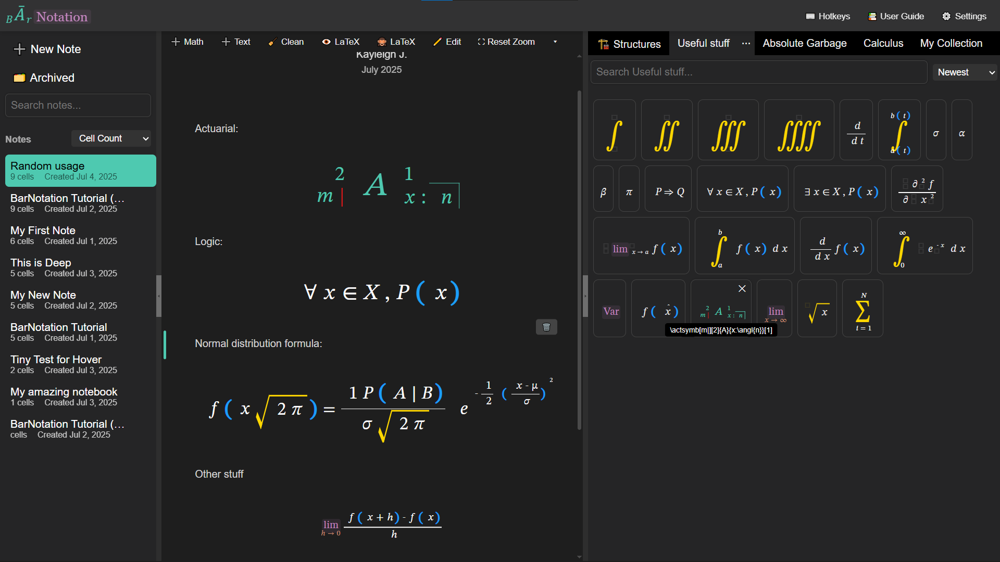
</p>

<p align="center">
  <em>See the <a href="#-screenshots">📷 Screenshots</a> section for a visual walkthrough!</em>
</p>

---

> ⚠️ **WARNING: This app is NOT production-ready. It is unstable, untested, and under heavy development. Proper database design has been procrastinated, and due to an unfortunate lack of experience developing apps like this, performance optimization is an afterthought (where after = now 😭).**

---

## ✨ Features

- **Cell-based note-taking**: Compose your notes as a series of *Math* and *Text* cells, inspired by the feel of a [Jupyter notebook](https://jupyter.org/).
- **Tree-structured Math Cells**: Math cells store structured math expressions using a node tree, with different node types corresponding to unique visual structures found in mathematics.
- **Smart Typing & Shortcuts**:
  - Type to insert basic (textual, inline) math
  - Use **hotkeys** (e.g. `/`) and **command sequences** (e.g. `\sum`, `\angl`, `\sqrt`) to transform input into fractions, sums, actuarial symbols, and more
- **Drag-and-Drop**:
  - Move math nodes within a cell
  - Copy math nodes across cells
  - Reorder notebook cells
- **Math Snippet Library**:
  - Save reusable math expressions to your personal **Library**
  - Drag entries from the library into any math cell
  - Create your own collections within the library, or use the premade ones
  - Copy expressions across collections by dragging them into other library tabs
  - Library entries are persistent and accessible across notebooks
  - Re-order the library tabs how you want and archive ones you don't need right now
- **LaTeX Integration**:
  - View the LaTeX translation of math cells
  - Copy LaTeX with `Ctrl+C`
  - Drag math snippets directly into external LaTeX editors like [Overleaf](https://www.overleaf.com/)

---

## 🧱 Supported Math Structures

BarNotation supports a growing list of structured math elements:

| **Type**                | **Node Interface**    | **Description**                                                                                                           | &nbsp; &nbsp; **Render Preview**&nbsp; &nbsp; | **How to Obtain**                                      |
| ----------------------- | --------------------- | ------------------------------------------------------------------------------------------------------------------------- | -------------------------- | ------------------------------------------------------ |
| `text`                  | `TextNode`            | A single character or rendered special symbol.                                                                            | <div align="center">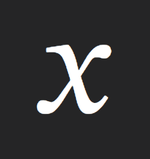</div> | Type directly |
| `multi-digit`           | `MultiDigitNode`      | A sequence of digit `TextNode`s treated as one number.                                                                    | <div align="center">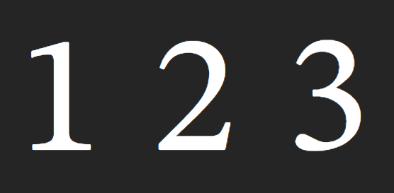</div> | Type multiple digits in a row |
| `command-input`         | `CommandInputNode`    | A sequence representing a LaTeX command. Turns into another node type when your sequence matches a known one.             | <div align="center">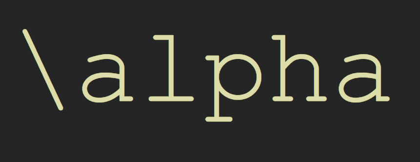</div> | Start with `\` and type a sequence |
| `styled`                | `StyledNode`          | An expression with non-standard font. Some commands like `\lim ` automatically lead to styled "lim" (just like LaTeX).    | <div align="center">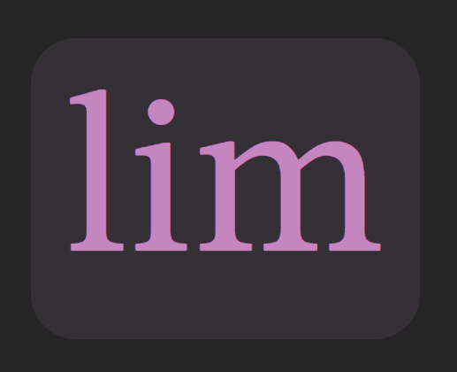</div> | E.g. `\upright `, `\text ` |  
| `root-wrapper`          | `RootWrapperNode`     | Holds your math cell's expression, used in toLatex to turn it into a block equation.                                      | (None)| Auto-created once per MathCell |
| `inline-container`      | `InlineContainerNode` | Container for an expression (sequence of nodes).                                                                          | <div align="center">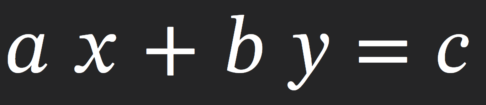</div> | For every transform that leads to new child nodes, child is inline-container |
| `group`                 | `GroupNode`           | Bracketed expression.                                                                                                     | <div align="center">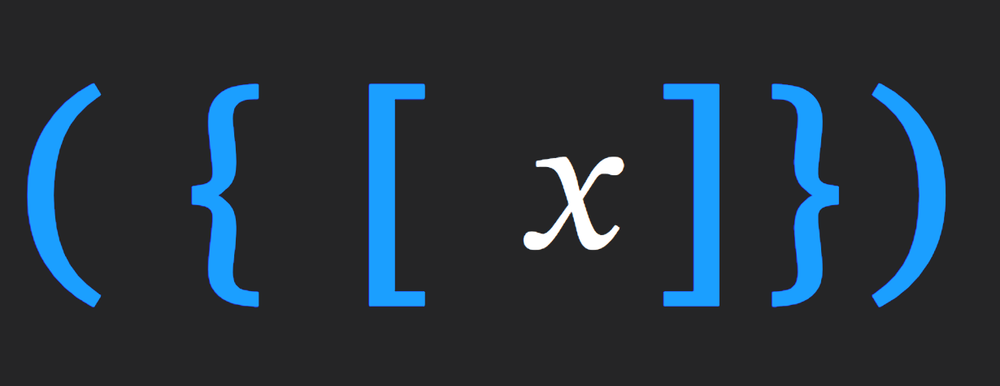</div> | Type brackets. App recognizes when pair is found |
| `fraction`              | `FractionNode`        | A fraction with numerator and denominator.                                                                                | <div align="center">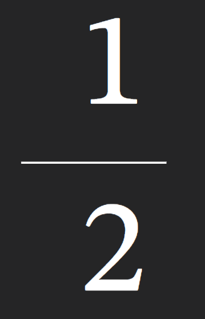</div> | `/` or `\frac `|  
| `nth-root`              | `NthRootNode`         | A root with an optional index.                                                                                            | <div align="center">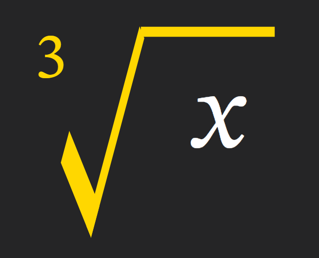</div> | Type `\sqrt` |
| `big-operator`          | `BigOperatorNode`     | Operators with upper/lower bounds like `∑`, `∏`.                                                                          | <div align="center">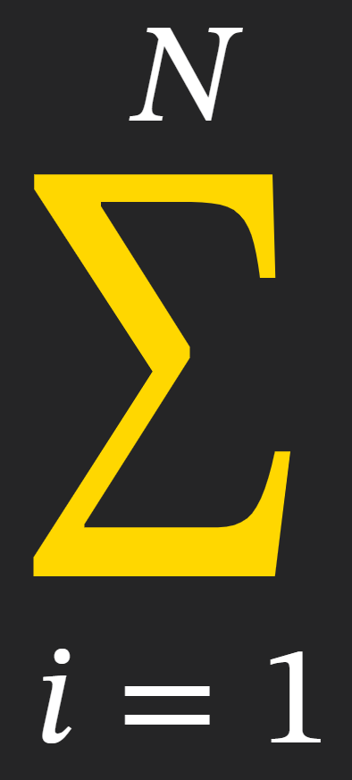</div> | E.g. `\sum `, `\int ` |
| `childed`               | `ChildedNode`         | Sub/superscript left or right of base, jump to new child depending on applied shortcut. Left side only reached by cursor. | <div align="center">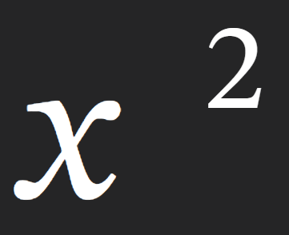</div> | `^` (= `Shift` + `6`) or `_` (= `Shift` + `-`) |
| `actsymb`               | `ChildedNode`         | Actuarial-style notation, same as above but app knows to use latex syntax as defined by the `\actuarialsymbol` package.   | <div align="center"></div> | `Side` + `height`, where `Side` is [`Shift` + `Ctrl` (left) or `Alt` (right)] and `height` is [`6` (up) or `-` (down)]
| `accented` (predefined) | `AccentedNode`        | Decorations above or below. | <div align="center">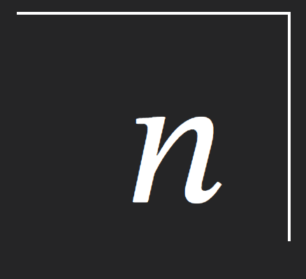</div> | Type commands like `\hat`, `\angl`, `\bar` |
| `accented` (custom)     | `AccentedNode`        | Custom over/under annotations (overset/underset).                                                                         | <div align="center">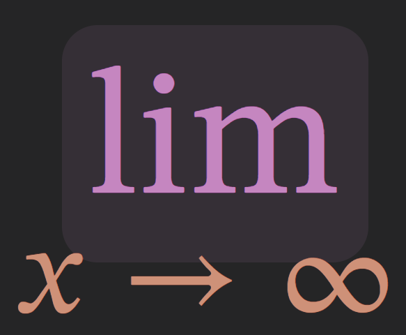</div> | `Shift` + `ArrowUp` or `ArrowDown` |

## 📷 Screenshots

### 📝 Main Editing Interface  
A simple, cell-based interface for math and text. Drag, type, and transform as you go.

<p align="center">
  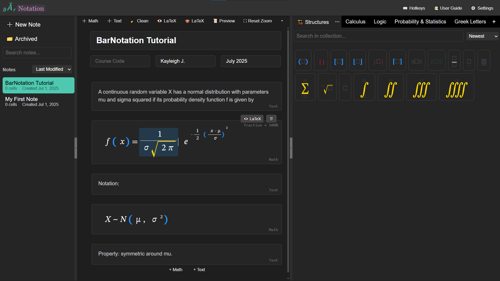
</p>

### 📚 Drag-and-Drop Math Library  
Save any expression for reuse. Just drag it into the library panel, and back into cells whenever you need!

<p align="center">
  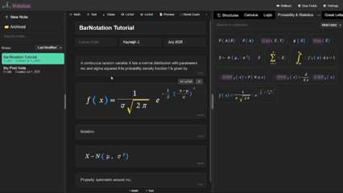
</p>

> 🤓 **Fun fact!**  
> The library keeps track of how often you re-use each snippet, so you can sort by "most used" (among others)!  
> Interested in seeing exact counts? Turn on **_nerd mode_** in settings.

### 🧩 Build Your Own Collections  
Create your own custom collections! Copy math from notes, or **drag between tabs**.

<p align="center">
  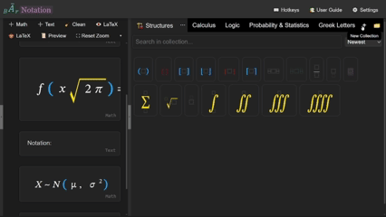
</p>

### 🗂️ Power Features for Collections

#### ↕️ Reorder Collection Tabs  
Just drag to rearrange!

<p align="center">
  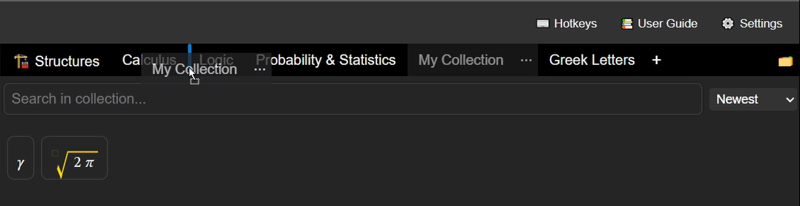
</p>

#### 📥 Archive Collections You’re Not Using  
Wildly different courses this semester, but expect similar ones in the future? Archive your collections to de-clutter your workspace!

<p align="center">
  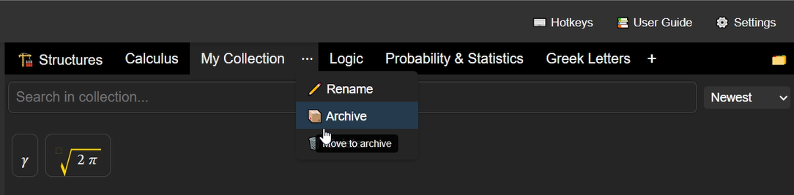
</p>

#### 🧭 View and Restore Archived Collections  
Searchable, previewable, and manageable. Even if you named a dozen of them "My Collection".

<p align="center">
  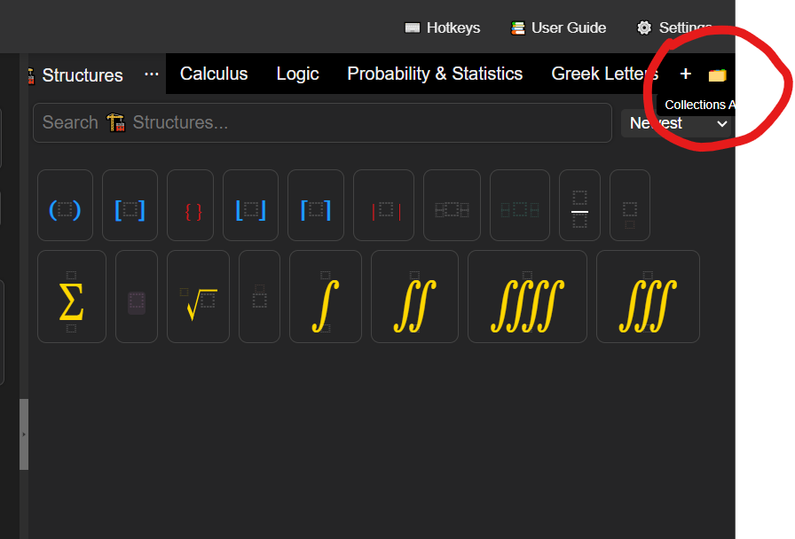
  &nbsp;&nbsp;&nbsp;
  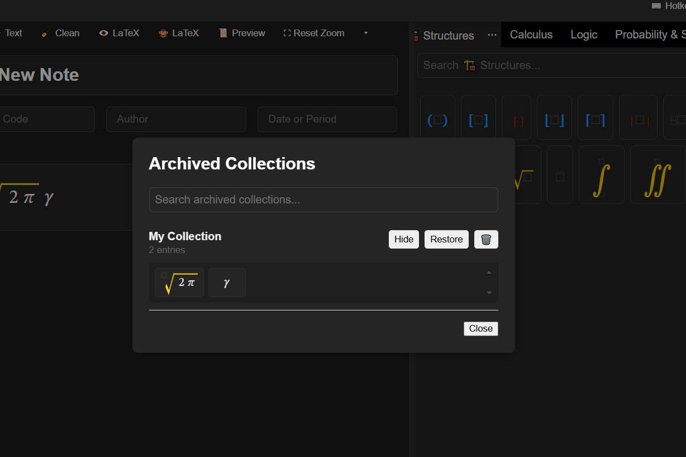
</p>

<p align="center"><i>Browse and restore from the archive (with previews!)</i></p>


### 📜 Preview Mode  
Check how your note would roughly render in LaTeX.

<p align="center">
  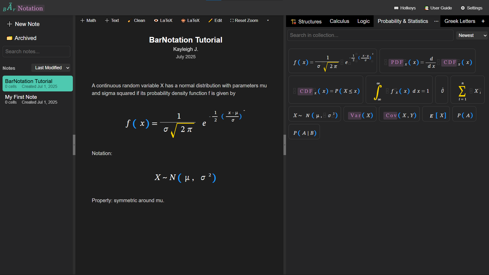
</p>

### 🌍 LaTeX In and Out  
Hate my app, but enjoy the math library? No problem! Just drag your snippets straight into any LaTeX editor (here: [Overleaf](https://www.overleaf.com/))!

<p align="center">
  
</p>

And yes, dragging raw LaTeX into the library works too! Just drop LaTeX code and it gets converted into structured math.

## 📁 Project Structure

The app is built in **React** with **TypeScript** and uses **Vite** as the build tool.

<details>
<summary><strong>Click to view full file tree</strong></summary>

```
.
├── App.tsx                        # Root app wrapper, renders main layout
├── index.css                      # Tailwind import, unused elsewhere
├── main.tsx                       # Loads App in React.StrictMode
├── vite-env.d.ts                  # Vite environment type declarations
│
├── assets
│   └── logo.svg                   # Full logo used in MainHeaderBar
│
├── components
│   ├── cells                      # Core editor cell components
│   │   ├── BaseCell.tsx           # Shared logic for Math/Text cells
│   │   ├── InsertCellButtons.tsx  # UI for adding new Math/Text cells
│   │   ├── MathCell.tsx           # MathEditor cell 
│   │   └── TextCell.tsx           # Textarea cell
│   │
│   ├── common                     # General reusable UI components
│   │   ├── SearchBar.tsx          # Styled search bar component
│   │   ├── SearchBar.module.css   # Styling for search bar
│   │   ├── ToastProvider.tsx      # Global toast/alert handler
│   │   └── toast.module.css       # Styling for toast alerts
│   │
│   ├── editor                     # Main math note editor pane
│   │   ├── EditorHeaderBar.tsx    # Toolbar for math editor (zoom, latex toggle, etc)
│   │   ├── EditorPane.tsx         # Handles cell list and editor pane state
│   │   ├── NotationEditor.tsx     # Renders the math/text cell list (1 notebook)
│   │   ├── NoteMetadataSection.tsx # Title, author, date metadata
│   │   └── *.module.css           # CSS modules for components above
│   │
│   ├── icons
│   │   └── CollapseIcon.tsx       # Arrow icon for collapsing UI sections
│   │
│   ├── layout                     # Page-level layout components
│   │   ├── EditorWorkspace.tsx    # Wraps EditorPane and MathLibrary (also drag context)
│   │   ├── MainHeaderBar.tsx      # Header bar with logo/settings/etc
│   │   ├── MainLayout.tsx         # Page layout: header, sidebar, workspace
│   │   ├── ResizableSidebar.tsx   # Resizable note history/sidebar component
│   │   └── *.module.css           # Styling for layout components
│   │
│   ├── mathExpression             # Math editor internals
│   │   ├── MathEditor.tsx         # Interactive math input component (1 expression)
│   │   ├── MathRenderer.tsx       # Recursive renderer with interactivity
│   │   ├── MathRenderers.tsx      # Specific renderers for each MathNode type
│   │   ├── MathView.tsx           # Non-interactive renderer (e.g. in Library)
│   │   ├── LatexViewer.tsx        # Shows raw LaTeX output for 1 expression
│   │   ├── DummyStartNodeRenderer.tsx # Dummy node for beginning of container
│   │   └── *.module.css           # Styling for math display components
│   │
│   ├── mathLibrary                # Math library for saved/prebuilt nodes
│   │   ├── MathLibrary.tsx        # Displays saved/standard math expressions
│   │   ├── TabDropdownPortal.tsx  # Dropdown for library tab actions
│   │   └── *.module.css           # Styling for library panel
│   │
│   ├── modals                     # Overlay modal components
│   │   ├── HotkeyOverlay.tsx      # Overlay with keyboard shortcuts
│   │   ├── LibCollectionArchiveModal.tsx # Archive/restore library collection
│   │   ├── SettingsModal.tsx      # Overlay for user settings/preferences
│   │   └── *.module.css           # Styling for modals
│   │
│   ├── notesMenu                  # Note switching and actions UI
│   │   ├── NotesMenu.tsx          # Sidebar for switching between notes
│   │   ├── NoteActionsDropdown.tsx # Dropdown for rename/delete note
│   │   └── *.module.css           # Styling for menu components
│   │
│   └── tooltips
│       ├── Tooltip.tsx            # Tooltip wrapper for hover hints
│       └── tooltip.css            # Tooltip styling
|
├── constants
│   └── premadeMathCollections.ts  # Initial math collections for library
│
├── hooks                         # Shared hooks and contexts
│   ├── DragContext.ts             # Global drag context types
│   ├── DragProvider.tsx           # Provides drag context
│   ├── useDragContext.ts          # Access drag context
│   ├── useCellDragState.ts        # Drag state hook for cells
│   ├── useDragState.ts            # Node drag state (OUTDATED)
│   ├── EditorHistoryContext.tsx   # Global editor history context
│   ├── EditorHistoryProvider.tsx  # Provides history context
│   ├── useEditorHistory.ts        # Local editor history hook (OUTDATED)
│   ├── useHoverState.ts           # Hover state for math nodes
│   ├── useZoom.ts                 # MathEditor zoom state hook
│   ├── toastContext.ts            # Toast context provider
│   └── useToast.ts                # Hook for showing toasts
│
├── logic                         # Math editor state and input logic
│   ├── cursor.ts                  # Cursor position in expression tree
│   ├── deletion.ts                # Handle backspace/delete logic
│   ├── editor-state.ts            # Core editor state (node + cursor)
│   ├── global-history.ts          # Full notebook history state
│   ├── handle-keydown.ts          # Keyboard input handler
│   ├── history.ts                 # (OUTDATED) local editor history
│   ├── insertion.ts               # Text/char insertion logic
│   ├── navigation.ts              # Arrow key navigation logic
│   ├── node-manipulation.ts       # Insertion/deletion of nodes
│   └── transformations.ts         # Node transforms (e.g., fractionize)
│
├── models                        # Data types and model logic
│   ├── latexParser.ts             # Parse LaTeX into MathNode tree
│   ├── libraryTypes.ts            # Types for saved library items
│   ├── nodeFactories.ts           # MathNode constructors
│   ├── nodeToLatex.ts             # Convert MathNode to LaTeX string
│   ├── noteTypes.ts               # Note/Cell/Metadata type defs
│   ├── specialSequences.ts        # Shortcuts like \frac → FractionNode
│   ├── transformations.ts         # Alternate transforms (legacy-ish)
│   └── types.ts                   # Core MathNode and variant types
│
├── styles
│   ├── accents.css                # Accent math node styling (hats, tildes, etc)
│   ├── cells.css                  # Cell styling (insert zones, focus, etc)
│   ├── hotkeyOverlay.css          # Hotkey overlay + settings shared styles
│   ├── latexOutputColoring.css    # LaTeX viewer syntax highlighting
│   ├── math-node.css              # Current math node styling
│   ├── math-node-old.css          # Legacy math node styling (unused?)
│   ├── math.css                   # Legacy general math styles
│   ├── settings.css               # Styling for toggles/settings UI
│   ├── styles.css                 # Global styles for layout and overlays
│   └── themes.css                 # Theme + DOM defaults + scrollbar overrides
│
└── utils
    ├── accentUtils.ts             # Decorations for accented nodes + required packages
    ├── bracketUtils.ts            # Bracket types and characters
    ├── collectionUtils.ts         # Init functions for math collections
    ├── mathHoverUtils.ts          # Hover behavior for math nodes
    ├── navigationUtils.ts         # Cursor/child traversal logic
    ├── noop.ts                    # Empty function used in MathView (non-interative Math render)
    ├── subsupUtils.ts             # Sup/subscript position helpers
    ├── textContainerUtils.ts      # (Unused) splitting container logic
    └── treeUtils.ts               # Tree update, find nodes, get logical children
```
</details>

---

## 🚀 Getting Started

### 1. Clone the repo
```bash
git clone https://github.com/Kayyleigh/BarNotation.git
cd BarNotation
```
### 2. Install Dependencies
```
npm install
```
### 3. Run the development server:
```
npm run dev
```
The app should now be running at http://localhost:5173.

--- 

## 🧠 Usage Tips

- **Insert a new cell**: Use the "+" buttons between or after cells, or in the editor header bar
- **Transform math**: Type a command like `\sqrt`, then hit space. Known commands are based on [LaTeX](https://www.cmor-faculty.rice.edu/~heinken/latex/symbols.pdf)!
- **Move/Copy math**: Drag elements directly within or between cells
- **Save reusable math**: Drag math to the Library panel on the right
- **Copy LaTeX**: `Ctrl+C` copies the LaTeX of the node left of your cursor
- **Reorder notes**: Drag the left margin of a cell up/down
- **External drag**: Drag snippets from the Library to apps like Overleaf. They paste as LaTeX!

---

## 🔮 Roadmap

Planned features and improvements include:

- 📦 Full notebook export as LaTeX
- 🎛️ Custom hotkeys
- 📚 Hierarchical notebook sections (e.g., sections, subsections)
- 🐛 Better error handling and onboarding experience

---

## 👩‍💻 Contributing
This is my first time pushing a project of this size out into the world. However:
- The app is structured for extensibility, especially around:
  - Adding new math node types (though this part is not as easy as I planned; the latex parser is not very extensible right now)
  - Creating new cell types
  - Defining new command sequences
- Issues and feedback are appreciated!

---

## 🤝 Acknowledgements

- Built with [React](https://react.dev/), [TypeScript](https://www.typescriptlang.org/), and [Vite](https://vitejs.dev/)
- Math editing and rendering inspired by [LaTeX](https://www.latex-project.org/)
- Overall editor behavior, layout, and styling inspired by [Jupyter Notebook](https://jupyter.org/), [Overleaf](https://www.overleaf.com/), and [Visual Studio Code](https://code.visualstudio.com/) 


---

## 🗣️ Feedback

Have ideas or suggestions? Found a bug?  
Please [open an issue](https://github.com/Kayyleigh/BarNotation/issues). Your feedback helps me improve!
