<p align="center">
  
</p>

<p align="center"><em>The mathematical note-taking app that truly raises the bar</em> 😎</p>

> [!IMPORTANT]
> Please visit the [Feature Design Voting](https://github.com/Kayyleigh/BarNotation/discussions/categories/feature-design-voting) Discussion category to vote on open design choices! These represent trade-offs that I can't fully resolve on my own, often because they come down to personal preferences or gaps in my understanding of the target audience. Your input really helps shape the project! 

# BarNotation

BarNotation is a real-time math note-taking app designed especially for students with hand pain in fast-paced lecture settings where writing detailed mathematical notation by hand can be painful and inefficient. An app like this is necessary because existing solutions (as far as I have found) do not allow complex structures such as actuarial symbols, nor do they provide easily customizable solutions to re-using sub-expressions. 

BarNotation enables users to build their notes as a sequence of "cells", either *Text* or *Math*, with intuitive keyboard entry, structural transformations, and drag-and-drop support for editing, reordering, and organizing notes and math expressions.

<p align="center">
  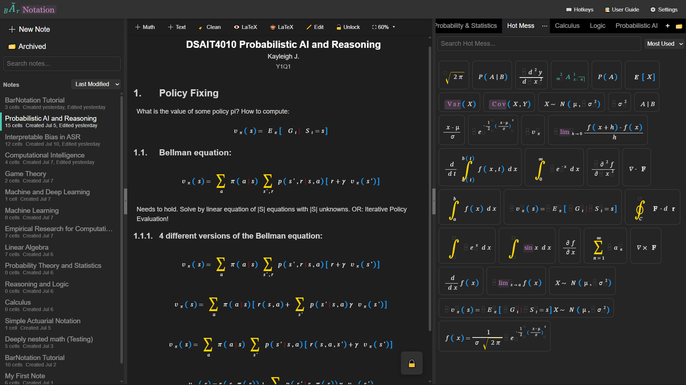
</p>
<p align="center">
  <em>See the <a href="#-screenshots">📷 Screenshots</a> section for a visual walkthrough!</em>
</p>

---
> [!WARNING]
> This app is NOT production-ready. It is still unstable, untested, and under heavy development. Proper database design has been procrastinated, and due to an unfortunate lack of experience developing apps like this, performance optimization was an afterthought (where after = the past few weeks 😭).

---

## ✨ Features

- **Cell-based note-taking**: Compose your notes as a series of *Math* and *Text* cells, inspired by the feel of a [Jupyter notebook](https://jupyter.org/).
- **Tree-structured Math Cells**: Math cells store structured math expressions using a node tree, with different node types corresponding to unique visual structures found in mathematics.
- **Hierarchical Text Cells**: Text cells can be marked as plain text, or section headers of 3 different levels, resulting in a hierarchical notebook.
- Re-order cells by drag-and-drop, duplicate existing cells, and insert new cells at any position.
- **Notebooks**:
  - Search and sort notebooks in the menu
  - duplicate, delete or archive notebooks
  - Search and restore archived notes
- **Smart Typing & Shortcuts**:
  - Type to insert basic (textual, inline) math
  - Use **hotkeys** (e.g. `/`) and **command sequences** (e.g. `\sum`, `\angl`, `\sqrt`) to transform input into fractions, sums, actuarial symbols, and more
  - When typing command sequences, leverage the **autocomplete** feature to speed up the process!
- **Drag-and-Drop**:
  - Move math nodes within a cell
  - Copy math nodes across cells
  - Reorder notebook cells
- **Math Snippet Library**:
  - Save reusable math expressions to your personal **Library**
  - Drag entries from the library into any math cell
  - Create your own collections within the library, or use the premade ones
  - Copy expressions across collections by dragging them into other library tabs
  - Library entries are persistent and accessible across notebooks
  - Re-order the library tabs how you want and archive ones you don't need right now
  - Duplicate existing collections 
  - Archive collections you don't need right now
  - Search, preview, and restore archived collections 
- **Editor Modes**:
  - Work in visible cells using Edit Mode
  - Switch to Preview mode to see roughly how LaTeX would render
  - Toggle Locked mode to disable interaction and get a clean overview with minimal clutter
- **LaTeX Integration**:
  - View the LaTeX translation of math cells
  - Copy LaTeX with `Ctrl+C`
  - Drag math snippets directly into external LaTeX editors like [Overleaf](https://www.overleaf.com/)
  - Drag raw LaTeX directly into the math library to obtain the corresponding structured math
- **Multilingual support**:
  - Set the app to English, Dutch, or Czech! More languages will be added later!

---

## 🧱 Supported Math Structures

BarNotation supports a growing list of structured math elements:

| **Type**                | **Node Interface**    | **Description**                                                                                                           | &nbsp; &nbsp; **Render Preview**&nbsp; &nbsp; | **How to Obtain**                                      |
| ----------------------- | --------------------- | ------------------------------------------------------------------------------------------------------------------------- | -------------------------- | ------------------------------------------------------ |
| `text`                  | `TextNode`            | A single character or rendered special symbol.                                                                            | <div align="center">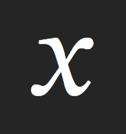</div> | Type directly |
| `multi-digit`           | `MultiDigitNode`      | A sequence of digit `TextNode`s treated as one number.                                                                    | <div align="center">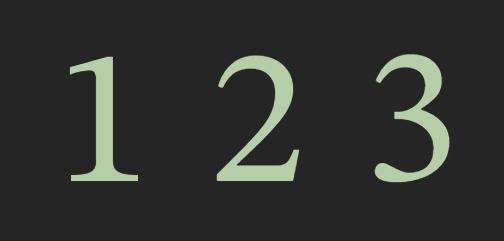</div> | Type multiple digits in a row |
| `command-input`         | `CommandInputNode`    | A sequence representing a LaTeX command. Turns into another node type when your sequence matches a known one.             | <div align="center">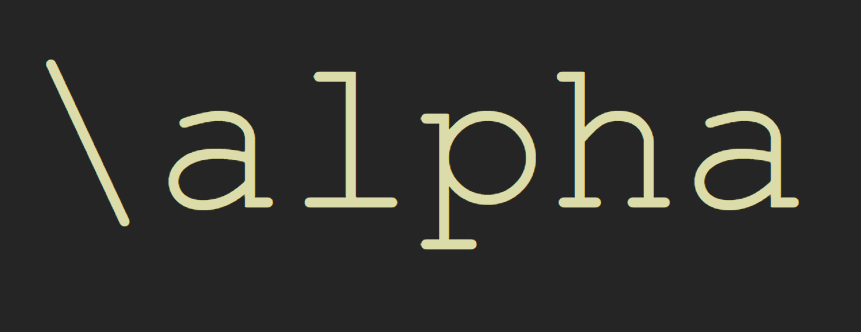</div> | Start with `\` and type a sequence |
| `styled`                | `StyledNode`          | An expression with non-standard font. Some commands like `\lim ` automatically lead to styled "lim" (just like LaTeX).    | <div align="center">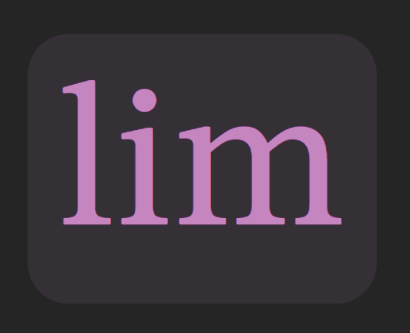</div> | E.g. `\upright `, `\text ` |  
| `root-wrapper`          | `RootWrapperNode`     | Holds your math cell's expression, used in toLatex to turn it into a block equation.                                      | (None)| Auto-created once per MathCell |
| `inline-container`      | `InlineContainerNode` | Container for an expression (sequence of nodes).                                                                          | <div align="center">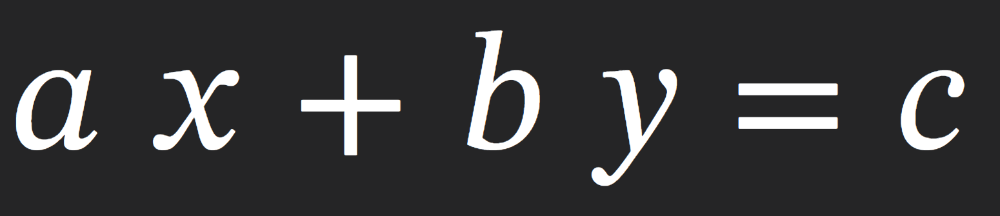</div> | For every transform that leads to new child nodes, child is inline-container |
| `group`                 | `GroupNode`           | Bracketed expression.                                                                                                     | <div align="center">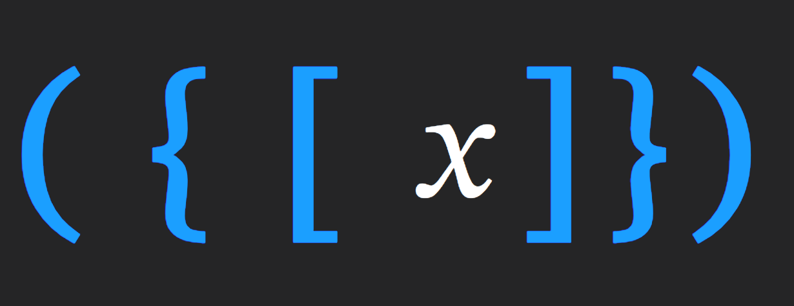</div> | Type brackets. App recognizes when pair is found |
| `fraction` (fraction)             | `FractionNode`        | A fraction with numerator and denominator.                                                                                | <div align="center">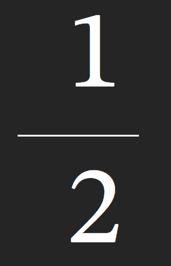</div> | `/` or `\frac `|  
| `fraction` (binom)             | `FractionNode`        | Special type of fraction-like structure representing a binomial coefficient. | <div align="center">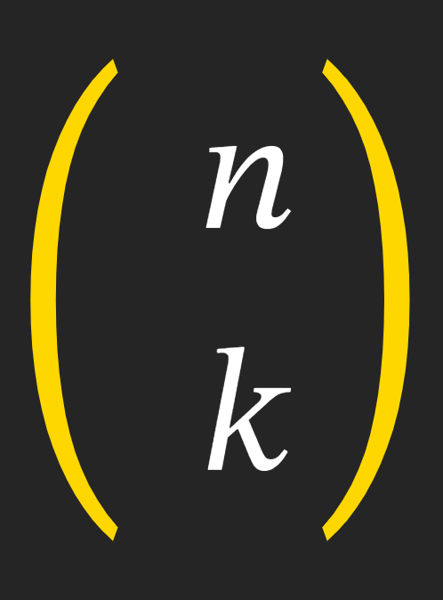</div>|`\binom `|  
| `nth-root`              | `NthRootNode`         | A root with an optional index.| <div align="center">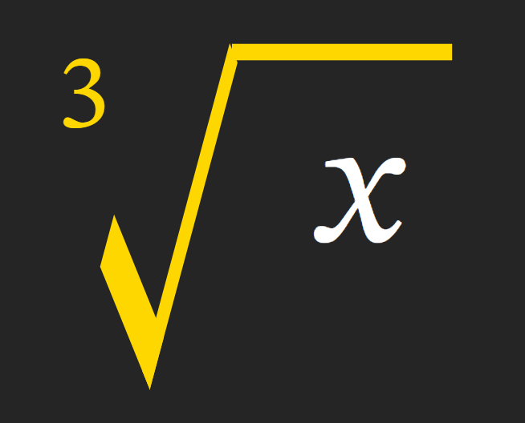</div> | Type `\sqrt` |
| `big-operator`          | `BigOperatorNode`     | Operators with upper/lower bounds like `∑`, `∏`.                                                                          | <div align="center">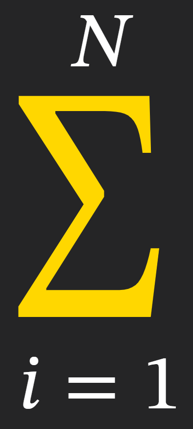</div> | E.g. `\sum `, `\int ` |
| `childed`               | `ChildedNode`         | Sub/superscript left or right of base, jump to new child depending on applied shortcut. Left side only reached by cursor. | <div align="center">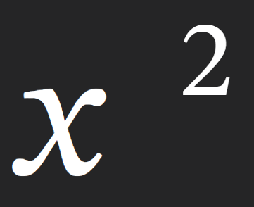</div> | `^` (= `Shift` + `6`) or `_` (= `Shift` + `-`) |
| `actsymb`               | `ChildedNode`         | Actuarial-style notation, same as above but app knows to use latex syntax as defined by the `\actuarialsymbol` package.   | <div align="center">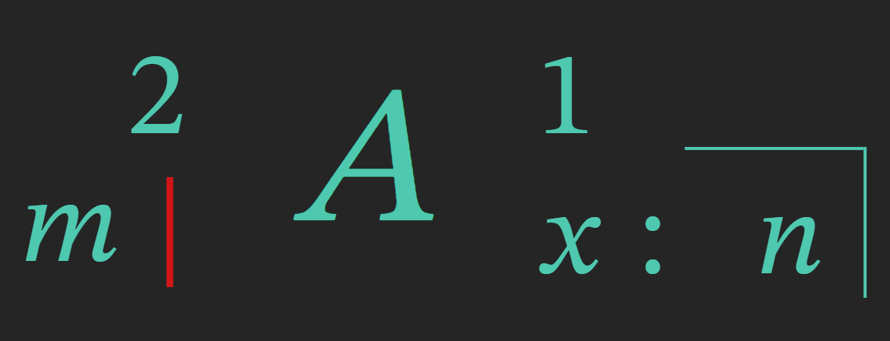</div> | `Side` + `height`, where `Side` is [`Shift` + `Ctrl` (left) or `Alt` (right)] and `height` is [`6` (up) or `-` (down)]
| `decorated` | `DecoratedNode`        | Decorations above or below. | <div align="center">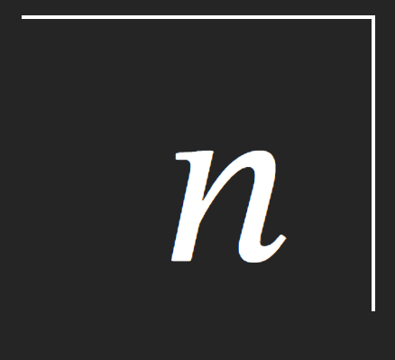</div> | Type commands like `\hat`, `\angl`, `\bar` |
| `overunderset` (overunderset)     | `OverUndersetNode`        | Custom over/under annotations (LaTeX's overset/underset).                                                                         | <div align="center">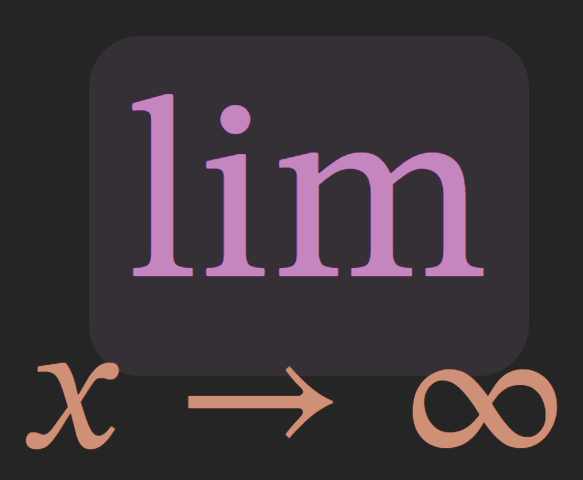</div> | `Shift` + `ArrowUp` or `ArrowDown` |
| `overunderset` (nthtopbottom)  | `OverUndersetNode`        | Special type of over/underset representing precedences in actuarial notation.                                                                         | <div align="center">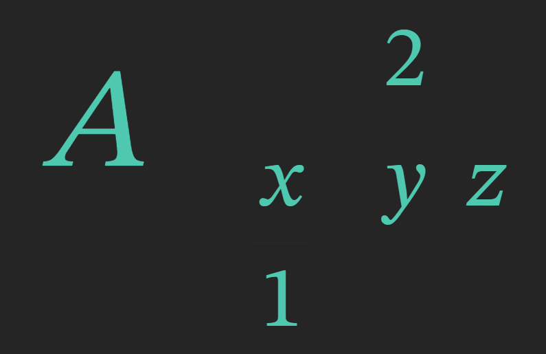</div> | `Alt` + `ArrowUp` or `ArrowDown` |
| `matrix` | `MatrixNode`        | Matrix or vector (a vector is a 1xn or mx1 matrix, just like in LaTeX). | <div align="center">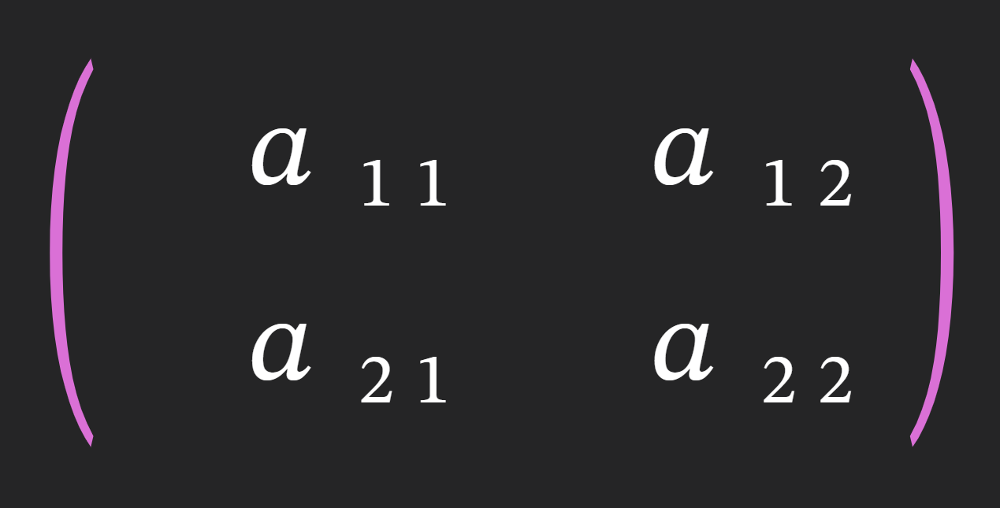</div> | `\matrix`, `\pmatrix`, ... (different bracket types). Use `Ctrl` + `Arrow keys` to insert new rows and columns. |

## 📷 Screenshots

> [!CAUTION]  
> This section may be slightly outdated. Since updating walkthroughs takes time, it only gets refreshed after enough meaningful UI changes. The image in the [Introduction](#barnotation) is always relatively up-to-date.  
> _Walkthrough last updated: **July 30, 2025**._

### 📝 Main Editing Interface

BarNotation offers a clean, cell-based interface for blending math and text. Type, drag, and transform as you go.

<p align="center">
  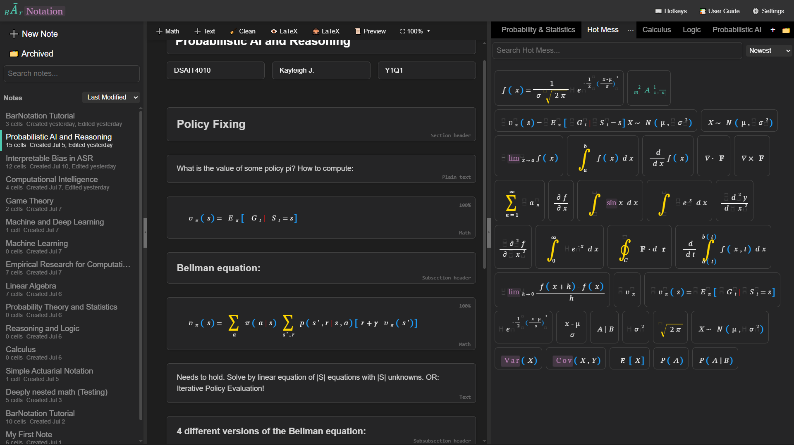
</p>

#### Create a New Notebook

Set your title, author, and date metadata when starting fresh:  
<p align="center">
  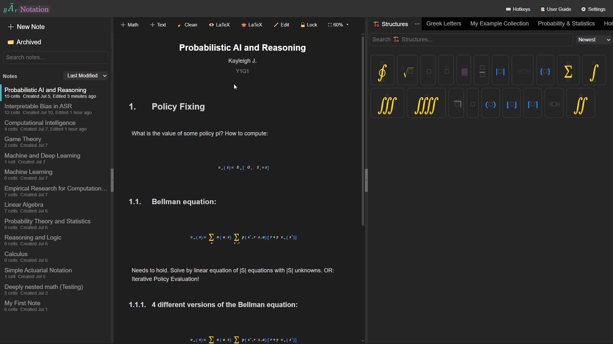
</p>

> [!NOTE]
> The "Date" field is just metadata. Unlike the creation date (used for sorting), this one will be used in the future LaTeX export feature. It also does not need to be a date, e.g. I personally put "Y1Q2" on my notes if I want to indicate a course was from quarter 2 of year 1.

#### Type Into Math Cells

Type straight into rendered math expressions! Use hotkeys and command sequences to build complex structures.  

<p align="center">
  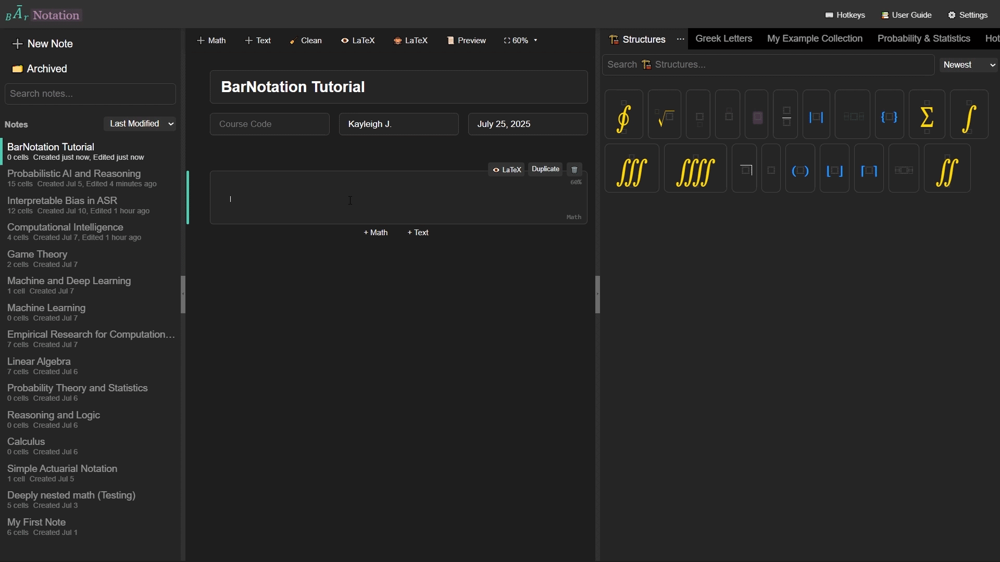
</p>

#### Insert and Reorder Text Cells

Add plain text cells or upgrade them to section headers! Reorder cells by dragging the left margin.

<p align="center">
  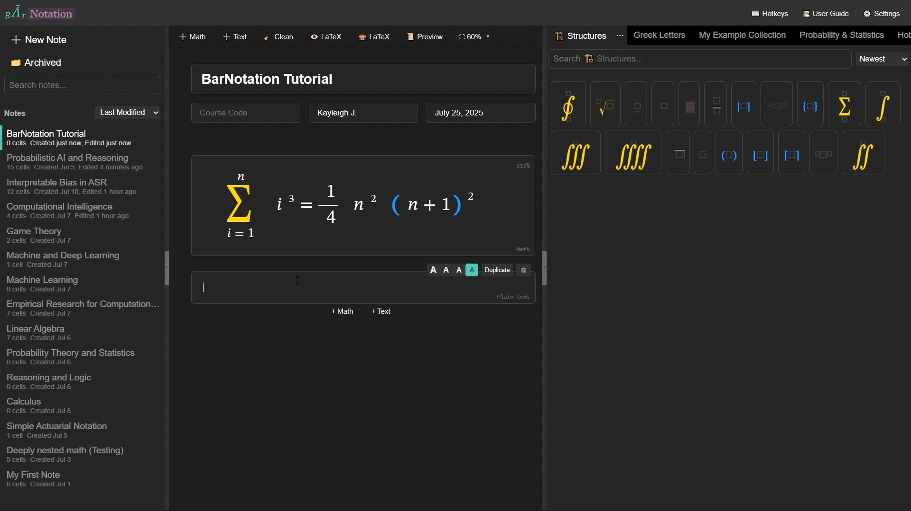
</p>

#### Autocomplete Command Sequences in Math Cells
Use the autocomplete feature to speed up your note-taking when typing out long command sequences!

<p align="center">
  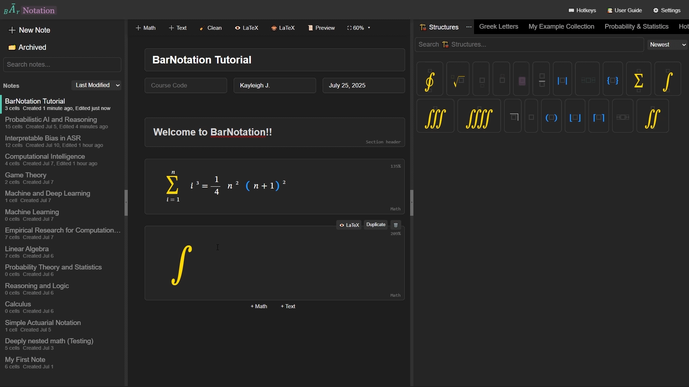
</p>

### 📚 Drag-and-Drop Library with Custom Collections

Save any expression for reuse: just drag it into the Library and back again whenever you need! Anything in the library is available to you **across the entire app**!

<div align="center">
  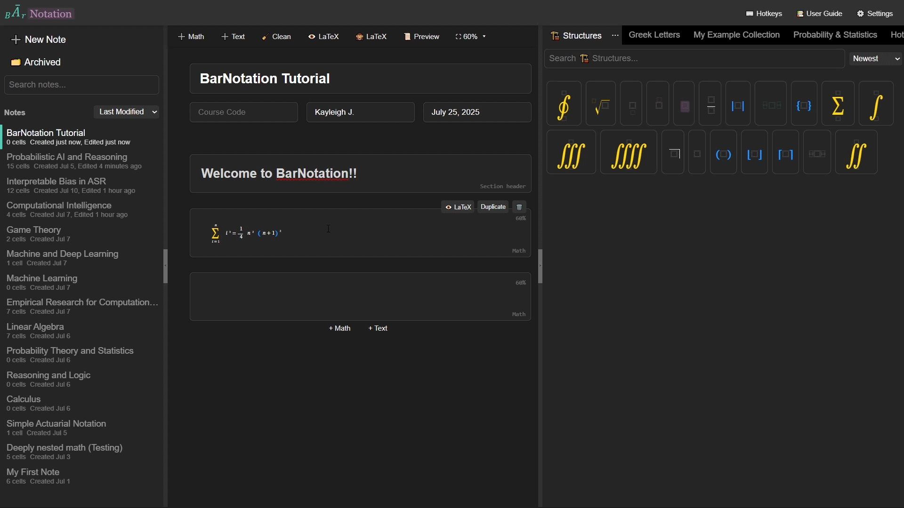
  &nbsp
  &nbsp
  &nbsp
  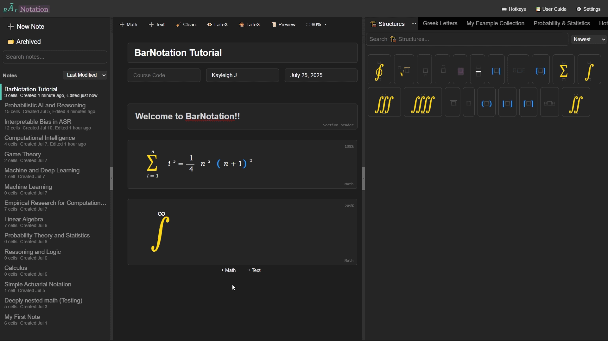
</div>

Create custom collections from scratch, dragging from cells or copying from other collections! Or you can duplicate an existing collection to save some time.

> [!TIP]  
> 🤓 **Fun fact!** The library tracks reuse frequency, so you can sort by "most used." Interested in exact counts? Turn on **_nerd mode_** in Settings.

### 🗂️ Collection Power Features

#### Rearrange Tabs
Organize your collections by dragging tabs into your preferred order.

<p align="center">
  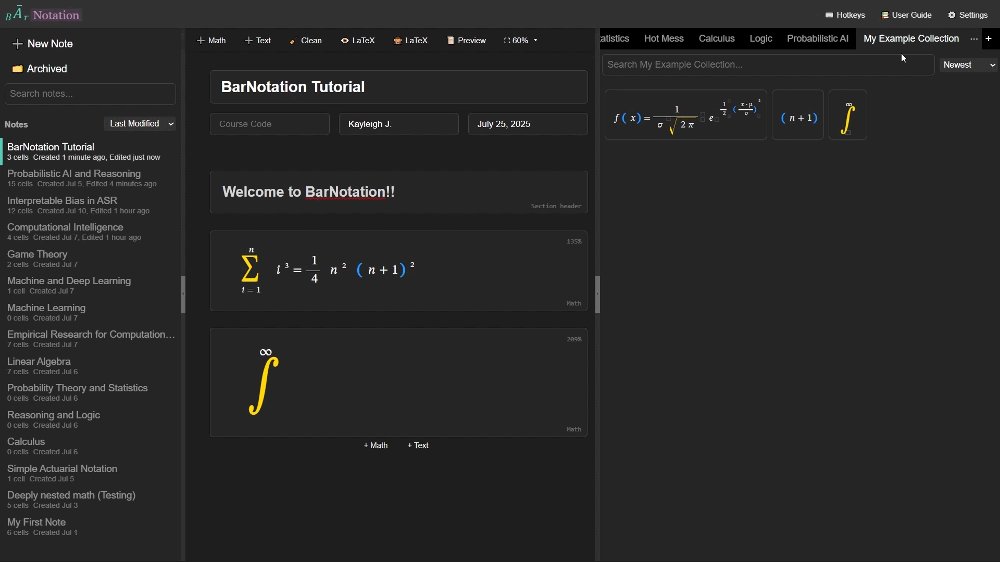
</p>

#### Archive Old Collections
Wildly different courses this semester, but expect similar ones in the future? Archive your collections to de-clutter your workspace! Search the archive and preview collection entries to find the correct collections back later.

<p align="center">
  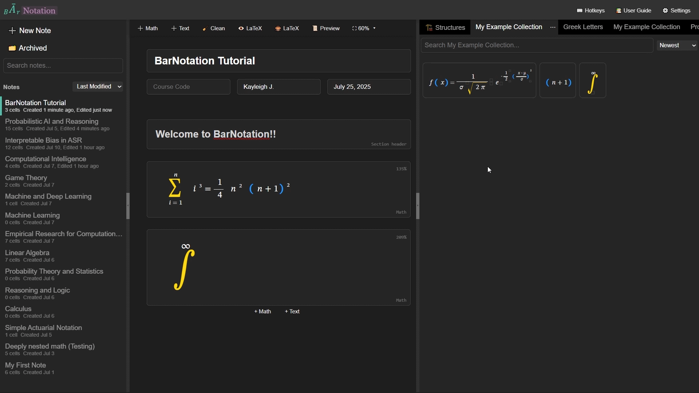
</p>


### 📜 Preview Mode

See how your note would roughly render in LaTeX. Including live-updating section numbering!

<p align="center">
  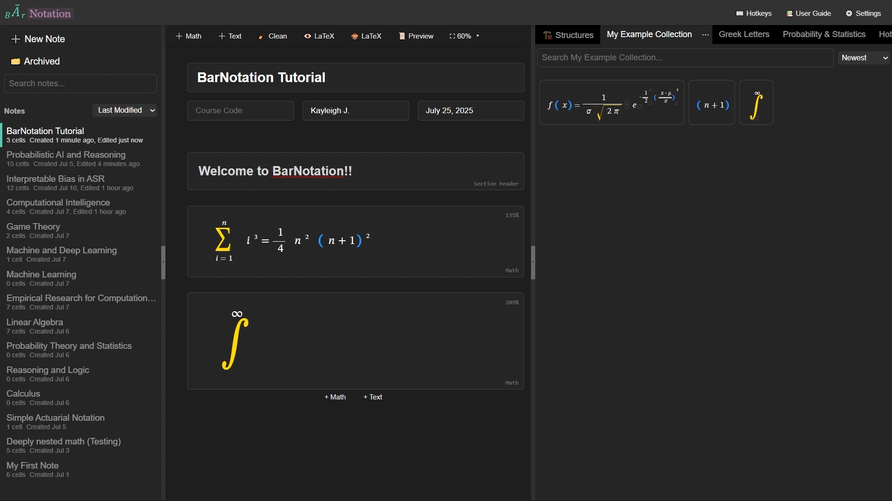
</p>


### 🔒 Locked Mode

Need a distraction-free overview? Lock the editor in preview mode for a polished look.

<p align="center">
  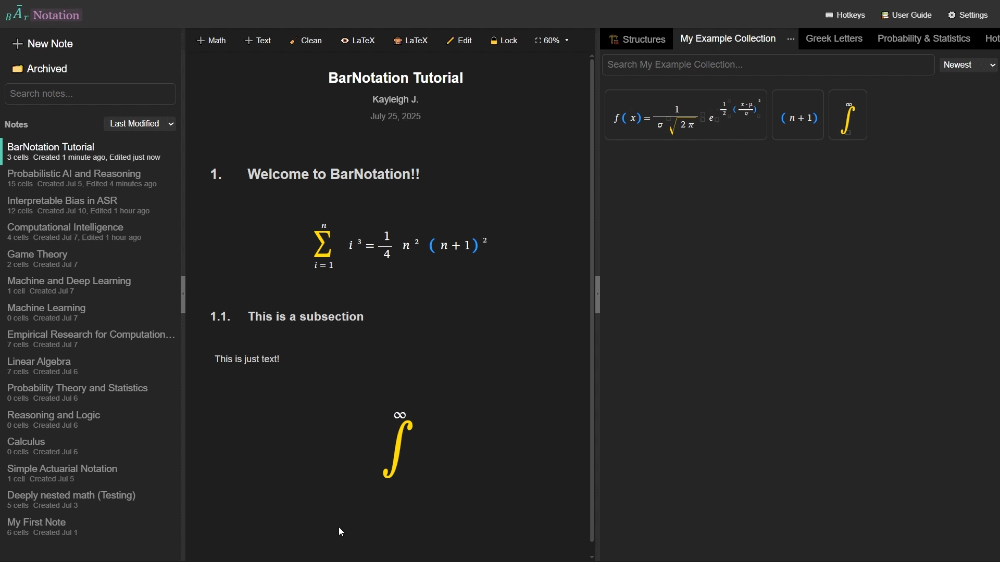
</p>


### 🔍 Fine-Grained Zoom Control

Change global zoom settings, but retain per-cell zoom control to handle deeply nested math without straining your eyes.

<p align="center">
  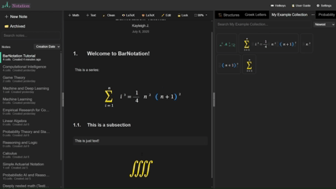
</p>


### 🎨 Workspace Customization

Toggle math coloring, author defaults, and library reuse visibility. Light mode exists, but its current visual appeal would be a disgrace to my GitHub page. 

<p align="center">
  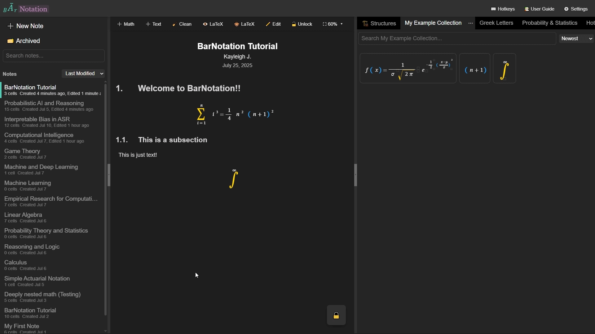
</p>

As of 27/07/2025 there is also a dropdown to switch between languages! Currently, only English, Dutch and Czech are supported, but I plan to add more soon.

> [!Note]
> The app is completely offline and local. Thus, the "Default author name" is not an account name, nor will it ever be visible to anyone else than yourself. It is purely there to auto-fill the "author" metadata field of notebooks you create after changing the name.   

### ⌨️ Hotkey Reference

Can't remember a hotkey? Open the cheat sheet anytime.

<p align="center">
  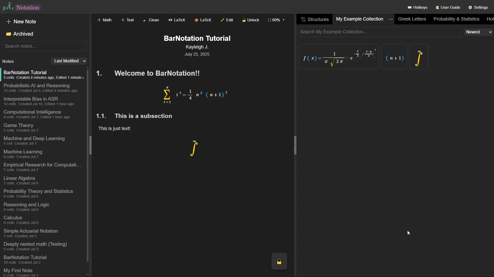
</p>

> [!NOTE]  
> A similar cheat sheet for **command sequences** is coming soon!


### 📓 Notebook Archive
Keep your workspace clean by archiving notebooks you don't need right now but still don't want to delete.

<p align="center">
  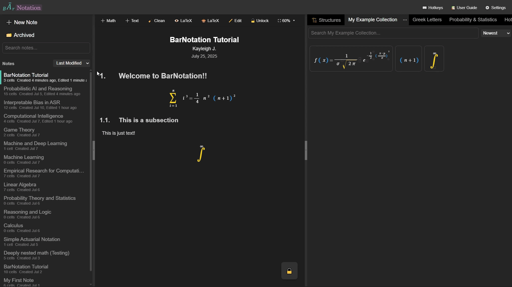
</p>

> [!TIP]
> For anyone trying out BarNotation before the [planned soft delete](#-roadmap) is implemented, I highly recommend using the archive instead, and manually perma-deleting every once in a while. Better safe than sorry! 

### 🌍 LaTeX In and Out

Enjoy the library but not the editor? Just drag your math into an external LaTeX editor like [Overleaf](https://www.overleaf.com/).

<div align="center">
  
</div>

#### Supported Interactions

**Drag-and-drop:**
- From Library → External LaTeX editors (e.g., Overleaf ✅, Notepad ❌)
- From External → Library (raw LaTeX gets auto-parsed into structured math)

**Clipboard:**
- Paste raw LaTeX into math cells → gets parsed
- `Ctrl+C` in a math cell → puts the LaTeX of the node **left to your cursor** into clipboard
- To copy the **entire** math cell's LaTeX block, use the per-cell preview feature

> [!TIP]  
> Any pasted LaTeX will be interpreted into structured math. Accidentally paste a full novel? Just `Ctrl+Z` to undo.

#### Full Note LaTeX Export
Export your notebook to LaTeX (.tex file) to open it in a different editing app, or just to safely store a backup! 

<p align="center">
  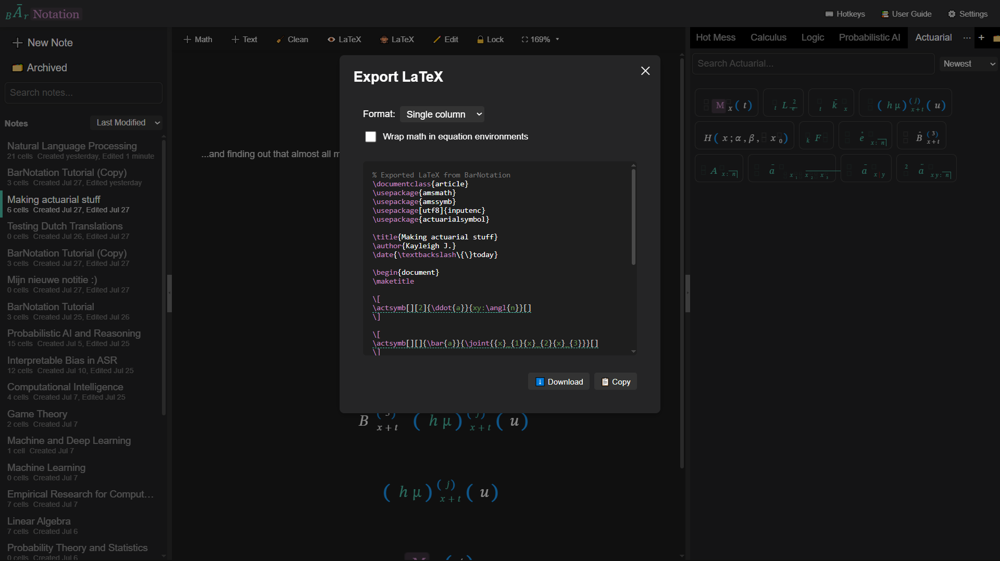
</p>

- Converts all cells into LaTeX (respecting hierarchy for text)
- Uses your metadata to fill in the title, author, and date
- Auto-detects required packages (for the forseeable future, only `actuarialsymbol` is supported)

> [!NOTE]  
> I plan to add a feature to **import from LaTeX** as well, but this might happen after the first working version due to time constrains (so not before September 1, 2025). This feature would make .tex files a safe way to store notes from BarNotation to recover files in case something happens to the app, or transfer between devices.

## 📁 Project Structure

The app is built in **React** with **TypeScript** and uses **Vite** as the build tool.

<details><summary><code>src/</code> — Click to see the full source folder</summary>

  - [`App.tsx`](https://github.com/Kayyleigh/BarNotation/blob/main/src/App.tsx) — Main entry point wrapper (renders main component)
  - [`index.css`](https://github.com/Kayyleigh/BarNotation/blob/main/src/index.css) — Tailwind import (likely unused)
  - [`main.tsx`](https://github.com/Kayyleigh/BarNotation/blob/main/src/main.tsx) — Bootstraps App inside React.StrictMode
  - [`vite-env.d.ts`](https://github.com/Kayyleigh/BarNotation/blob/main/src/vite-env.d.ts) — Vite environment type declarations
  - [`assets/`](https://github.com/Kayyleigh/BarNotation/blob/main/src/assets/) — Static assets
    - [`logo.svg`](https://github.com/Kayyleigh/BarNotation/blob/main/src/assets/logo.svg) — Full logo SVG (used in header)
  - [`components/`](https://github.com/Kayyleigh/BarNotation/blob/main/src/components/) — React components grouped by function
    - [`common/`](https://github.com/Kayyleigh/BarNotation/blob/main/src/components/common/) — Shared UI used across the app
      - [`SearchBar.module.css`](https://github.com/Kayyleigh/BarNotation/blob/main/src/components/common/SearchBar.module.css) — Styling for the searchbar component
      - [`SearchBar.tsx`](https://github.com/Kayyleigh/BarNotation/blob/main/src/components/common/SearchBar.tsx) — Searchbar component used to filter lists
      - [`SortDropdown.module.css`](https://github.com/Kayyleigh/BarNotation/blob/main/src/components/common/SortDropdown.module.css) — Styling for the sort dropdown
      - [`SortDropdown.tsx`](https://github.com/Kayyleigh/BarNotation/blob/main/src/components/common/SortDropdown.tsx) — Dropdown component for sorting lists
      - [`toast.module.css`](https://github.com/Kayyleigh/BarNotation/blob/main/src/components/common/toast.module.css) — Styling for toasts
      - [`ToastRenderer.tsx`](https://github.com/Kayyleigh/BarNotation/blob/main/src/components/common/ToastRenderer.tsx) — Component for toasts
    - [`editor/`](https://github.com/Kayyleigh/BarNotation/blob/main/src/components/editor/) — Editor and Notation-related components
      - [`CellRow.tsx`](https://github.com/Kayyleigh/BarNotation/blob/main/src/components/editor/CellRow.tsx) — Row in the editor: a cell and its preceding insert buttons
      - [`Editor.module.css`](https://github.com/Kayyleigh/BarNotation/blob/main/src/components/editor/Editor.module.css) — Styling for EditorPane/NotationEditor
      - [`EditorHeaderBar.module.css`](https://github.com/Kayyleigh/BarNotation/blob/main/src/components/editor/EditorHeaderBar.module.css) — Styling for the editor header bar
      - [`EditorHeaderBar.tsx`](https://github.com/Kayyleigh/BarNotation/blob/main/src/components/editor/EditorHeaderBar.tsx) — EditorPane header (controls, zoom, add cell, etc.)
      - [`EditorPane.tsx`](https://github.com/Kayyleigh/BarNotation/blob/main/src/components/editor/EditorPane.tsx) — Manages cells and header/editor coordination
      - [`NotationEditor.tsx`](https://github.com/Kayyleigh/BarNotation/blob/main/src/components/editor/NotationEditor.tsx) — Renders single Notebook's cell list
      - [`NoteMetadataSection.module.css`](https://github.com/Kayyleigh/BarNotation/blob/main/src/components/editor/NoteMetadataSection.module.css) — CSS for note metadata section
      - [`NoteMetadataSection.tsx`](https://github.com/Kayyleigh/BarNotation/blob/main/src/components/editor/NoteMetadataSection.tsx) — Note metadata (title, author, date)
      - [`cells/`](https://github.com/Kayyleigh/BarNotation/blob/main/src/components/editor/cells/) — Reusable cell components (math/text)
        - [`BaseCell.tsx`](https://github.com/Kayyleigh/BarNotation/blob/main/src/components/editor/cells/BaseCell.tsx) — Basic shared cell structure
        - [`cell.module.css`](https://github.com/Kayyleigh/BarNotation/blob/main/src/components/editor/cells/cell.module.css) — Cell styling
        - [`InsertCellButtons.tsx`](https://github.com/Kayyleigh/BarNotation/blob/main/src/components/editor/cells/InsertCellButtons.tsx) — Insert Math/Text Cell buttons
        - [`MathCell.tsx`](https://github.com/Kayyleigh/BarNotation/blob/main/src/components/editor/cells/MathCell.tsx) — Cell with MathEditor
        - [`TextCell.tsx`](https://github.com/Kayyleigh/BarNotation/blob/main/src/components/editor/cells/TextCell.tsx) — Cell with simple textarea
    - [`icons/`](https://github.com/Kayyleigh/BarNotation/blob/main/src/components/icons/) — UI icon components
      - [`CollapseIcon.tsx`](https://github.com/Kayyleigh/BarNotation/blob/main/src/components/icons/CollapseIcon.tsx) — Collapse arrow icon
    - [`layout/`](https://github.com/Kayyleigh/BarNotation/blob/main/src/components/layout/) — Layout and layout-related components
      - [`EditorWorkspace.module.css`](https://github.com/Kayyleigh/BarNotation/blob/main/src/components/layout/EditorWorkspace.module.css) — CSS for workspace styling
      - [`EditorWorkspace.tsx`](https://github.com/Kayyleigh/BarNotation/blob/main/src/components/layout/EditorWorkspace.tsx) — Wrapper for EditorPane & MathLibrary
      - [`MainHeaderBar.tsx`](https://github.com/Kayyleigh/BarNotation/blob/main/src/components/layout/MainHeaderBar.tsx) — Outdated header bar (logo, settings)
      - [`MainLayout.tsx`](https://github.com/Kayyleigh/BarNotation/blob/main/src/components/layout/MainLayout.tsx) — Overall app layout structure
      - [`ModalsLayer.tsx`](https://github.com/Kayyleigh/BarNotation/blob/main/src/components/layout/ModalsLayer.tsx) — Top-level component to efficiently render (e.g. settings) modals
      - [`ResizableSidebar.module.css`](https://github.com/Kayyleigh/BarNotation/blob/main/src/components/layout/ResizableSidebar.module.css) — CSS for resizable sidebar
      - [`ResizableSidebar.tsx`](https://github.com/Kayyleigh/BarNotation/blob/main/src/components/layout/ResizableSidebar.tsx) — Resizable sidebar component
    - [`mathExpression/`](https://github.com/Kayyleigh/BarNotation/blob/main/src/components/mathExpression/) — Math expression rendering/editing
      - [`CommandInputNodeComponent.module.css`](https://github.com/Kayyleigh/BarNotation/blob/main/src/components/mathExpression/CommandInputNodeComponent.module.css) — Styling for the command input component
      - [`CommandInputNodeComponent.tsx`](https://github.com/Kayyleigh/BarNotation/blob/main/src/components/mathExpression/CommandInputNodeComponent.tsx) — Command input component with autocomplete dropdown
      - [`DummyStartNodeRenderer.tsx`](https://github.com/Kayyleigh/BarNotation/blob/main/src/components/mathExpression/DummyStartNodeRenderer.tsx) — Dummy start node for drag/drop
      - [`LatexViewer.module.css`](https://github.com/Kayyleigh/BarNotation/blob/main/src/components/mathExpression/LatexViewer.module.css) — CSS for LaTeX viewer
      - [`LatexViewer.tsx`](https://github.com/Kayyleigh/BarNotation/blob/main/src/components/mathExpression/LatexViewer.tsx) — Displays LaTeX of a math expression
      - [`MathEditor.module.css`](https://github.com/Kayyleigh/BarNotation/blob/main/src/components/mathExpression/MathEditor.module.css) — Styling for the MathEditor
      - [`MathEditor.tsx`](https://github.com/Kayyleigh/BarNotation/blob/main/src/components/mathExpression/MathEditor.tsx) — Math expression editor
      - [`MathRenderer.tsx`](https://github.com/Kayyleigh/BarNotation/blob/main/src/components/mathExpression/MathRenderer.tsx) — Recursive expression renderer with drag
      - [`MathRenderers.tsx`](https://github.com/Kayyleigh/BarNotation/blob/main/src/components/mathExpression/MathRenderers.tsx) — Renderers for individual MathNode types
      - [`MathView.tsx`](https://github.com/Kayyleigh/BarNotation/blob/main/src/components/mathExpression/MathView.tsx) — Non-interactive math viewer (used in Library)
    - [`mathLibrary/`](https://github.com/Kayyleigh/BarNotation/blob/main/src/components/mathLibrary/) — Math Library components
      - [`CollectionTabs.tsx`](https://github.com/Kayyleigh/BarNotation/blob/main/src/components/mathLibrary/CollectionTabs.tsx) — Rendering Collection tab header in library panel
      - [`LibraryEntries.tsx`](https://github.com/Kayyleigh/BarNotation/blob/main/src/components/mathLibrary/LibraryEntries.tsx) — Rendering entries of a single collection in the library panel
      - [`MathLibrary.module.css`](https://github.com/Kayyleigh/BarNotation/blob/main/src/components/mathLibrary/MathLibrary.module.css) — CSS for library panel
      - [`MathLibrary.tsx`](https://github.com/Kayyleigh/BarNotation/blob/main/src/components/mathLibrary/MathLibrary.tsx) — Math node library panel (uses CollectionTabs and LibraryEntries)
      - [`TabDropdownPortal.module.css`](https://github.com/Kayyleigh/BarNotation/blob/main/src/components/mathLibrary/TabDropdownPortal.module.css) — CSS for library dropdown
      - [`TabDropdownPortal.tsx`](https://github.com/Kayyleigh/BarNotation/blob/main/src/components/mathLibrary/TabDropdownPortal.tsx) — Library dropdown (rename, archive, delete)
    - [`modals/`](https://github.com/Kayyleigh/BarNotation/blob/main/src/components/modals/) — Modal components
      - [`ArchiveModal.module.css`](https://github.com/Kayyleigh/BarNotation/blob/main/src/components/modals/ArchiveModal.module.css) — Archive modal styling
      - [`ArchiveModal.tsx`](https://github.com/Kayyleigh/BarNotation/blob/main/src/components/modals/ArchiveModal.tsx) — Archive modal with searchbar and dropdown
      - [`ExportLatexModal.module.css`](https://github.com/Kayyleigh/BarNotation/blob/main/src/components/modals/ExportLatexModal.module.css) — Styling for LaTeX export modal
      - [`ExportLatexModal.tsx`](https://github.com/Kayyleigh/BarNotation/blob/main/src/components/modals/ExportLatexModal.tsx) — LaTeX export modal for viewing/downloading/copying full note's LaTeX
      - [`HotkeyOverlay.module.css`](https://github.com/Kayyleigh/BarNotation/blob/main/src/components/modals/HotkeyOverlay.module.css) — Hotkey overview modal
      - [`HotkeyOverlay.tsx`](https://github.com/Kayyleigh/BarNotation/blob/main/src/components/modals/HotkeyOverlay.tsx) — Hotkey info overlay
      - [`LibCollectionArchiveModal.module.css`](https://github.com/Kayyleigh/BarNotation/blob/main/src/components/modals/LibCollectionArchiveModal.module.css) — Styling for library collection archive model
      - [`LibCollectionArchiveModal.tsx`](https://github.com/Kayyleigh/BarNotation/blob/main/src/components/modals/LibCollectionArchiveModal.tsx) — Library collection archive model (builds upon ArchiveModal)
      - [`Modal.module.css`](https://github.com/Kayyleigh/BarNotation/blob/main/src/components/modals/Modal.module.css) — Basic modal styling
      - [`Modal.tsx`](https://github.com/Kayyleigh/BarNotation/blob/main/src/components/modals/Modal.tsx) — Modal basics with outside click = close
      - [`NotebookArchiveModal.module.css`](https://github.com/Kayyleigh/BarNotation/blob/main/src/components/modals/NotebookArchiveModal.module.css) — Styling for notes archive modal
      - [`NotebookArchiveModal.tsx`](https://github.com/Kayyleigh/BarNotation/blob/main/src/components/modals/NotebookArchiveModal.tsx) — Notes archive model (builds upon ArchiveModal)
      - [`SettingsModal.module.css`](https://github.com/Kayyleigh/BarNotation/blob/main/src/components/modals/SettingsModal.module.css) — Styling for settings modal
      - [`SettingsModal.tsx`](https://github.com/Kayyleigh/BarNotation/blob/main/src/components/modals/SettingsModal.tsx) — Settings/preferences modal (e.g., theme)
    - [`notesMenu/`](https://github.com/Kayyleigh/BarNotation/blob/main/src/components/notesMenu/) — Note switching/opening menu
      - [`NoteActionsDropdown.module.css`](https://github.com/Kayyleigh/BarNotation/blob/main/src/components/notesMenu/NoteActionsDropdown.module.css) — Styling for the note options dropdown
      - [`NoteActionsDropdown.tsx`](https://github.com/Kayyleigh/BarNotation/blob/main/src/components/notesMenu/NoteActionsDropdown.tsx) — Dropdown of note entry using portal
      - [`NoteListItem.tsx`](https://github.com/Kayyleigh/BarNotation/blob/main/src/components/notesMenu/NoteListItem.tsx) — One entry in the notes menu
      - [`NotesMenu.module.css`](https://github.com/Kayyleigh/BarNotation/blob/main/src/components/notesMenu/NotesMenu.module.css) — Styling for the notes menu
      - [`NotesMenu.tsx`](https://github.com/Kayyleigh/BarNotation/blob/main/src/components/notesMenu/NotesMenu.tsx) — Menu to switch or open notes
    - [`tooltips/`](https://github.com/Kayyleigh/BarNotation/blob/main/src/components/tooltips/) — Tooltip UI components
      - [`tooltip.css`](https://github.com/Kayyleigh/BarNotation/blob/main/src/components/tooltips/tooltip.css) — CSS for tooltips
      - [`Tooltip.tsx`](https://github.com/Kayyleigh/BarNotation/blob/main/src/components/tooltips/Tooltip.tsx) — Tooltip wrapper for hover text
  - [`constants/`](https://github.com/Kayyleigh/BarNotation/blob/main/src/constants/) — Default values used in the app
    - [`editorConstants.ts`](https://github.com/Kayyleigh/BarNotation/blob/main/src/constants/editorConstants.ts) — Constants for editor (widths, standard zoom levels, etc.)
    - [`premadeMathCollections.ts`](https://github.com/Kayyleigh/BarNotation/blob/main/src/constants/premadeMathCollections.ts) — Predefined library collections
  - [`hooks/`](https://github.com/Kayyleigh/BarNotation/blob/main/src/hooks/) — React hooks for state and interaction
    - [`cellDrag/`](https://github.com/Kayyleigh/BarNotation/blob/main/src/hooks/cellDrag/) — hook for cell dragging
      - [`useCellDragState.ts`](https://github.com/Kayyleigh/BarNotation/blob/main/src/hooks/cellDrag/useCellDragState.ts) — Hook for dragging cells (in notebook)
    - [`editorHistory/`](https://github.com/Kayyleigh/BarNotation/blob/main/src/hooks/editorHistory/) — hook, context and provider for editor history
      - [`EditorHistoryContext.tsx`](https://github.com/Kayyleigh/BarNotation/blob/main/src/hooks/editorHistory/EditorHistoryContext.tsx) — Context for editor history
      - [`EditorHistoryProvider.tsx`](https://github.com/Kayyleigh/BarNotation/blob/main/src/hooks/editorHistory/EditorHistoryProvider.tsx) — Provider for history context
      - [`useEditorHistory.ts`](https://github.com/Kayyleigh/BarNotation/blob/main/src/hooks/editorHistory/useEditorHistory.ts) — Hook for editor history
    - [`editorMode/`](https://github.com/Kayyleigh/BarNotation/blob/main/src/hooks/editorMode/) — hook, context and provider for editor mode
      - [`EditorModeContext.ts`](https://github.com/Kayyleigh/BarNotation/blob/main/src/hooks/editorMode/EditorModeContext.ts) — Editor mode context (edit, preview, locked)
      - [`EditorModeProvider.tsx`](https://github.com/Kayyleigh/BarNotation/blob/main/src/hooks/editorMode/EditorModeProvider.tsx) — Context provider for editor mode, synced with localStorage
      - [`useEditorMode.ts`](https://github.com/Kayyleigh/BarNotation/blob/main/src/hooks/editorMode/useEditorMode.ts) — Hook to access editor mode context
    - [`latexViewRefresh/`](https://github.com/Kayyleigh/BarNotation/blob/main/src/hooks/latexViewRefresh/) — hook, context and provider for latex view refresh
      - [`LatexRefreshContext.ts`](https://github.com/Kayyleigh/BarNotation/blob/main/src/hooks/latexViewRefresh/LatexRefreshContext.ts) — Context for triggering LaTeX refresh
      - [`LatexRefreshProvider.tsx`](https://github.com/Kayyleigh/BarNotation/blob/main/src/hooks/latexViewRefresh/LatexRefreshProvider.tsx) — Context provider for LaTeX refresh
      - [`useLatexRefresh.ts`](https://github.com/Kayyleigh/BarNotation/blob/main/src/hooks/latexViewRefresh/useLatexRefresh.ts) — Hook to trigger LaTeX refresh
    - [`mathDrag/`](https://github.com/Kayyleigh/BarNotation/blob/main/src/hooks/mathDrag/) — hook, context and provider for math drag-and-drop
      - [`DragContext.ts`](https://github.com/Kayyleigh/BarNotation/blob/main/src/hooks/mathDrag/DragContext.ts) — Global drag context
      - [`DragProvider.tsx`](https://github.com/Kayyleigh/BarNotation/blob/main/src/hooks/mathDrag/DragProvider.tsx) — Context provider for drag-and-drop state
      - [`useDragContext.ts`](https://github.com/Kayyleigh/BarNotation/blob/main/src/hooks/mathDrag/useDragContext.ts) — Hook to access drag-and-drop context
    - [`mathHover/`](https://github.com/Kayyleigh/BarNotation/blob/main/src/hooks/mathHover/) — hook, context and provider for math hover
      - [`HoverContext.ts`](https://github.com/Kayyleigh/BarNotation/blob/main/src/hooks/mathHover/HoverContext.ts) — Hover state context for MathNode paths
      - [`HoverProvider.tsx`](https://github.com/Kayyleigh/BarNotation/blob/main/src/hooks/mathHover/HoverProvider.tsx) — Context provider for hover path state
      - [`useHover.ts`](https://github.com/Kayyleigh/BarNotation/blob/main/src/hooks/mathHover/useHover.ts) — Hook to access hover path context
    - [`mathZoom/`](https://github.com/Kayyleigh/BarNotation/blob/main/src/hooks/mathZoom/) — hook for math zoom
      - [`useZoom.ts`](https://github.com/Kayyleigh/BarNotation/blob/main/src/hooks/mathZoom/useZoom.ts) — Zoom control hook for MathEditor
    - [`resizablePanels/`](https://github.com/Kayyleigh/BarNotation/blob/main/src/hooks/resizablePanels/) — hook, context and provider for side panel resizing
      - [`ResizableContext.tsx`](https://github.com/Kayyleigh/BarNotation/blob/main/src/hooks/resizablePanels/ResizableContext.tsx) — Context for resizing side panels
      - [`ResizableProvider.tsx`](https://github.com/Kayyleigh/BarNotation/blob/main/src/hooks/resizablePanels/ResizableProvider.tsx) — Context provider for resizing side panels
      - [`useResizablePanels.ts`](https://github.com/Kayyleigh/BarNotation/blob/main/src/hooks/resizablePanels/useResizablePanels.ts) — Hook to trigger side panel resizing
    - [`toast/`](https://github.com/Kayyleigh/BarNotation/blob/main/src/hooks/toast/) — hook and context for toast popup messages
      - [`toastContext.ts`](https://github.com/Kayyleigh/BarNotation/blob/main/src/hooks/toast/toastContext.ts) — Context for triggering toast notifications
      - [`ToastProvider.tsx`](https://github.com/Kayyleigh/BarNotation/blob/main/src/hooks/toast/ToastProvider.tsx) — React provider for toasts
      - [`useToast.ts`](https://github.com/Kayyleigh/BarNotation/blob/main/src/hooks/toast/useToast.ts) — Hook to trigger toast notifications
  - [`i18n/`](https://github.com/Kayyleigh/BarNotation/blob/main/src/i18n/) — Multi-lingual support
    - [`I18nContext.ts`](https://github.com/Kayyleigh/BarNotation/blob/main/src/i18n/I18nContext.ts) — Context for languages
    - [`I18nProvider.tsx`](https://github.com/Kayyleigh/BarNotation/blob/main/src/i18n/I18nProvider.tsx) — Provider for languages
    - [`languages.ts`](https://github.com/Kayyleigh/BarNotation/blob/main/src/i18n/languages.ts) — List of available languages
    - [`useI18n.ts`](https://github.com/Kayyleigh/BarNotation/blob/main/src/i18n/useI18n.ts) — Hook for languages
    - [`strings/`](https://github.com/Kayyleigh/BarNotation/blob/main/src/i18n/strings/) — Folder for language files
      - [`cs.ts`](https://github.com/Kayyleigh/BarNotation/blob/main/src/i18n/strings/cs.ts) — Czech
      - [`de.ts`](https://github.com/Kayyleigh/BarNotation/blob/main/src/i18n/strings/de.ts) — German (NOT YET IMPLEMENTED)
      - [`el.ts`](https://github.com/Kayyleigh/BarNotation/blob/main/src/i18n/strings/el.ts) — Greek (NOT YET IMPLEMENTED)
      - [`en.ts`](https://github.com/Kayyleigh/BarNotation/blob/main/src/i18n/strings/en.ts) — English
      - [`es.ts`](https://github.com/Kayyleigh/BarNotation/blob/main/src/i18n/strings/es.ts) — Spanish (NOT YET IMPLEMENTED)
      - [`fr.ts`](https://github.com/Kayyleigh/BarNotation/blob/main/src/i18n/strings/fr.ts) — French (NOT YET IMPLEMENTED)
      - [`nl.ts`](https://github.com/Kayyleigh/BarNotation/blob/main/src/i18n/strings/nl.ts) — Dutch
      - [`ro.ts`](https://github.com/Kayyleigh/BarNotation/blob/main/src/i18n/strings/ro.ts) — Romanian (NOT YET IMPLEMENTED)
      - [`sk.ts`](https://github.com/Kayyleigh/BarNotation/blob/main/src/i18n/strings/sk.ts) — Slovak (NOT YET IMPLEMENTED)
  - [`logic/`](https://github.com/Kayyleigh/BarNotation/blob/main/src/logic/) — Core MathEditor logic (cursor, input, history)
    - [`cursor.ts`](https://github.com/Kayyleigh/BarNotation/blob/main/src/logic/cursor.ts) — CursorPosition: container + index
    - [`deletion.ts`](https://github.com/Kayyleigh/BarNotation/blob/main/src/logic/deletion.ts) — Backspace handler
    - [`editor-state.ts`](https://github.com/Kayyleigh/BarNotation/blob/main/src/logic/editor-state.ts) — Editor state type (rootNode, cursor)
    - [`global-history.ts`](https://github.com/Kayyleigh/BarNotation/blob/main/src/logic/global-history.ts) — Global cell history (id-order mapping)
    - [`handle-keydown.ts`](https://github.com/Kayyleigh/BarNotation/blob/main/src/logic/handle-keydown.ts) — MathEditor keydown handler
    - [`history.ts`](https://github.com/Kayyleigh/BarNotation/blob/main/src/logic/history.ts) — HistoryState (OUTDATED format)
    - [`insertion.ts`](https://github.com/Kayyleigh/BarNotation/blob/main/src/logic/insertion.ts) — Character insertion logic
    - [`navigation.ts`](https://github.com/Kayyleigh/BarNotation/blob/main/src/logic/navigation.ts) — Arrow key navigation in MathEditor
    - [`node-manipulation.ts`](https://github.com/Kayyleigh/BarNotation/blob/main/src/logic/node-manipulation.ts) — MathNode insert/delete logic
    - [`transformations.ts`](https://github.com/Kayyleigh/BarNotation/blob/main/src/logic/transformations.ts) — MathNode transformations (e.g. wrap in fraction)
  - [`models/`](https://github.com/Kayyleigh/BarNotation/blob/main/src/models/) — Types and models for nodes, notes, etc.
    - [`commandRegistry.ts`](https://github.com/Kayyleigh/BarNotation/blob/main/src/models/commandRegistry.ts) — New registry for commands (Probably redundant)
    - [`latexParser.ts`](https://github.com/Kayyleigh/BarNotation/blob/main/src/models/latexParser.ts) — Parses LaTeX into MathNode tree
    - [`libraryTypes.ts`](https://github.com/Kayyleigh/BarNotation/blob/main/src/models/libraryTypes.ts) — LibraryEntry interface (metadata, LaTeX, etc.)
    - [`nodeFactories.ts`](https://github.com/Kayyleigh/BarNotation/blob/main/src/models/nodeFactories.ts) — Factories for MathNode types
    - [`nodeToLatex.ts`](https://github.com/Kayyleigh/BarNotation/blob/main/src/models/nodeToLatex.ts) — Converts MathNode to LaTeX string
    - [`noteTypes.ts`](https://github.com/Kayyleigh/BarNotation/blob/main/src/models/noteTypes.ts) — Types for CellData, NoteMetadata, Note
    - [`specialSequences.ts`](https://github.com/Kayyleigh/BarNotation/blob/main/src/models/specialSequences.ts) — Escape → MathNode mappings
    - [`textTypes.ts`](https://github.com/Kayyleigh/BarNotation/blob/main/src/models/textTypes.ts) — Text types for text hierarchy
    - [`transformations.ts`](https://github.com/Kayyleigh/BarNotation/blob/main/src/models/transformations.ts) — Helper transforms (WIP/boilerplate)
    - [`types.ts`](https://github.com/Kayyleigh/BarNotation/blob/main/src/models/mathNodeTypes.ts) — Full MathNode type definition
  - [`styles/`](https://github.com/Kayyleigh/BarNotation/blob/main/src/styles/) — Global CSS styles
    - [`accents.css`](https://github.com/Kayyleigh/BarNotation/blob/main/src/styles/accents.css) — CSS for accented math nodes
    - [`cells.css`](https://github.com/Kayyleigh/BarNotation/blob/main/src/styles/cells.css) — Styles for cells and insert zones
    - [`hotkeyOverlay.css`](https://github.com/Kayyleigh/BarNotation/blob/main/src/styles/hotkeyOverlay.css) — CSS for hotkey overlay & settings modal
    - [`latexOutputColoring.css`](https://github.com/Kayyleigh/BarNotation/blob/main/src/styles/latexOutputColoring.css) — LaTeX viewer syntax coloring
    - [`math-node-old.css`](https://github.com/Kayyleigh/BarNotation/blob/main/src/styles/math-node-old.css) — Math styling (OUTDATED)
    - [`math-node.css`](https://github.com/Kayyleigh/BarNotation/blob/main/src/styles/math-node.css) — Styling for MathNode components
    - [`math.css`](https://github.com/Kayyleigh/BarNotation/blob/main/src/styles/math.css) — Outdated math styles
    - [`settings.css`](https://github.com/Kayyleigh/BarNotation/blob/main/src/styles/settings.css) — Settings toggles styling
    - [`styles.css`](https://github.com/Kayyleigh/BarNotation/blob/main/src/styles/styles.css) — Base UI styles: headers, overlays, containers
    - [`textStyles.module.css`](https://github.com/Kayyleigh/BarNotation/blob/main/src/styles/textStyles.module.css) — App-wide sizing definitions of text types: plain text, (sub(sub))sections
    - [`themes.css`](https://github.com/Kayyleigh/BarNotation/blob/main/src/styles/themes.css) — Root theme styles (dark/light, scrollbars)
  - [`utils/`](https://github.com/Kayyleigh/BarNotation/blob/main/src/utils/) — Utility functions
    - [`accentUtils.ts`](https://github.com/Kayyleigh/BarNotation/blob/main/src/utils/accentUtils.ts) — Maps decorations to LaTeX packages
    - [`bracketUtils.ts`](https://github.com/Kayyleigh/BarNotation/blob/main/src/utils/bracketUtils.ts) — Bracket style definitions
    - [`collectionUtils.ts`](https://github.com/Kayyleigh/BarNotation/blob/main/src/utils/collectionUtils.ts) — Init functions for library collections
    - [`dateUtils.ts`](https://github.com/Kayyleigh/BarNotation/blob/main/src/utils/dateUtils.ts) — Creation/archived date formatting incl. "just now", "yesterday", etc
    - [`mathHoverUtils.ts`](https://github.com/Kayyleigh/BarNotation/blob/main/src/utils/mathHoverUtils.ts) — MathNode hover event handlers
    - [`navigationUtils.ts`](https://github.com/Kayyleigh/BarNotation/blob/main/src/utils/navigationUtils.ts) — Cursor movement helpers
    - [`noop.ts`](https://github.com/Kayyleigh/BarNotation/blob/main/src/utils/noop.ts) — `noop` function: `() => {}`
    - [`noteUtils.tsx`](https://github.com/Kayyleigh/BarNotation/blob/main/src/utils/noteUtils.tsx) — Derives section header numbering for text node hierarchy
    - [`stringUtils.ts`](https://github.com/Kayyleigh/BarNotation/blob/main/src/utils/stringUtils.ts) — Basic string manipulation
    - [`subsupUtils.ts`](https://github.com/Kayyleigh/BarNotation/blob/main/src/utils/subsupUtils.ts) — CornerPosition helper (used in transforms)
    - [`textContainerUtils.ts`](https://github.com/Kayyleigh/BarNotation/blob/main/src/utils/textContainerUtils.ts) — Unused: split MultiDigit nodes
    - [`treeUtils.ts`](https://github.com/Kayyleigh/BarNotation/blob/main/src/utils/treeUtils.ts) — Utilities for MathNodes
    - [`latexUtils/`](https://github.com/Kayyleigh/BarNotation/blob/main/src/utils/latexUtils/) — Utility functions for LaTeX exporting
      - [`latexDependencies.ts`](https://github.com/Kayyleigh/BarNotation/blob/main/src/utils/latexUtils/latexDependencies.ts) — Functions to determine required LaTeX packages for preamble
      - [`latexExportFormatters.ts`](https://github.com/Kayyleigh/BarNotation/blob/main/src/utils/latexUtils/latexExportFormatters.ts) — Formatting functions for LaTeX (preamble; cells to LaTeX)
</details>

> [!CAUTION]
> Since this app is under heavy development right now, this filetree may be outdated. I might not keep it up-to-date between larger working versions of the app, since files frequently get added, deleted, renamed or modified. 
> _Filetree last updated: **July 27, 2025**._

---

## 🚀 Getting Started

### 1. Clone the repo
```bash
git clone https://github.com/Kayyleigh/BarNotation.git
cd BarNotation
```
### 2. Install Dependencies
```
npm install
```
### 3. Run the development server:
```
npm run dev
```
The app should now be running at http://localhost:5173.

--- 

## 🧠 Usage Tips

- **Insert a new cell**: Use the "+" buttons between or after cells, or in the editor header bar
- **Transform math**: Type a command like `\sqrt`, then hit space. Known commands are based on [LaTeX](https://www.cmor-faculty.rice.edu/~heinken/latex/symbols.pdf)!
- **Command sequence autocompletion**: use autocomplete to speed up your process! Autocompletion is available as soon as you type `\`, and a matching sequence can be selected by navigating the dropdown using arrows or the mouse. Select one to get the target node, by clicking, tabbing, or pressing enter!   
- **Move/Copy math**: Drag elements directly within or between cells
- **Save reusable math**: Drag math to the Library panel on the right
- **Copy LaTeX**: `Ctrl+C` copies the LaTeX of the node left of your cursor
- **Reorder notes**: Drag the left margin of a cell up/down
- **External drag**: Drag snippets from the Library to apps like Overleaf. They paste as LaTeX!

---

## 🔮 Roadmap

Planned features and improvements include:

- [ ] More languages! I will do my best to convince my friends to help me translate to German, French, Spanish, Slovak, Romanian and Greek.
- [ ] Enable custom library zoom level
- [ ] Implement tagging feature for notes in the notes menu (potentially replacing the "course code" idea)
- [ ] Make text cells support hyperlinks, italic, and bold 
- [ ] Table cell type
- [ ] Image cell type
- [ ] Enable custom command sequences
- [ ] Implement soft delete, i.e. all deleted notes, collections and entries move to a bin so they can be recovered for a little bit before perma delete. (Especially entries since those are easy to accidentally delete)
- [ ] Proper persistent storage (I currently put everything in the browser localStorage)
- [ ] Customizable hotkeys (?)
- [ ] Custom command sequences (?—See the [Discussion on this](https://github.com/Kayyleigh/BarNotation/discussions/14))
- [ ] Overview of existing command sequences
- [ ] Proper user guide 
- [ ] Bulk select of collection entries (for copying to another collection or bulk-delete)
- [ ] Advanced search in collections and/or notes on inclusion/exclusion or depth of math node type(s)
- [ ] Enable custom names on collection entries, and include it in search logic. Can be a button on hover, but single char is so small, I think either "edit mode" or a new modal for modifying entries (name, node, count). Latter may be overly complex for what it adds to the experience
- [ ] Add `cases` math node type
- [ ] Add `multiline-equation` math node type
- [ ] Proper bracket handling (right now all brackets become parentheses, while LaTeX has fancy stuff to make the brackets as tall as the stuff inside)
- [ ] Better error handling and onboarding experience
- [ ] Very unsure about this one, but I want to look into allowing inline math in text cells too (probably much less interactive than the math cells) because you can see in the screenshots section that writing "... with parameters mu and sigma" is just kinda ugly and definitely going to be a common issue in real-world settings
- [ ] Import from LaTeX feature to get an entire note at once. Very useful if export to latex feature exists, since then you can export all your notes and import them on another device. Or make recoverable backups.

> [!NOTE]
> This is not an exhaustive list, nor is it chronologically ordered. Some of these may already exist on other branches. 
> _Roadmap last updated: **July 30, 2025**._

Not sure how many of these will be done by the end of the summer of 2025, but my goal is to have a usable version of BarNotation available for real-world use **by September 1, 2025**, since that is the beginning of the school year! (Good for the target audience, which is students, but also for me because I am going to be busy with uni as well.) 

---

## 👩‍💻 Contributing
This is my first time pushing a project of this size out into the world. However:
- The app is structured for extensibility, especially around:
  - Adding new math node types (though this part is not as easy as I planned; the latex parser is not very extensible right now)
  - Creating new cell types
  - Defining new command sequences
- Issues and feedback are appreciated!

Find the instructions to contribute [here](CONTRIBUTING.md).

### Contributors
A special thanks to my friends who have contributed to BarNotation ❤️

- Czech translations: [Daniel M.](https://github.com/BlekDok)

---

## 🤝 Acknowledgements

- Built with [React](https://react.dev/), [TypeScript](https://www.typescriptlang.org/), and [Vite](https://vitejs.dev/)
- Math editing and rendering inspired by [LaTeX](https://www.latex-project.org/)
- Overall editor behavior, layout, and styling inspired by [Jupyter Notebook](https://jupyter.org/), [Overleaf](https://www.overleaf.com/), and [Visual Studio Code](https://code.visualstudio.com/) 

---

## 🗣️ Feedback

Have ideas or suggestions? Found a bug?  
Please [open an issue](https://github.com/Kayyleigh/BarNotation/issues). Your feedback helps me improve!
