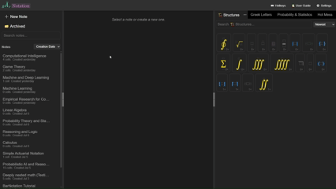

<p align="center">
  
</p>

<p align="center"><em>The mathematical note-taking app that truly raises the bar</em> 😎</p>

> [!IMPORTANT]
> Please visit the [Feature Design Voting](https://github.com/Kayyleigh/BarNotation/discussions/categories/feature-design-voting) Discussion category to vote on open design choices! These represent trade-offs that I can't fully resolve on my own, often because they come down to personal preferences or gaps in my understanding of the target audience. Your input really helps shape the project! 

# BarNotation

BarNotation is a real-time math note-taking app designed especially for students with hand pain in fast-paced lecture settings where writing detailed mathematical notation by hand can be painful and inefficient. An app like this is necessary because existing solutions (as far as I have found) do not allow complex structures such as actuarial symbols, nor do they provide easily customizable solutions to re-using sub-expressions. 

BarNotation enables users to build their notes as a sequence of "cells", either *Text* or *Math*, with intuitive keyboard entry, structural transformations, and drag-and-drop support for editing, reordering, and organizing notes and math expressions.

<p align="center">
  
</p>
<p align="center">
  <em>See the <a href="#-screenshots">📷 Screenshots</a> section for a visual walkthrough!</em>
</p>

---
> [!WARNING]
> This app is NOT production-ready. It is still unstable, untested, and under heavy development. Proper database design has been procrastinated, and due to an unfortunate lack of experience developing apps like this, performance optimization is an afterthought (where after = now 😭).

---

## ✨ Features

- **Cell-based note-taking**: Compose your notes as a series of *Math* and *Text* cells, inspired by the feel of a [Jupyter notebook](https://jupyter.org/).
- **Tree-structured Math Cells**: Math cells store structured math expressions using a node tree, with different node types corresponding to unique visual structures found in mathematics.
- **Hierarchical Text Cells**: Text cells can be marked as plain text, or section headers of 3 different levels, resulting in a hierarchical notebook.
- Re-order cells by drag-and-drop, duplicate existing cells, and insert new cells at any position.
- **Notebooks**:
  - Search and sort notebooks in the menu
  - duplicate, delete or archive notebooks
  - Search and restore archived notes
- **Smart Typing & Shortcuts**:
  - Type to insert basic (textual, inline) math
  - Use **hotkeys** (e.g. `/`) and **command sequences** (e.g. `\sum`, `\angl`, `\sqrt`) to transform input into fractions, sums, actuarial symbols, and more
- **Drag-and-Drop**:
  - Move math nodes within a cell
  - Copy math nodes across cells
  - Reorder notebook cells
- **Math Snippet Library**:
  - Save reusable math expressions to your personal **Library**
  - Drag entries from the library into any math cell
  - Create your own collections within the library, or use the premade ones
  - Copy expressions across collections by dragging them into other library tabs
  - Library entries are persistent and accessible across notebooks
  - Re-order the library tabs how you want and archive ones you don't need right now
  - Duplicate existing collections 
  - Archive collections you don't need right now
  - Search, preview, and restore archived collections 
- **Editor Modes**:
  - Work in visible cells using Edit Mode
  - Switch to Preview mode to see roughly how LaTeX would render
  - Toggle Locked mode to disable interaction and get a clean overview with minimal clutter. 
- **LaTeX Integration**:
  - View the LaTeX translation of math cells
  - Copy LaTeX with `Ctrl+C`
  - Drag math snippets directly into external LaTeX editors like [Overleaf](https://www.overleaf.com/)
  - Drag raw LaTeX directly into the math library to obtain the corresponding structured math

---

## 🧱 Supported Math Structures

BarNotation supports a growing list of structured math elements:

| **Type**                | **Node Interface**    | **Description**                                                                                                           | &nbsp; &nbsp; **Render Preview**&nbsp; &nbsp; | **How to Obtain**                                      |
| ----------------------- | --------------------- | ------------------------------------------------------------------------------------------------------------------------- | -------------------------- | ------------------------------------------------------ |
| `text`                  | `TextNode`            | A single character or rendered special symbol.                                                                            | <div align="center"></div> | Type directly |
| `multi-digit`           | `MultiDigitNode`      | A sequence of digit `TextNode`s treated as one number.                                                                    | <div align="center"></div> | Type multiple digits in a row |
| `command-input`         | `CommandInputNode`    | A sequence representing a LaTeX command. Turns into another node type when your sequence matches a known one.             | <div align="center"></div> | Start with `\` and type a sequence |
| `styled`                | `StyledNode`          | An expression with non-standard font. Some commands like `\lim ` automatically lead to styled "lim" (just like LaTeX).    | <div align="center"></div> | E.g. `\upright `, `\text ` |  
| `root-wrapper`          | `RootWrapperNode`     | Holds your math cell's expression, used in toLatex to turn it into a block equation.                                      | (None)| Auto-created once per MathCell |
| `inline-container`      | `InlineContainerNode` | Container for an expression (sequence of nodes).                                                                          | <div align="center"></div> | For every transform that leads to new child nodes, child is inline-container |
| `group`                 | `GroupNode`           | Bracketed expression.                                                                                                     | <div align="center"></div> | Type brackets. App recognizes when pair is found |
| `fraction`              | `FractionNode`        | A fraction with numerator and denominator.                                                                                | <div align="center"></div> | `/` or `\frac `|  
| `nth-root`              | `NthRootNode`         | A root with an optional index.                                                                                            | <div align="center"></div> | Type `\sqrt` |
| `big-operator`          | `BigOperatorNode`     | Operators with upper/lower bounds like `∑`, `∏`.                                                                          | <div align="center"></div> | E.g. `\sum `, `\int ` |
| `childed`               | `ChildedNode`         | Sub/superscript left or right of base, jump to new child depending on applied shortcut. Left side only reached by cursor. | <div align="center"></div> | `^` (= `Shift` + `6`) or `_` (= `Shift` + `-`) |
| `actsymb`               | `ChildedNode`         | Actuarial-style notation, same as above but app knows to use latex syntax as defined by the `\actuarialsymbol` package.   | <div align="center"></div> | `Side` + `height`, where `Side` is [`Shift` + `Ctrl` (left) or `Alt` (right)] and `height` is [`6` (up) or `-` (down)]
| `accented` (predefined) | `AccentedNode`        | Decorations above or below. | <div align="center"></div> | Type commands like `\hat`, `\angl`, `\bar` |
| `accented` (custom)     | `AccentedNode`        | Custom over/under annotations (overset/underset).                                                                         | <div align="center"></div> | `Shift` + `ArrowUp` or `ArrowDown` |

<!-- ## 📷 Screenshots

> [!CAUTION]
> This section may be outdated. Updating the walkthrough takes a lot of time, so I only update it after enough significant changes have occurred to the UI. The image in the [introduction](#barnotation) is kept up-to-date. This section was last updated on 08/07/2025 (July 8). 


### 📝 Main Editing Interface  
A simple, cell-based interface for math and text. Drag, type, and transform as you go.

Create new notebook and set Title, author and date:
<p align="center">
  
</p>
note: date is not synced with creation date. Creation date is for app usage so you better distinguish your collections, while the date metadata field is for the future latex export feature. 


Type directly into a rendered math expression! Use hotkeys and special command sequences to transfrom nodes into more complex structures:

<p align="center">
  
</p>

Insert text cells with plain text for your paragraphs, or turn them into section, subsection or subsubsection headers! 

<p align="center">
  
</p>

Not happy with the cell ordering? Drag the cell margin to move it to the desired spot! 

### 📚 Drag-and-Drop Library with Custom Collections 
Save any expression for reuse. Just drag it into the library panel, and back into cells whenever you need!


<p align="center">
  
</p>

Create your own custom collections! Copy math from notes, or **drag between tabs**.

<p align="center">
  
</p>

> [!TIP]
> 🤓 **Fun fact!** The library keeps track of how often you re-use each snippet, so you can sort by "most used" (among others)! Interested in seeing exact counts? Turn on **_nerd mode_** in settings.

### 🗂️ Power Features for Collections

#### ↕️ Reorder Collection Tabs  
Just drag to rearrange!

<p align="center">
  
</p>

#### 📥 Archive Collections You’re Not Using  
Wildly different courses this semester, but expect similar ones in the future? Archive your collections to de-clutter your workspace!

<p align="center">
  
</p>

Archived collections are searchable and previewable, so no worries if you named a dozen of them "My Collection".

### 📜 Preview Mode  
Check how your note would roughly render in LaTeX.

<p align="center">
  
</p>

In preview mode, you can see your section header numbering update in real-time!

### 🔒 Locked Mode  
When in preview mode, you can additionally **"lock"** your editor at any time to disable interaction, for a max clean overview of your notes!

<p align="center">
  
</p>

### 🔍 Fine-Grained Zoom Control
Global customizable zoom default, and separate zoom control per math cell so you can easily keep control over your deeply nested expressions

<p align="center">
  
</p>

### 🎨 Customizable Workspace 
Toggle math coloring for preview mode, set your (default author) name, toggle collection entry re-use visibility. You can also set the app to light mode, but its severe lack of visual appeal would bring too much dishonor to this walkthrough to show it here.

<p align="center">
  
</p>

### ⌨️ Hotkey Overview
See all hotkeys whenever you need! 
<p align="center">
  
</p>

> [!Note]
> A similar thing will exist for a full command sequence overview. The update for that will also contain the [planned autocomplete feature](#-roadmap).  

### 🗂️ Notebook Archive
Archive notebooks you no longer need in your workspace when you dont want to delete them. 

<p align="center">
  
</p>

### 🌍 LaTeX In and Out  
Hate my app, but enjoy the math library? No problem! Just drag your snippets straight into any LaTeX editor (here: [Overleaf](https://www.overleaf.com/)).

<p align="center">
  
</p>

Drag-and-drop:
- library to external (as long as external allows dropping - Overleaf does, but e.g. Notepad (on Windows 10, at least) does not)
- external to library: just drag raw latex and it gets converted into structured math!

Clipboard:
- external to math cell: just paste raw latex and it gets converted into structured math
- `Ctrl+C` inside a math cell will place the corresponding **LaTeX** of the node **left to your cursor** in your clipboard
- You can get the full LaTeX math block (i.e. `\[`...`\]`) with the LaTeX preview feature on each math cell. 

> [!IMPORTANT]
> Whatever is in your clipboard will also be transformed into structured math! I recommend pasting only valid LaTeX math, though, but if you paste some huge text in there you can simply undo it using `Ctrl+Z`. 

> [!NOTE]
> A later (in this case, soon!) update of BarNotation will enable full LaTeX exporting of a notebook, i.e., translate all cells to latex (hierarchy-aware for text cells!) and generate the preamble based on the metadata section (title, author, date) and automatically inferred required packages (for the forseeable future, only `actuarialsymbol` is supported as extra package).  -->

## 📷 Screenshots

> [!CAUTION]  
> This section may be slightly outdated. Since updating walkthroughs takes time, it only gets refreshed after enough meaningful UI changes. The image in the [Introduction](#barnotation) is always up-to-date.  
> _Walkthrough last updated: **July 8, 2025**._

### 📝 Main Editing Interface

BarNotation offers a clean, cell-based interface for blending math and text. Type, drag, and transform as you go.

<p align="center">
  
</p>

#### Create a New Notebook

Set your title, author, and date metadata when starting fresh:  
<p align="center">
  
</p>

> [!NOTE]
> The "Date" field is just metadata. Unlike the creation date (used for sorting), this one will be used in the future LaTeX export feature. It also does not need to be a date, e.g. I personally put "Y1Q2" on my notes if I want to indicate a course was from quarter 2 of year 1.

#### Type Into Math Cells

Type straight into rendered math expressions! Use hotkeys and command sequences to build complex structures.  

<p align="center">
  
</p>

#### Insert and Reorder Text Cells

Add plain text cells or upgrade them to section headers! Reorder cells by dragging the left margin.

<p align="center">
  
</p>

### 📚 Drag-and-Drop Library with Custom Collections

Save any expression for reuse: just drag it into the Library and back again whenever you need! Anything in the library is available to you **across the entire app**!

<div align="center">
  
  &nbsp
  &nbsp
  &nbsp
  
</div>

Create custom collections from scratch, dragging from cells or copying from other collections! Or you can duplicate an existing collection to save some time.

> [!TIP]  
> 🤓 **Fun fact!** The library tracks reuse frequency, so you can sort by "most used." Interested in exact counts? Turn on **_nerd mode_** in Settings.

### 🗂️ Collection Power Features

#### Rearrange Tabs
Organize your collections by dragging tabs into your preferred order.

<p align="center">
  
</p>

#### Archive Old Collections
Wildly different courses this semester, but expect similar ones in the future? Archive your collections to de-clutter your workspace! Search the archive and preview collection entries to find the correct collections back later.

<p align="center">
  
</p>


### 📜 Preview Mode

See how your note would roughly render in LaTeX. Including live-updating section numbering!

<p align="center">
  
</p>


### 🔒 Locked Mode

Need a distraction-free overview? Lock the editor in preview mode for a polished look.

<p align="center">
  
</p>


### 🔍 Fine-Grained Zoom Control

Change global zoom settings, but retain per-cell zoom control to handle deeply nested math without straining your eyes.

<p align="center">
  
</p>


### 🎨 Workspace Customization

Toggle math coloring, author defaults, and library reuse visibility. Light mode exists, but its current visual appeal would be a disgrace to my GitHub page. 

<p align="center">
  
</p>

> [!Note]
> The app is completely offline and local. Thus, the "Default author name" is not an account name, nor will it ever be visible to anyone else than yourself. It is purely there to auto-fill the "author" metadata field of notebooks you create after changing the name.   

### ⌨️ Hotkey Reference

Can't remember a hotkey? Open the cheat sheet anytime.

<p align="center">
  
</p>

> [!NOTE]  
> A similar cheat sheet for **command sequences** is coming soon! That same update should include the [autocomplete support](#-roadmap).


### 📓 Notebook Archive

Keep your workspace clean by archiving notebooks you don't need right now but still don't want to delete.

<p align="center">
  
</p>

> [!TIP]
> For anyone trying our BarNotation before the [planned soft delete](#-roadmap) is implemented, I highly recommend using the archive instead, and manually perma-deleting every once in a while. Better safe than sorry! 

### 🌍 LaTeX In and Out

Enjoy the library but not the editor? Just drag your math into an external LaTeX editor like [Overleaf](https://www.overleaf.com/).

<div align="center">
  
</div>

#### Supported Interactions

**Drag-and-drop:**
- From Library → External LaTeX editors (e.g., Overleaf ✅, Notepad ❌)
- From External → Library (raw LaTeX gets auto-parsed into structured math)

**Clipboard:**
- Paste raw LaTeX into math cells → gets parsed
- `Ctrl+C` in a math cell → puts the LaTeX of the node **left to your cursor** into clipboard
- To copy the **entire** math cell's LaTeX block, use the per-cell preview feature

> [!IMPORTANT]  
> Any pasted LaTeX will be interpreted into structured math. Accidentally paste a full novel? Just `Ctrl+Z` to undo.

> [!NOTE]  
> Full LaTeX **notebook export** is coming soon! It will:
> - Convert all cells into LaTeX (respecting hierarchy for text)
> - Use your metadata for title, author, date
> - Auto-detect required packages (for the forseeable future, only `actuarialsymbol` is supported)


## 📁 Project Structure

The app is built in **React** with **TypeScript** and uses **Vite** as the build tool.

<details>
<summary><strong>Click to view full file tree</strong></summary>

```
.
├── App.tsx                        # Root app wrapper, renders main layout
├── index.css                      # Tailwind import, unused elsewhere
├── main.tsx                       # Loads App in React.StrictMode
├── vite-env.d.ts                  # Vite environment type declarations
│
├── assets
│   └── logo.svg                   # Full logo used in MainHeaderBar
│
├── components
│   ├── cells                      # Core editor cell components
│   │   ├── BaseCell.tsx           # Shared logic for Math/Text cells
│   │   ├── InsertCellButtons.tsx  # UI for adding new Math/Text cells
│   │   ├── MathCell.tsx           # MathEditor cell 
│   │   └── TextCell.tsx           # Textarea cell
│   │
│   ├── common                     # General reusable UI components
│   │   ├── SearchBar.tsx          # Styled search bar component
│   │   ├── SearchBar.module.css   # Styling for search bar
│   │   ├── ToastProvider.tsx      # Global toast/alert handler
│   │   └── toast.module.css       # Styling for toast alerts
│   │
│   ├── editor                     # Main math note editor pane
│   │   ├── EditorHeaderBar.tsx    # Toolbar for math editor (zoom, latex toggle, etc)
│   │   ├── EditorPane.tsx         # Handles cell list and editor pane state
│   │   ├── NotationEditor.tsx     # Renders the math/text cell list (1 notebook)
│   │   ├── NoteMetadataSection.tsx # Title, author, date metadata
│   │   └── *.module.css           # CSS modules for components above
│   │
│   ├── icons
│   │   └── CollapseIcon.tsx       # Arrow icon for collapsing UI sections
│   │
│   ├── layout                     # Page-level layout components
│   │   ├── EditorWorkspace.tsx    # Wraps EditorPane and MathLibrary (also drag context)
│   │   ├── MainHeaderBar.tsx      # Header bar with logo/settings/etc
│   │   ├── MainLayout.tsx         # Page layout: header, sidebar, workspace
│   │   ├── ResizableSidebar.tsx   # Resizable note history/sidebar component
│   │   └── *.module.css           # Styling for layout components
│   │
│   ├── mathExpression             # Math editor internals
│   │   ├── MathEditor.tsx         # Interactive math input component (1 expression)
│   │   ├── MathRenderer.tsx       # Recursive renderer with interactivity
│   │   ├── MathRenderers.tsx      # Specific renderers for each MathNode type
│   │   ├── MathView.tsx           # Non-interactive renderer (e.g. in Library)
│   │   ├── LatexViewer.tsx        # Shows raw LaTeX output for 1 expression
│   │   ├── DummyStartNodeRenderer.tsx # Dummy node for beginning of container
│   │   └── *.module.css           # Styling for math display components
│   │
│   ├── mathLibrary                # Math library for saved/prebuilt nodes
│   │   ├── MathLibrary.tsx        # Displays saved/standard math expressions
│   │   ├── TabDropdownPortal.tsx  # Dropdown for library tab actions
│   │   └── *.module.css           # Styling for library panel
│   │
│   ├── modals                     # Overlay modal components
│   │   ├── HotkeyOverlay.tsx      # Overlay with keyboard shortcuts
│   │   ├── LibCollectionArchiveModal.tsx # Archive/restore library collection
│   │   ├── SettingsModal.tsx      # Overlay for user settings/preferences
│   │   └── *.module.css           # Styling for modals
│   │
│   ├── notesMenu                  # Note switching and actions UI
│   │   ├── NotesMenu.tsx          # Sidebar for switching between notes
│   │   ├── NoteActionsDropdown.tsx # Dropdown for rename/delete note
│   │   └── *.module.css           # Styling for menu components
│   │
│   └── tooltips
│       ├── Tooltip.tsx            # Tooltip wrapper for hover hints
│       └── tooltip.css            # Tooltip styling
|
├── constants
│   └── premadeMathCollections.ts  # Initial math collections for library
│
├── hooks                         # Shared hooks and contexts
│   ├── DragContext.ts             # Global drag context types
│   ├── DragProvider.tsx           # Provides drag context
│   ├── useDragContext.ts          # Access drag context
│   ├── useCellDragState.ts        # Drag state hook for cells
│   ├── useDragState.ts            # Node drag state (OUTDATED)
│   ├── EditorHistoryContext.tsx   # Global editor history context
│   ├── EditorHistoryProvider.tsx  # Provides history context
│   ├── useEditorHistory.ts        # Local editor history hook (OUTDATED)
│   ├── useHoverState.ts           # Hover state for math nodes
│   ├── useZoom.ts                 # MathEditor zoom state hook
│   ├── toastContext.ts            # Toast context provider
│   └── useToast.ts                # Hook for showing toasts
│
├── logic                         # Math editor state and input logic
│   ├── cursor.ts                  # Cursor position in expression tree
│   ├── deletion.ts                # Handle backspace/delete logic
│   ├── editor-state.ts            # Core editor state (node + cursor)
│   ├── global-history.ts          # Full notebook history state
│   ├── handle-keydown.ts          # Keyboard input handler
│   ├── history.ts                 # (OUTDATED) local editor history
│   ├── insertion.ts               # Text/char insertion logic
│   ├── navigation.ts              # Arrow key navigation logic
│   ├── node-manipulation.ts       # Insertion/deletion of nodes
│   └── transformations.ts         # Node transforms (e.g., fractionize)
│
├── models                        # Data types and model logic
│   ├── latexParser.ts             # Parse LaTeX into MathNode tree
│   ├── libraryTypes.ts            # Types for saved library items
│   ├── nodeFactories.ts           # MathNode constructors
│   ├── nodeToLatex.ts             # Convert MathNode to LaTeX string
│   ├── noteTypes.ts               # Note/Cell/Metadata type defs
│   ├── specialSequences.ts        # Shortcuts like \frac → FractionNode
│   ├── transformations.ts         # Alternate transforms (legacy-ish)
│   └── types.ts                   # Core MathNode and variant types
│
├── styles
│   ├── accents.css                # Accent math node styling (hats, tildes, etc)
│   ├── cells.css                  # Cell styling (insert zones, focus, etc)
│   ├── hotkeyOverlay.css          # Hotkey overlay + settings shared styles
│   ├── latexOutputColoring.css    # LaTeX viewer syntax highlighting
│   ├── math-node.css              # Current math node styling
│   ├── math-node-old.css          # Legacy math node styling (unused?)
│   ├── math.css                   # Legacy general math styles
│   ├── settings.css               # Styling for toggles/settings UI
│   ├── styles.css                 # Global styles for layout and overlays
│   └── themes.css                 # Theme + DOM defaults + scrollbar overrides
│
└── utils
    ├── accentUtils.ts             # Decorations for accented nodes + required packages
    ├── bracketUtils.ts            # Bracket types and characters
    ├── collectionUtils.ts         # Init functions for math collections
    ├── mathHoverUtils.ts          # Hover behavior for math nodes
    ├── navigationUtils.ts         # Cursor/child traversal logic
    ├── noop.ts                    # Empty function used in MathView (non-interative Math render)
    ├── subsupUtils.ts             # Sup/subscript position helpers
    ├── textContainerUtils.ts      # (Unused) splitting container logic
    └── treeUtils.ts               # Tree update, find nodes, get logical children
```
</details>

> [!NOTE]
> Since this app is under heavy development right now, this filetree is already outdated. I will not keep it up-to-date between larger working versions of the app, since files frequently get added, deleted, renamed or modified. 
> _Filetree last updated: **??? (Before July 8. Will update this soon probably)**._

---

## 🚀 Getting Started

### 1. Clone the repo
```bash
git clone https://github.com/Kayyleigh/BarNotation.git
cd BarNotation
```
### 2. Install Dependencies
```
npm install
```
### 3. Run the development server:
```
npm run dev
```
The app should now be running at http://localhost:5173.

--- 

## 🧠 Usage Tips

- **Insert a new cell**: Use the "+" buttons between or after cells, or in the editor header bar
- **Transform math**: Type a command like `\sqrt`, then hit space. Known commands are based on [LaTeX](https://www.cmor-faculty.rice.edu/~heinken/latex/symbols.pdf)!
- **Move/Copy math**: Drag elements directly within or between cells
- **Save reusable math**: Drag math to the Library panel on the right
- **Copy LaTeX**: `Ctrl+C` copies the LaTeX of the node left of your cursor
- **Reorder notes**: Drag the left margin of a cell up/down
- **External drag**: Drag snippets from the Library to apps like Overleaf. They paste as LaTeX!

---

## 🔮 Roadmap

Planned features and improvements include:

- [ ] Enable custom library zoom level
- [ ] Implement soft delete, i.e. all deleted notes, collections and entries move to a bin so they can be recovered for a little bit before perma delete. (Especially entries since those are easy to accidentally delete)
- [ ] Proper persistent storage (I currently put everything in the browser localStorage)
- [ ] Full notebook export as LaTeX
- [ ] Customizable hotkeys
- [ ] Overview of existing command sequences
- [ ] Autocomplete of existing command sequences when typing in `command-input` nodes
- [ ] Proper user guide 
- [ ] Bulk select of collection entries (for copying to another collection or bulk-delete)
- [ ] Advanced search in collections and/or notes on inclusion/exclusion or depth of math node type(s)
- [ ] Enable custom names on collection entries, and include it in search logic. Can be a button on hover, but single char is so small, I think either "edit mode" or a new modal for modifying entries (name, node, count). Latter may be overly complex for what it adds to the experience
- [ ] Add `binom`, `vector` and `matrix` math node types
- [ ] Add `cases` math node type
- [ ] Add `multiline-equation` math node type
- [ ] Proper bracket handling (right now all brackets become parentheses, while LaTeX has fancy stuff to make the brackets as tall as the stuff inside)
- [ ] Better error handling and onboarding experience
- [ ] Very unsure about this one, but I want to look into allowing inline math in text cells too (probably much less interactive than the math cells) because you can see in the screenshots section that writing "... with parameters mu and sigma" is just kinda ugly and definitely going to be a common issue in real-world settings

> [!NOTE]
> This is not an exhaustive list, nor is it chronologically ordered. Some of these may already exist on other branches. 
> _Roadmap last updated: **July 8, 2025**._


---

## 👩‍💻 Contributing
This is my first time pushing a project of this size out into the world. However:
- The app is structured for extensibility, especially around:
  - Adding new math node types (though this part is not as easy as I planned; the latex parser is not very extensible right now)
  - Creating new cell types
  - Defining new command sequences
- Issues and feedback are appreciated!

---

## 🤝 Acknowledgements

- Built with [React](https://react.dev/), [TypeScript](https://www.typescriptlang.org/), and [Vite](https://vitejs.dev/)
- Math editing and rendering inspired by [LaTeX](https://www.latex-project.org/)
- Overall editor behavior, layout, and styling inspired by [Jupyter Notebook](https://jupyter.org/), [Overleaf](https://www.overleaf.com/), and [Visual Studio Code](https://code.visualstudio.com/) 


---

## 🗣️ Feedback

Have ideas or suggestions? Found a bug?  
Please [open an issue](https://github.com/Kayyleigh/BarNotation/issues). Your feedback helps me improve!
