# Actuarial Math Notation Tool
## Introduction
When not given access to lecture slides, students have to take notes in class. Doing so on paper is painful for students with chronic pain. Digital note-taking may help, but this is difficult when mathematical notation is involved. In particular, actuarial notation requires accents and sub-/superscripts that are often not available in tools such as {TODO}, or take long to find in menus (in e.g. Word) or type out (in e.g. Latex packages that enable actuarial notation).

This document describes and designs an application that enables the creation of mathematical notation, with a heavy focus on user freedom and ease-of-use. The goal is to enable math students with chronic pain to take lecture notes of math notation digitally, quick enough to not be restricted to physical writing when trying to keep up with the lecturers during class. The application focuses heavily on user freedom and minimal pain, always keeping in mind this use case. To avoid overcomplicating the app, it is meant to be used exclusively for math notation, meaning the user should still type surrounding textual lecture notes elsewhere.

The remainder of this document is structured as follows. First, background information is needed on chronic pain to find out what types of movements (i.e., drag/type/click) are beneficial or should be prioritized/avoided. Next, the building blocks of actuarial notation are examined, as this is necessary before deciding on the underlying data model(s) of the system. Afterwards, I look into existing tools for digital math notations to find out what conventions this application should follow as well as what features are missing in existing tools and should thus be included here. Next, I outline the requirements of the application.

## Background

### Chronic Pain
https://pubmed.ncbi.nlm.nih.gov/22270231/

### Actuarial Notation
sources:
- https://www.casact.org/sites/default/files/database/proceed_proceed49_49123.pdf (fancy, old, original)
- https://ctan.math.illinois.edu/macros/latex/contrib/actuarialsymbol/actuarialsymbol.pdf (best)
- https://ctan.math.illinois.edu/macros/latex/contrib/actuarialangle/actuarialangle.pdf (just the angle?)
- https://en.wikipedia.org/wiki/Actuarial_notation (probably where client got the image they sent in dc)

elements to add still:
- underline (accent?)

elements that are missing in 


### Existing Tools
Sources:
- Overleaf (or other latex editor but idk any). This is where the libraries from the actuarial notation subsection can be used. That takes a lot of writing (cuz you need to know the commands for these symbols, and esp. if you are in a new lecture you can get sth you never saw b4 and thus dunno the command)
- https://editor.codecogs.com/ (single-line text editor with buttons for sub-menus of clickable units that can be inserted. has to-latex parsing. And dragging! I think)
- https://www.mathkeyboards.com/custom-buttons (TODO if this is free then def check it out and see if custom can be made for actuarial. However, still has limitation of: if new symbol encountered in class, u ar fukt)
- https://math.typeit.org/ not good enough for actuarial
- https://www.imatheq.com/imatheq/com/imatheq/math-equation-editor-latex-mathml.html I think does not allow sub-/superscripts on the left side of symbols, but is a good source for types of units that should exist (e.g. matrices etc I have no thought abt much)
- https://www.geogebra.org/graphing?lang=en Geogebra my beloved, but sucks hard for this use case
- Word's built-in equation editor. Goated but takes a while to make the actuarial stuff, and esp. some of the symbols in the fav latex package may be impossible (the crosswordy ones)

https://www.reddit.com/r/OneNote/comments/12ejg2b/how_to_write_math_equations_in_onenote_answer/
https://www.reddit.com/r/OneNote/comments/qjx629/how_do_i_type_math_expressions_faster_in_onenote/

https://www.youtube.com/watch?v=FZT7V97nrQY LyX looks really cool

MathType is best (?) but not free

Best 2 solutions:
- continue with init plan; make super free canvas of broadening & deepening expression tree with no semantics. Good for complete freedom but to allow those diabolical ones, since it does not know semantics, I need to allow diabolical on all symbols. This will clutter the expansion options. (plus idk yet how to make that dispaly with proper spacing, and how to deal w e.g. matrices or multi-line stuff)
- make actual meaning, i.e. diff structures get diff underlying data model. So basically, like already existing stuff but WITH actuarial things, and enable dragging of predefined symbols/structures OR saved expressions OR sub-parts of the same expression (but not direct ancestor), into places. I am starting to prefer this option A LOT

## Planned Solution and Alternative Options
TODO rewrite: this section normally doesnt exist in tech writing but I include it cuz there are some design choices to be made, and if client hates current plan then its good they know there are other options and what tradeoffs they each have.

Basically: valid syntax w set structures, or complete WYSIWYG blank canvas that allows for structures that don't make sense at all in math. Former means I have to know all the stuff the client uses in their life; latter is way freer but harder to parse & display nicely

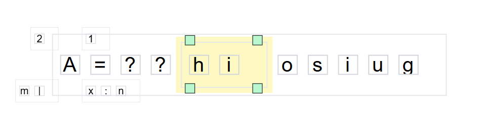

**Current plan**: focus on user freedom; workspace starts with a single place to type, and as soon as you type a character, you get access to a bunch of other locations in the canvas where you can add new characters. These are not restricted to valid mathematical semantics, but the possible locations are inspired by the locations that mathematical notation normally makes use of. Thus, a sweet spot between user freedom and parseability
**Alternative Solution #1**: TODO find out if possible: just have buttons for actuarial units and a parser to valid latex and/or word equations. Pros: very quick implementation; no need for storage; simple usage. Cons: no ability to add new structures when lectures introduce something unexpected; during note-taking need to switch betw the app and another (e.g. word, overleaf); if client likes a notation tool that does not support the ones I build parser for, the desired notation cannot be obtained.
**Alternative Solution #2**: alt solution #1 but add functionality to create and save own structures? TODO think about how that would be implemented (if possible). Kinda similar idea to current plan, but with latex writing instead of expanding UI? Con: still cannot take quick notes if encountering something completely new in class. 

TODO rewrite: these solutions lead to wildly different applications. I will be assuming the current plan for the remainder of this doc. Maybe add images of how the remaining options could look, to give the client a choice to abort everything and go for an alternative if that is what they prefer.

## Requirements of the Application
TODO rough req elicitation process:
- (that one discord msg 
- conclusions from background section) 

TODO mention that these reqs are flexible cuz custom app so client can request changes to this section

Requirements are often formatted as user stories (TODO cite). For example, a user story could state: "as a student with chronic pain, I want to use tabbing to navigate the UI to minimize pain due to mouse movements". I believe that my knowledge of chronic pain as well as actuarial math are insufficient to make any assumptions about the user's needs. Therefore, I format the requirements from my own perspective, explicitly stating the assumptions I make as well as the rationale behind them. 

### Functional Requirements
Functional requirements describe the behavior or functions of the system. They essentially represent the features that are present in the application. I prioritize the functional requirements according to the MoSCoW method (TODO cite?). This method splits the requirements into four levels: (1) Must-haves, which make up the Minimum Usable Subset; (2) Should-haves, which are important but not critical; (3) Could-haves, which would improve, e.g., user experience; and (4) Won't-haves, which are left out of the current development despite being desirable. While the MoSCoW method is primarily useful when budgets and time constaints are present, I follow it for this project to define clear intervention points (i.e., after each category) where the system can be reflected upon. Moreover, due to the lack of a deadline, the _Won't-have_ category contains desirable features that I do not yet know how to implement, but may be explored after "deployment". The following functional requirements are identified:

**MUST HAVE**:
- todo: any expression that is in that fav source (the latex package)
- any expression that is in my own prob & stats notes
- any expression that is in my own calculus notes (may be limited cuz idk wtf is calc II and III, I had 1 course)
- any expression in my own lin alg notes
- any expression in my own Game Theory notes (only 1 lecture but it was huge)
- simple textual notes field for each expression? Seems useful, after checking my own notes

**SHOULD HAVE**:
- todo

**COULD HAVE**:
- todo

**WANT TO HAVE BUT WON'T HAVE (YET)**:
- todo

### Non-Functional Requirements 
Non-functional requirements specify criteria that the application should meet regarding e.g. usability, scalability, and performance. The application can still function without these, but for the purpose of this specific application, it is crucial to keep in mind usability in each step of the development process. The following non-functional requirements are relevant:
- todo
-
-


## Description of the Application 
TODO keep moving this stuff to reqs

The following UI/UX functionality is needed:
-
-
-


Later, the following functionality will be added to the app to allow proper integration into the life of a student who uses it repeatedly when taking lecture notes:

1. **Saving notations**: notations should be saved with some metadata, including a title and the time that the notation was saved. These will enable the user to look back at their lecture notes later. Saved notations will be visible in a menu on the right side of the page at all times (perhaps collapsible). Selecting a saved notation should load it into the current canvas, enabling editing and deletion. 
1. **Unsaved notations**: If the user opens a saved notation while the canvas in not empty, the user should be prompted whether they want to throw away their current canvas or save it as a new notation first.
1. **Drag saved into canvas**: Dragging a saved notation into the current canvas will deep-copy the notation as a new math unit and place it at the node where it is dropped into the current canvas. 
 
2. **Parsing**: Parser to Latex (or other). This function is separate from the UI as it only depends on the data model. However, this will require extra consideration into the precedence rules of my loosely defined "math", and how to deal with ambiguity. Freedom should always be prioritized over semantic validity, because the main goal of the app is to allow speedy note-taking comparable to writing on paper, where anything is possible.
2. **Parser output**: The UI should contain a (collapsible?) box at the bottom, where Latex (or other; if more formats are implemented, these will be mutually-exclusively selectible using e.g. tabs inside this specific UI box) is parsed. While parsing would ideally be done in real-time, the way that I define math most likely means that the majority of notations are invalid or ambiguous mid-editing. To avoid unnecessary pressure on the user to fix the validity of their notations, a having to press a button to parse it may be preferred. This way, the application may also feel less like a latex-parser and more like the free canvas it was designed to be.

1. **Save to image**: TODO

The following functionality would be really cool, but is not my priority (yet) due to implementation complexity or uncertainty of whether added functionality may slow down usage too much (which would go against the purpose of the app):
1. **Tags on saved notations**: the user may want to add tags to their notations, e.g. to indicate that the notation is part of a certain course. These tags should then be possible to filter on, in the UI element that holds saved notations.
2. **Parser feedback**: On parse failures, the parser could tell the user why the failure happens and what they could change to make their notation valid for parsing.


Design choices that the client may want to have the final decision on:
- 

Notes on parsing to what? 
- latex
- word? Uses MathML (https://www.w3.org/Math/whatIsMathML.html)
- obsidian? Uses latex
- other?

## Requirements
Things to mention:
- this is an offline tool. No auth, no conn protocols, etc. All notation is locally stored. This is because there is no reason to make it fancy when all you need is a notation tool. 


## Design of the Math Notation Tool

### Definition of "Mathematical Notation"
TODO insert stuff abt this from other place I typed it. Also add a flowchart(?) of this design, showing an example notation vs its representation in my system, where all types of MathUnits are utilized

This mathematical notation tool is meant for actuarial math students with chronic pain. The application must enable complex math notation, including actuarial symbols. Since the application is not meant as a parser of valid math, but rather a tool to restrict the user as little as possible while promoting speed (following reasonable restrictions within mathematical notation), I define "math" more loosely: 
TODO maybe put picture instead of the data model; put data model in Design? or picture too
- A mathematical unit can be a **group** of mathematical units, or a **single unit** (i.e. a leaf). 
- A mathematical unit can have up to 4 children, which are also math units. These children are called `ul`, `ur`, `ll` and `lr`, representing **super- and subscripts** on the left and right side of the main symbol. 
- Math units can be **decorated**: a group can have: a "joint" decoration XOR a "angl" decoration (but more options may be added later); and a leaf can have an accent ("tilde", "bar", etc.; there will be a list of possible options here).


### Software Architecture Design Choices
- React?
- database stuff =? 
- here put data model?

### User Interface Design Choices

- pictures of the current version
- UI design of the final version (make it clear that it is not exisitng yet)

## Testing the Math Notation Tool
### Testing the Code Quality
I'll think about it :)
### User Testing
Only client can do that


Notes:
- Github is used by myself, itll be on private for now
- Maybe no unit testing because I do not enjoy it AT ALL, so yeah the application may fail
- If this all ends up existing, I recommend user testing w client at least once before actually using it irl. It'll be iterative-ish procedure where every time something breaks, I'll fix it? 

## Ethics, Safety, Privacy, Blabla
- Privacy concerns when making the github public cuz this doc is talking about "actuarial math students with chronic pain who do not get access to lecture slides" - getting kinda specific?
- No issues except make sure the user does not think I am giving them virus or sth 
- Be clear abt offline tool = no issues; no auth etc so no passwords, yadayada
- Misuse of the application only disadvantages yourself

## Conclusion and Final Notes
- short summary of all this
- notes on that I am just human and this will all change and maybe be in the bin and maybe when user will try it out, the UI will be super duper fucked and weird, etc.
- Basically end with the question of whether the client is even interested in this

---
# Dev-log

## First version (05/05/2025-08/05/2025)

### 05/05/2025 
Made initial version. It cannot do operators yet, but the boxes are working (using buttons on hover)

Current biggest issues:
- Enable tree broadening by typing >1 char in node. Current plan would expect operators, but perhaps there is no harm in accepting any? I am not building a language, and want to avoid restricting the user by adding unnecessary complex procedures for continuing expansion of the tree.
- Enable tree broadening to the left as well, e.g. when you have "A" and you try to make it "+A" because you are aiming for "1+A"

Next steps:
- Fix spacing of initial node's children (should always be right next to the symbol - in the places where sub- and superscripts normally go)
- Fix positioning of children
- Make children ~half the size of the parent (in case of sub/supscripts; NOT in expressions)
- Boxes should show on hover of the place where you expect the child, rather than clicking a button
- Only allow child creation when parent is not empty

Next stage:
- Ctr+z should undo box creation 
- Add options for \joint xor \angl (non-single math units)
- Add options for accents (single math units)
- Summations, "{", etc. 

Later Stages:
- Latex parsing
- Save images
- Drag & drop saved 
- Shortcuts for characters that are not on keyboard (as alternative to selecting or dragging from a menu)
- dark mode

### 06/05/2025
- Now allowig children only on hover by adding `{unit.value !== '' && hovered && (`
- Decent boxes now; still with buttons but the boxes shrink with tree lvl and only start overlapping after triple nested in certain places

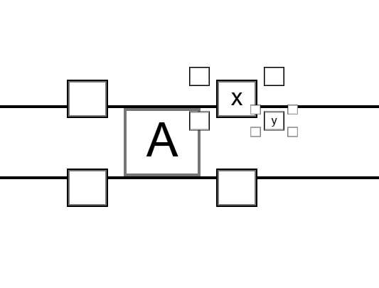

- made child boxes creation in loop for minimal hardcoding

Current problems (/solutions):
- If child box selected, should not disappear on stop hover
- If 1 char typed, do not de-select (should allow typing "x+1" without clicks) --> by default, the "add new" box should be selected
- should not delete children of singles when turned into group
- length of child box should anchor to corresponding corner (i.e., LR and UL should expand to the right)
- background color not working
- when splitting into group, afterwards you cannot split further into sub-groups. fix it

Changed translations of percentages to .5rem to make sure length of child does not influence distance from parent

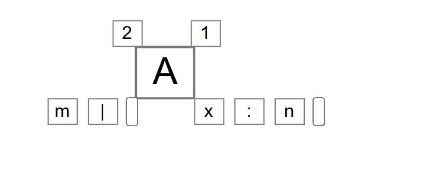

Next steps:
- enable adding on-level anywhere (not just at very right)
- make split-into-group auto select the adder
- make init box a group box to ensure children are not shared when adding a sibling
- accents and decorations

Current progress (23:54):
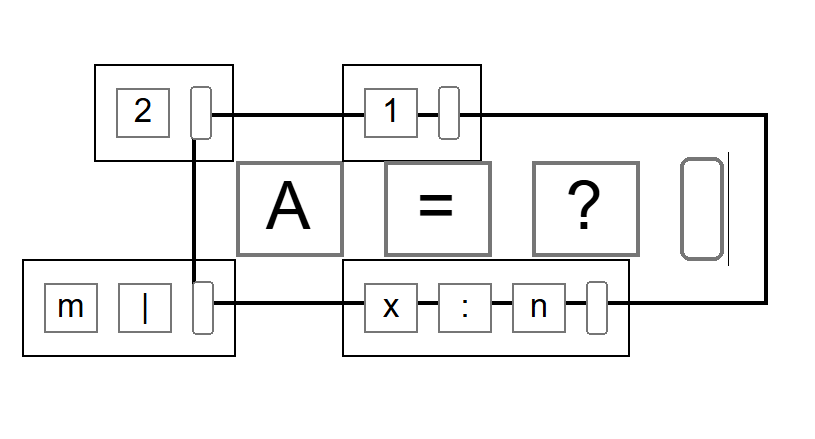

Next steps:
- do the thing with the group feeling like text input (insert anywhere, etc)
- ability to drag units? I would like to enable at least dragging a leaf from a size-2 group to a different leaf (e.g. in its parent), such that the other leaf and the dragged item become a group, and the size-2 group is reverted back to a leaf
- multi-selection of nodes should enable wrapping into a group

### 07/05/2025

Current implementation also allows e.g.:
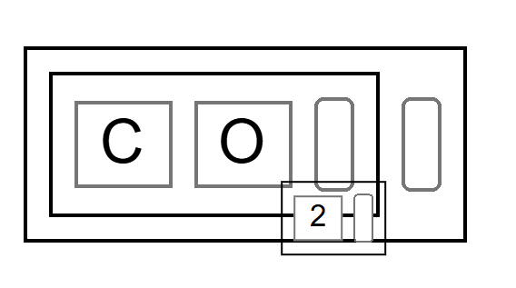

Brackets are not dealt with in any sophisticated way:
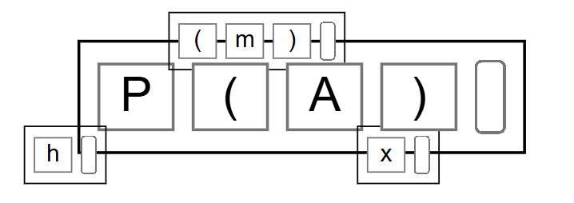
This is the freedom/parsability trade-off. The current implementation allows stuff like this: 
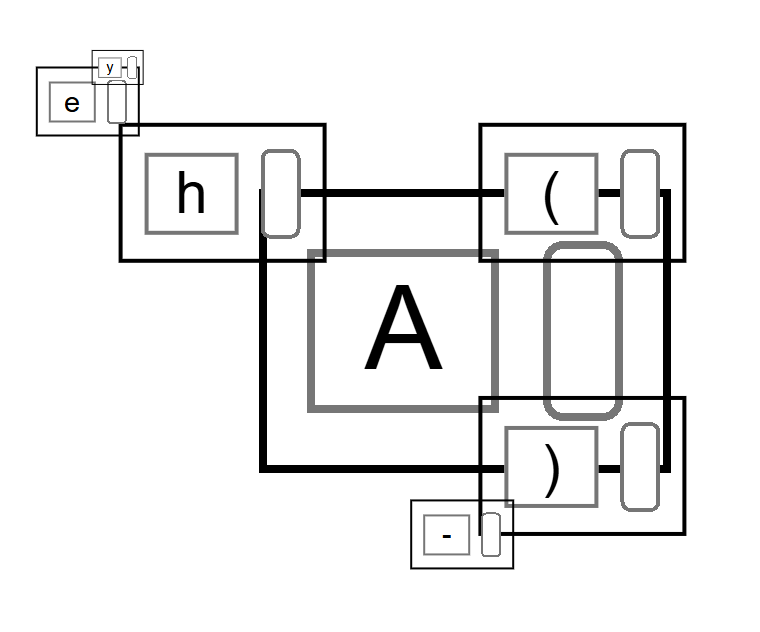 
... which you probably don't need, but for a math notation tool the goal is to enable the user to type out notation as freely as possible, just as they are allowed on paper. There is no benefit here in restricting the user to type in valid math, except in parsing, which is not the main functionality this application aims for because restrictions likely increase difficulty of usage

Found out that tailwind wasnt working at all, fixed it by doing @import "tailwindcss";. Now it looks more usable but the child boxes are fucked

Little less fucked but must ensure either child position depends on its size, or siblings are shifted to avoid extreme overlap

Fixed sizing of children

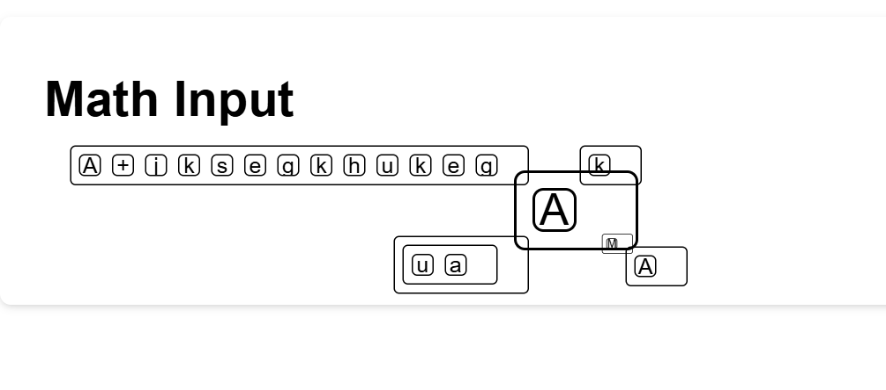

When allowing accents and decorations, also allow adding a decoration on a leaf (and turning it into a group in the process!)

next steps:
(DONE) switch all l&r, u&l because atm the corners are exactly wrong 
- The thing where it takes sibling length is fucked. Change it. It's exactly working on the type of situations where I do not need it. I should have the width be done automatically somehow if possible; really not good to be passing these recursive shits all over.
- enable grouping neighbors in flex on some multi-selection 
- drag, & allow in any idx
- make length depend on children
Only after that:
- accents and decorations
- parse normal nodes to `_{LL}^{UL}{Symbol}_{LR}^{UR}`
- parse group nodes to just the symbols next to each other, or in brackets?
- math canvas should not overflow
- Should have option to decrease size of math text (keep in mind e.g. partial-screen use)

Perhaps after that start making the functionality for saving (and loading prev) notations
After that: summations and special cases
Then go for amazing kerboard controlling & shortcuts

---
Switched order or children on tabbing: now UL -> LL -> UR -> LR. But think again about how it usually would work, I think I based it on chemistry now

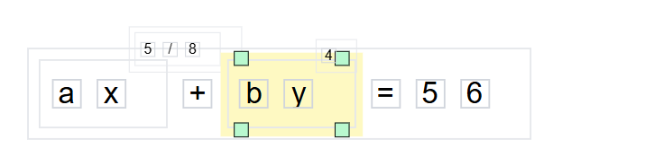

Switched order again cuz felt better

Would like to make the bg color of children of hovered green, but probably complicated

keyboard stuff:
- if at end or start of box and right or left arrow (resp.), leave box, go to the next insertion position (unless sth changes when implementing that).
- if drag item, allow drop in any position except any of its own descendants. 
- if backspace on empty box with no children, destroy. EXCEPT in last box; then backspace should send you to prev box  

tradeoffs to consider:
- make `^` and `_` send you to child boxes? (Good for speed?) Leads to inability to type these characters normally in the notation
- should `/` make it a fraction? (would require extra stuff w. brackets for proper rendering) 

### 08/05/2025
Gotta refactor everything maybe because this is going in the bin.

## Proper Design (08/05/2025-???)

### 08/05/2025
Added a section to the start of this document, outlining the application design properly (similar to how it is taught in my uni).

Thought on matrices: I currently define groups as left-to-right stuffs. Is it not just best to define grid instead? That fixes the issue with that one actuarial symbol that looks like a crossword or sth, and simultaneously enables matrices (and actual crosswords LOL)

Current plan:
1. 
2. Make an Overleaf for the actual "report" (potentially to show client)
3. 

MathML (does not work for Word... but works in md lol):
<math xmlns="http://www.w3.org/1998/Math/MathML"><mrow><mrow><msup> <mi>x</mi> <mn>2</mn> </msup> <mo>+</mo><mrow><mn>4</mn><mo>&InvisibleTimes;</mo><mi>x</mi></mrow><mo>+</mo><mn>4</mn></mrow><mo>=</mo><mn>0</mn></mrow></math>

Going to re-define math. So far I have been caring abt only 2 types of structures. MathML docs explain nicely how they do it, so I can easily see what important structures I am missing. Let's design the whole thing before re-implementing it. By first going over the MathML docs and then over the docs of the Actuarial notation Latex to see what is missing 

angln in mathml: (not working)
<math xmlns="http://www.w3.org/1998/Math/MathML"><msub><mi>a</mi><mrow><menclose notation='actuarial'><mi>n</mi></menclose><mo>&#x2063;<!--INVISIBLE SEPARATOR--></mo><mi>i</mi></mrow></msub></math>

note:
any left bracket should create a right bracket to the right side of the last selected character (if none selected then that means cursor) (and left bracket to the left ofc). Except if there is an un-opened closing bracket?

structure types:
- central + max 4 children
- horizontal rows
- vertical stacks
is it possible to have everything always be a grid, where you can expand up/down/left/right, as well as deeper/shallower (resp. for sub-grouping, and jumping to sibling), and 4 optional children? Sounds like too many directions for proper usability, esp. w also accents and deco. Also how to ever parse to latex

Tomorrow: start over with the alternative solution (i.e. math with semantics). Start by taking some diabolical examples from the actuarial package and other math notation expected in actuarial science. Draw out the tree for each example. see what data models I'll need. Then ask chatGPT if it is physically possible to implement it in such a way that structures are draggable and the spacing is clean. If so, implement an initial version. After that, the 2 solutions can be compared and it's possible to ask the client if they are interested in either. And esp ask if they tried existing solutions; and if the proposed solution(s) solve the problems encountered w existing ones. And at some point ask about struggles related to the pain cuz hard to find info when googling. Googling about mouse usage with FM leads to animal experiments; everyone else only cares about brain fog or Speech-to-Text; all actual stuff I found on FM + HCI issues is for old people (and often only women) with only percentages, not actual differences betw options such as keyboard shortcuts and dragging blabla which seems very important to the client so is good to know more abt their personal experience cuz this is an opportunity to make a completely custom tool that is exactly designed to be as painless as possible for the client

### 09/05/2025
Started Overleaf 
Made first version of extremely incomplete semantic-aware version
Is very bad, cannot handle nested?!
Can handle nested now
Also may have some starting point for dragging

Next steps:
- bring back the input fields in render blocks by putting stuff from MathNodeView.tsx to render.tsx.
- Add bracket node
- add operator (/expression) node
- find out if Integral and Summation are best in same node, with some enum? or separate?
- make "insert" (i.e. click menu) not replace all

### 10/05/2025

Need the sweet spot in generalization of underlying data types
Things to consider:

e.g. when typing an integral: 
1. the system could be aware that it is an integral and already place "d⬚" -> notations are made with minimal typing
2. Alternatively it could just be a symbol that you insert, and the d⬚ is your own responsibility -> notations are made with minimal moving around (or in other words, you don't get thrown into restrictions due to the semantic validity)

For this app:
- all notation should exist; i.e., the graphical layout of math should be represented rather than its semantics (user is taking lecture notes; semantics are their responsibility similarly to how handwritten is)
- underlying data model should be designed in such a way that it can also be disambiguated into Latex, preferably 

The integral is especially a good example here cuz ideally, latex would take "\," before dx for a tiny space.

some random source I found on latex math: https://www.cmor-faculty.rice.edu/~heinken/latex/symbols.pdf
I will now categorize it all into how many children:

0 children (= Leaf):
- any mathematical character, operator, etc
- any common function name (e.g. sin, cos, deg)

1 child:
- overline
- underline
- widehat
- widetilde
- ...
- underbrace
- ANY accent

2 children:
- frac
- sqrt\[n\]

many chidlren:
- \begin{array}{cols} row1 \\ row2 \\ . . . rowm \end{array}

From this, it seems that all I need is: 
- normal typing of leaves (+ menu containing characters that don't exist on keyboard)
- single-child nodes for accents and decorations
- double-child nodes for fractions and roots
- 


1. BaseNode
Purpose: Base class for all nodes.
Children: None

2. MultiCharacterNode
Purpose: Represents multi-character terms like variables, numbers, and operators.
Children: List of CharacterNode.
UI Behavior: Handles typing expressions like x+5, allows easy manipulation and transformation into other node types.
3. CharacterNode
Purpose: Represents a single character.
Children: None.
UI Behavior: Displays a single character, allows accents or transformations.
4. DecoratedNode
Purpose: Applies an accent or decoration to a single child node.
Children: 1 child (CharacterNode or MultiCharacterNode).
UI Behavior: Allows user to apply decorations like \hat{}, \bar{}, etc.
5. GroupNode
Purpose: Groups sub-expressions, enabling transformations or operations on them.
Children: 1 or more nodes (could be MultiCharacterNode, OperatorNode, etc.).
UI Behavior: Makes sub-expressions into a group (e.g., x + 5 could turn into (x + 5)).
6. BigOperatorNode (Previously SummationIntegralNode)
Purpose: Represents any large operator (like summation, integration, or others).
Children: 1 child for the expression (e.g., summand, integrand), Optional LimitNode for the lower and upper bounds.
UI Behavior: Handles both summation (∑) and integral (∫) notation, but can be extended to other big operators.
7. SubSupScriptedNode
Purpose: Represents a node that can have subscript, superscript, or actuarial notation.
Children: 4 optional children:
Base Node (the core element, like x in x^2 or x_1).
Subscript (optional, for subscript notation).
Superscript (optional, for exponent notation).
Actuarial/Other Accents (optional, for notation like hats or bars on characters).
UI Behavior: Flexible UI that lets users apply subscripts, superscripts, and accents on a single node.
8. LimitNode
Purpose: Represents limits, used with BigOperatorNode (or other large operators).
Children: CharacterNode (the limit value).
UI Behavior: Represents the limit in an expression.
9. MatrixNode
Purpose: Represents a matrix.
Children: List of MatrixRowNode (each row contains multiple elements).
UI Behavior: Lets users add rows/columns to a matrix.
10. VectorNode
Purpose: Represents a vector.
Children: List of VectorElementNode.
UI Behavior: Allows vector expansion or modification.
11. FractionNode
Purpose: Represents a fraction.
Children: 2 children (NumeratorNode, DenominatorNode).
UI Behavior: Allows creating fractions by dragging and dropping.
12. AccentNode
Purpose: Represents an accent on a character.
Children: 1 child (CharacterNode or MultiCharacterNode).
UI Behavior: Applies accents like \hat{}, \bar{} on individual nodes.

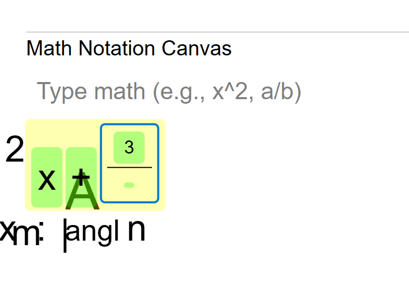
Have something that "works" but it's super unusable

### 11/05/2025 
Found out that Actuarial needs to change; there is no UR child. All characters and groups should be allowed to have a number (at least 1, 2, 3) as decoration

Also I should really fix the way that typing works. Like omg at least allow the user to type more than 1 char without being de-selected

Did some stuff related to decorations. There are now decorations for i,ii,iiitop- and bottom, and some others but have not tested all. They also light up on hover for testing purposes.


So now Actuarial does not have UR child :)

### 12/05/2025
I have a working editor that is not even that fucked, like omg it actually enables typing with some perceived affordance and feeling like a text editor even though I do not use input fields. 

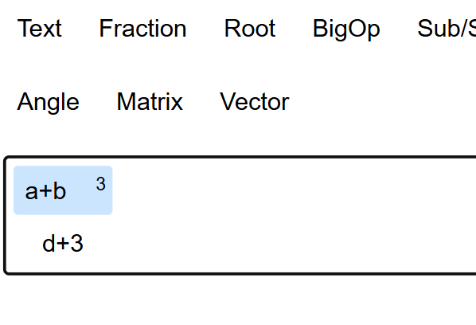

Next steps:
- fix that problem w right arrow on non-text
- do not wait for Dead+^, but rather shift plus 6?
- enable deletion of subsup "wrap" on backspace when all are empty (but maybe only on the "first" child and have the others be like leftarrow cuz all 4 children always exist if 1 exists, but it shouold not feel that way for the user)
- make text size fit the node type
- put line betw fraction
- fix positioning, esp of 4 children
- re-implement drag functionality 
- allow grouping and un-grouping/spplitting of nodes
- enable decorations
- enable bigoperator 
- ...
- nice UI esp for toolbar plz

### 13/05/2025
CSS is now pretty for fractions and subsup

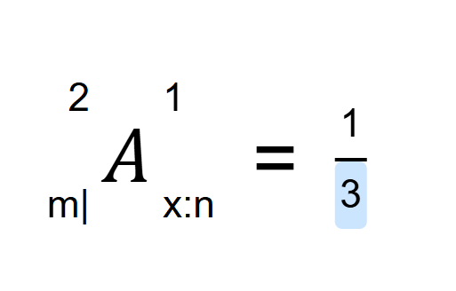

fixed some navigational issues
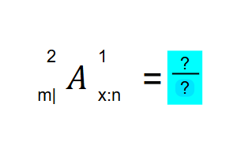

Must fix the nesting of IC. Like, gotta really think of when to use IC and when to use textNode. 

Must add spatial intuition to fractions and subsup

dirty-fixed shift+6 by doing Shift + e.code=Digit6, so now it does not make sense for people with keyboards that are different than mine in the way that "^" is reached. But it was a good way imo to match how underscore reacts. These are used for subsup, left and right dep on if control or shift

I think I fixed the deletion of subsup by not checking if we are currently in a child

If ever need to change arrownav order of 4 children. need to change in more than 1 place. omg idk even where. keeping it for now cuz too much drama

First version of parser to/from Latex !!!
Maybe good way to identify flaws in my data model is by perfecting the from-latex parser and keep trying examples from my playground overleaf doc until I have successfully parsed them all into my app
But that way my app assumes latex === math 
What I want is not only latex, also some of the stuff in actuarialsymbol 
Either way I have to rigorously define the scope of (visual) math in terms of latex-completeness I guess?
Makes sense cuz the examples I have in playground are based on the branches of math that I mention in the requirements of the application (calc, linalg, etc). So the examples are some test cases for the requirements. Passing all test cases does not guarantee that I can indeed represent all math!!

### 14/05/2025

It still breaks when I try to type sth after deleting everything
At least after deleting fraction
latex to mathnode is scuffed cuz of things like ordering and I fogot how to deal with brackets maybe?

It should be keeping track of open bracket pairs 
like `\frac{{4}+3}...` should have {4}+3 rather than  everything until the final bracket of the expression

SOme important next steps for usability:
- hover should change bg of nodes that can be edited
- delete numerator should just be empty numerator (until 2nd press?)
- up/down arrow keys should work on subsup children to navigate 
- drag-and-drop yay
- toolbar finally
- for debugging/testing (esp video), could print current pressed key in some other UI element


Re-evaluating all math structures based on the latex examples I am using to guide the testing. I will now look over all of them to decide whether subsup is enough for all special cases like that, or if I should split into diff types. Also will note on the ways to parse.

- `a_x` should parse even though it is not `_{}^{}{a}_{x}^{}`
- `f^{-1}` should put -1 as "exponent" of f

\actsymb should not be the same as subsup if parsing to valid latex with actuarialsymbol package enabled. Two reasons:
1. The left-side subscrips don't anchor to the base symbol
2. subsup allows right-side superscript (UR). So does \actsymb, but in a situation where the user wants to do \itop they might use UR, and get confused if they want to move it to the next char in LR. However, a disadvantage of removing UR is that `\actsymb[n][2]{A}{x}[(m)]` (apart from needing special parsing logic) will be rendered above "x", not necessarily anchored to the principal symbol if the precedence number (which in my design is allowed to be any string, not only "1", "2" or "3") is longer than the first character of the lower-right child. That is, assuming I will have precedence numbers and their corresponding parent centered.

The actsymb doc actually mentions the clash betw RU and precedences: 
> In such rare circumstances, one needs to insert a strut (an invisible vertical rule) in the subscript to push it downward as needed

Therefore I think my final decision is:
- actsymb should have 4 children
- actsymb is not subsup UNLESS THERE IS A GOOD REASON WHY subsup DOES NOT NEED TO EXIST ANYMORE. I think the main reason would be the alignment on the left, visualization-wise. I think that is a bad reason to keep it. However, it is a good idea maybe to think about the consequences of forcing the user to use \actuarialsymbol. If I have a notation that is just "x^2", it's a little strange to parse it to an actuarialsymbol. Thus, tradeoff between: (1) having 1:n mapping from visual representation to valid latex; and (2) following the simplest (built-in) latex conventions whenever possible.

Things to still consider:
- should precedence numbers only be allowed inside of actsymb? Not even sure if that is possible when I start allowing drag functionality. Prioritize user freedom over semantic validity?
- actsymb (if not same type as subsup) should intuitively not have navigation say that arrow up on LR jumps to UR. Instead, need to have up-arrow and down-arrow jump to add precedence numbers (or rather, precedence MathNode? again, freedom-validity tradeoff). In fact, if precedences are allowed anywhere then up and down should always lead to that (but do require a non-empty parent!).

Potential ways to decrease confusion caused by 1:n mapping of visualizations to valid semantics of subsup-like MathNodes (use at least 1 in final app, preferable more?):
1. Different shortcuts/actions needed to generate the MathNode
2. On hover, show button (or tooltip + some shortcut) to transform subsup to actsymb and vice versa
3. When user tries arrow-up (or whatever else is going to normally lead to precedence number) on subsup, show a warning to the user that they are not inside an actsymb (and instructions on how to fix it).

Whether precedences should be allowed outside of actsymb? Depends if it is ever needed elsewhere. Also before I forget again and ponder this yet again: this approach does not have 1:n mapping from visualisation to valid syntax. If it did, I would have thought precedence + its parent, versus Vector. But I think vector would center vertically while precedences look kinda like accents (location-wise).

In the previous iteration of the design of this application, I assumed that \itop, \iitop, ... \iiibottom would all be accent options. Instead, I will assume that something like PrecedencedNode could exist and have it somehow check if it is inside of actsymb before allowing its creation?

So my current preferred idea (personally) is:
- actsymb gets own MathNode type
- actsymb gets 4 children (just like subsup)
- precedence gets own MathNode type (similar to accent (or deco - do check if ever on >1 symbol!))
- actsymb's LR child is by default a precedence node
- precedence nodes are not allowed anywhere else
- actsymb gets own creation shortcut
- subsup can be converted to actsymb at any time by pressing a button that appears on hover
- actsymb can be converted to subsup if no node in LR has a precedence. Else it should warn, and allow forceful conversion that would throw away the precedences.

Note to self: before precedences can be implemented (assuming they are like accents, not deco), I need accents to exist. Need to strictly define accent vs deco! That in turn requires re-consideration of my way of dealing with IC vs TextNode...

Before thinking more deeply this is my thought: everything should always become separate TextNodes inside an IC. When brackets are inserted, it should make a group with TextNodes inside (or wrap in IC but atm implementation has just TextNode list). When a transformation is called, the node it will apply it on will be either the previous TextNode, or the previous GroupNode if the prev node is a GroupNode. 
It should be possible to create new groups by bulk-selecting sibling nodes and then pressing "(". 
Accents can go on TextNode
Deco can go on IC (or the fake-or-maybe-soon-literal IC inside of GroupNode)

Maybe the IC -> TextNodes mechanism, instead of simple max-1 length, should detect at least that numbers next to each other should stay together (so a TextNode is a unit holding a letter, a number, or a special symbol of any kind). Implication: cannot use bar notation on numbers.

Enable group explosion and multi-select grouping of siblings. Possible? I'll think about it soon.

Why Group and IC should both exist: if only IC, then would need to teach the user an action that they would need to apply to make the nested IC. Since current plan would split into TextNode as the user types. Advantage of that approach would be that 1+((2+3)/4) would be representable without brackets, just like in physical writing. But the action required for nesting would be essentially a hidden bracket, which may decrease usability of the app due to the allowed actions of groups being more strict than in physical writing (because the latter is complete freedom), and which groups exist would be visible on e.g. hover. Instead, brackets can show possibilities much better as it already follows conventions used in calculators and other online tools.
Why not only Group? Well I think anyway group is a wrapper around IC, meaning IC also exists. But why not only define group with a list of nodes, and have no IC? Because implicitly that is just IC with brackets all over the place. When does it make a difference? When a new node layer is made, i.e., the root (so the first state that the user experiences) and the children of subsup-like nodes.

Is it safe to keep both? When drag-and-drop is enabled, and you have e.g. (1+2)/3, the app allows the replacement of (1+2) with e.g. 1+2. I may be wrong but I think that is harmless because the brackets serve as a way to notify the transformation logic which node to take to the new MathNode. In drag-and-drop logic, the MathNode is already there. Therefore, such behavior will lead to safe deletion of brackets, which may even be nice for the user to clean up unwanted brackets after the expression tree is already in shape.

Why not merge Group into IC and have it render brackets only when the parent is also an IC? Or perhaps better: only when the user was the one to type the bracket? For the latter: not sure yet, sounds like a decent option but might get messy especially in parsers. For the former: would not allow (1+2)^3, because the parent is a subsup. Brackets make sense to render in any visual math structure where the size and alignment match its parent's. That is: IC in IC, IC in subsup-like node, ...?

No brackets needed around:
- IC in RootNode (assuming root will be rendered with a line above)
- IC in subsup's child
- IC in fraction
- IC in decorated (assuming the decoration already covers the group visually)

Still have to think about BigOperator. I think I need to re-define that one to not have a "body" or whatever. Better to just treat it as a special symbol with 2 children: lower and upper. Use it inside an IC. If you want to make it look semantically valid, explicitly use brackets. But my app does not need to know what to "apply" the operator to, since it's purely visual and latex does not care either.

I have not yet thought about Vector and Matrix.
Also I still need to add support for multi-line things, like cases?
Also lim(...)

Trying to think of a logical IC vs Group ruleset:
- IC on start
- IC on children of nodes created by shortcuts
- Group (wrapping an IC) on manually defined bracket

(1+2)/3 can only be made using brackets because else the system does not know that 1+2 is supposed to be a group. Thus, (1+2)/3 will be shown with brackets even though the system could be aware that this is redundant. For the first version of the app I will keep it simple (i.e. keep brackets) but later on I can look into automatic bracket removal on transform, or some cleanup button that allows the user to choose to remove all redundant brackets at once.

What about when the user types "1a"? "1" and "a" are separate TextNodes.
At least one potential issue with all this: operators would be allowed to have accents. I think that is ok; latex may also allow it?

Summary:
- **ActSymbNode**: actsymb gets own MathNode type
- actsymb gets 4 children (just like subsup)
- precedence gets own MathNode type **PrecedenceNode** (similar to accent (or deco - do check if ever on >1 symbol!))
- ActSymbNode's LR child is by default a PrecedenceNode
- precedence nodes are not allowed anywhere else
- actsymb gets own creation shortcut
- subsup can be converted to actsymb at any time by pressing a button that appears on hover
- actsymb can be converted to subsup if no node in LR has a precedence. Else it should warn, and allow forceful conversion that would throw away the precedences.
- **GroupNode** created when user puts brackets. Is just wrap around InlineContainerNode
- **BigOperatorNode** should not have a body

Afterwards, rough idea:
LimNode should have only 1 child. It should be either created by always checking if the text "lim" is there, or by some safer combination like \lim. Latter is cleaner but requires new functionality regarding parsing of the input (in latex-like way).
Accent vs Deco: DecoratedNode should wrap an InlineContainer

Accents/Decorations:
- tilde `\tilde{}`
- hat `\hat{}`
- widehat `\widehat{}`
- bar `\bar{}`
- double dots `\ddot{}`
- circle `\mathring{}`
- angl `\angl{}` -> requires actuarial angle
- underline `\underline{}`
- overline/joint `\joint{}` -> looks a lot like \bar{} tbh but still good to have both supported

I think AccentNode does not have to exist at all! Latex allows decoration on anything

Next steps: 
Go over all the points in my recent summary and implement all the changes on parts that currently will break the system 

Definitely first step is whatever I need to do to ensure that everything is always a separate TextNode 

### 15/05/2025

I will not be working on this in the morning and afternoon due to actual responsibilities piling up.
I did play around in the train for a few seconds and noticed that subsup still does not get reverted to textnode on deletion of all children.

Did some writing in the train :)

### 16/05/2025

At some point should send sth like this to the potential client:
> Some time ago there was a conversation here about your struggles with chronic pain and taking lecture notes on paper due to the lack of actuarial notation in existing software. I really enjoy and miss software engineering, so I started working on a tool that might help. It's very early in implementation, but the design is ready. So this is where I believe that the whole thing is achievable, but it's early enough for any feedback to be properly taken into account. If you are interested, I'd like to involve you in further development so it can actually become a custom solution for your exact situation (e.g. most comfortable keyboard/mouse usage for less pain, but also finding the right balance between visual expressiveness versus semantic validity). "Involvement" here just means: I write stuff about assumptions -> you correct me if I am wrong; I mention alternative design choices -> you pick your preference or give your opinion. (I write the whole design rationale in a technical report anyway so all I have to do is say which paragraphs are relevant) If you'd rather not, that's totally fine of course, I might continue making it anyway because it's really fun and existing tools do indeed suck for no good reason. Either way I will slow down until the end of June because I have been neglecting uni.

I think ctrl+- and control+6 should lead to Actuarial instead of subsup left (and for both, if +shift then left side), because realistically you would never have to use those slots in subsup without also using right-hand sides. OR maybe even ever. Except in chemistry. In actuarial, it is used, and while it is not the main one to start with semantically (cuz the lower right should be the most important?), in math note taking one might read left-to-right and want to start the note-taking on the left. 

Now looking into how to make textnodes appear in a good way instead of always having the user choose when to end the textnode

These are all characters that are sent to the adder:
```a-zA-Z0-9=:;\'\"\`~|?.,<>?+!@#$%&*()\[\]\{\}\-```
Note: brackets are wrong, at least opening brackets don't count here and closing maybe.
I think GroupNode maker will have to know when it is unclosed and look for the next matching closing bracket. So for now I will assume I have to turn them into separate textnodes.

Cases:
1. if current node's (old) content contains "\", check if match with any specialSequence. If so, transform to the result of said sequence. Otherwise, append to the same TextNode.
2. `0-9` -> check if curr content also 0-9 and if so, append. Else new textnode
3. `a-zA-Z` -> gets own new TextNode
4. other -> new TextNode

Idea: if typed shortcuts (with '\') will have 1 child, allow wraparound on select of a node when typing '\'? Still need to think about how to deal with invalid ones

Damnit I just realised that even though my "keep digits together" is important for transformations, it disables the cursor-like functionality so if you type a long number and want to change the first digit, you have to remove all the others first. I want to fix it, but I think it's something to add later rather than change the whole approach

chatgpt fucked up so bad, todo ask it to take into acc editorstate and cursor in all the /logic/ files

ok I fixed it kinda but still big problem w anything mroe than just 1st level inline 
but 1st lvl inline has: 
- cursor
- move cursor on click (but should still change the cursor type to caret)
- move cursor on arrows
- backspace
And apparently even selecting mult w mouse (but no copy paste stuff, but that feels like it should so now I have to implement that as well at some point!)

### 17/05/2025
Fixed the fraction problem w ability to type!! it is awesome now :DD just no deletion yet 
But when clicking back into the parent container, it will not let you back in using arrows
Must fix deletion of inlinecontainer when textnode is last one (or rather textnode if only one in container)

Now going to put back the 4 insert cases into the current insertion logic
Note: in the future, specialSequences will contain:
- all no-child symbols in https://www.cmor-faculty.rice.edu/~heinken/latex/symbols.pdf. These are put in TextNode
- perhaps more, with 1 child. Must be careful not to build another latex parser (or do so but properly and on purpose)

Fixed the cases I think! Current progress:
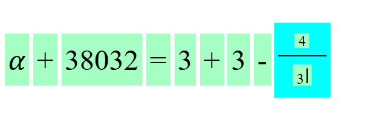

I think later on I might regret the way numbers are 1 textnode. Maybe it should be a group somehow. But for now this is clean enough to continue I hope 

Either way, Group is the next logical thing to implement
perhaps after fixing the deletion logic of fractions


Finding out how markdown deals with brackets:

Opening:
() - if end of container then make both
(8 - if start of nonempty, only opening
8(9 - if middle, only opening

Closing:
) -> if end of container, only closing
8)9 -> if middle, only closing
89) -> if end, only closing

closing after opening:
(8)

opening after closing:
(8) -> if at start, take existing closing
89(w87r}) -> crap, this one can deal with intruders
8()) -> if next to existing closing, make new pair 

8)]]

Reduce to clean ruleset for my app:
Opening bracket:
1. if no more non-bracket after in container -> make pair with empty containernode
2. if matching closing bracket textNode later in node -> transform all betw into GroupNode with contents wrapped in its IC
3. else only opening bracket in textnode (normal insertion behavior)

Closing bracket:
1. if matching opening bracket textNode earlier in node -> transform all betw into GroupNode with contents wrapped in its IC
2. else only closing bracket in textNode (normal insertion behavior)

Some test cases for me to think about how to break my own idea:
ab{cd)} -> 
I think it will be ok, else I will fix it later

OMGGGGG
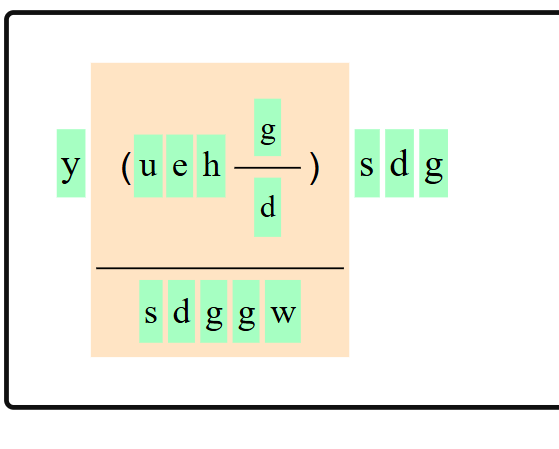

I think it's actually decent omg. Just expanding and prettifying now. Until it's bit more usable to know what else to do

For every node type, add in these:
- directionalChildOrder in navigation utils
- renderer in MathRenderers
- case in MathRenderer
- stuff in treeutils
- shortcut handling in handle-keydown
- latex parse in latexparser
- creator in Nodefactories

Next bug to fix is line 109 in the deletion, it should be poss to delete fully empty node
but curr failsafe already exists, can go right arr and remove whole thing anyway

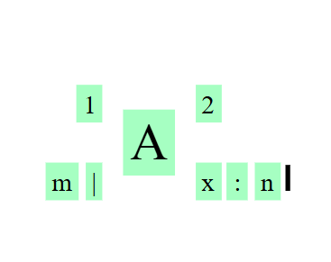

Aw yeah baby
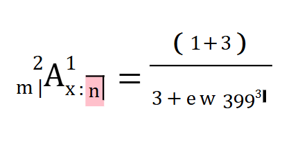

Next steps:
- PrecedenceNode: only allow inside actuarial, work kinda like decoration
- drag and drop
- update parser for new nodes
- Fix auto jump in new groupnode, must take into acc which bracket side
- ...
- Toolbar
- Saving notations
- load from latex
- vectors and matrices

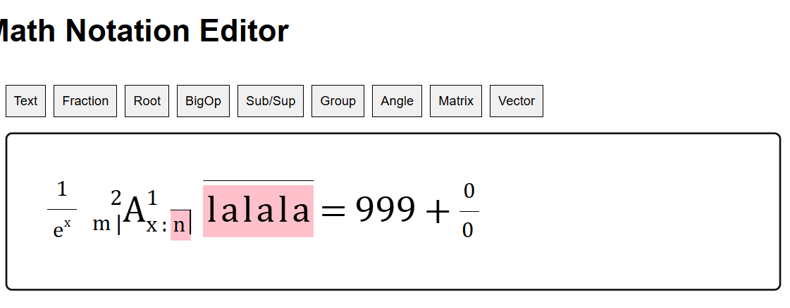
Good stuff
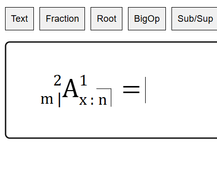

Also things to think abt:
- current specialSequence tries to match at any moment. Thus if two latex ones start w same substring then my curr approach only allows 1. SOlutions are: either have user do space or sth to confirm, or have small enough subset of special characters (or choose alternative sequences but that is a bad idea imo)
- must eventually put clear overview of shortcuts and sequences on very easy to find place in main editor page

TODO: allow node ungrouping on deletion of either bracket?
and: make numbers (2+ digits) implicit groups?
make shortcuts for \sum and \int to have bigop work already without drag or buttons
must fix non-grouped brackets in tonode parseS

### 18/05/2025

Greek letters
Rationale: special characters and their sequences make sense when using widely known sequences. Don't ask user to learn shit tons of sequences of course. So I use the LaTeX ones from https://www.cmor-faculty.rice.edu/~heinken/latex/symbols.pdf. Copied them into this .md file. Anything that didn't appear as the correct symbol, I went to w3schools to copy paste btter one. Cuz the actual symbol is the one that is printed in the TextNode.

ℵ \aleph
α \alpha 
β \beta 
ℶ \beth
χ \chi 
ℸ \daleth 
δ \delta 
ͷ \digamma
ϵ \epsilon 
η \eta 
γ \gamma
ℷ \gimel
ι \iota 
κ \kappa 
λ \lambda 
µ \mu 
ν \nu 
ω \omega
φ \phi 
π \pi 
ψ \psi 
ρ \rho 
σ \sigma
τ \tau 
θ \theta 
υ \upsilon 
ε \varepsilon 
ϰ \varkappa 
ϕ \varphi 
ϖ \varpi 
ϱ \varrho 
ς \varsigma 
ϑ \vartheta 
ξ \xi 
ζ \zeta 

∆ \Delta 
Γ \Gamma 
Λ \Lambda 
Ω \Omega
Φ \Phi 
Π \Pi 
Ψ \Psi 
Σ \Sigma 
Θ \Theta
Υ \Upsilon
Ξ \Xi

I added a space to all childless sequences, to:
1.  make sure shared starting strings are not making one unreachable
2. make sure LaTeX actually prints it and does not wait for a longer sequence

Note: the way special chars are defined, if you know a latex sequence by heart you can still use it in my editor even if it does not exist here. Existence in my codebase only makes it render as the actual symbol. If you use \updownarrow (and space), it can still be parsed to latex and there it will display anyway (because the special sequence is kept as a normal string)

Implemented undo and redo using ctrl +z and +y

BUG: missing \actsymb[][][P]{\bar{A}}{x:\angln} parse - need to somehow desugar that into my logic cuz I will not be making a separate structure for it cuz it is already visually possible
Basically desugar that entire user guide of actuarialsymbol (but remember: parsing back to latex will not make the fancy one. Not necessary)

Current bugs:
- BUG: pasting brackets does not group them
    - Importance: meh, visually correct but extra effort needed to transform
- BUG: pasting multi-digit numbers does not keep them in 1 text node
    - Importance: low, visually correct but extra effort needed to transform. In fact, sometimes this version is beneficial e.g. for better cursor control inside numbers (which atm of writing is not existing)

Perhaps the new manipulation stuff (for clipboard events) can be used in other /logic/ as well, cuz I have shit tons of duplication for updating the tree and finding the container

### 19/05/2025

I have not considered this before: https://www.overleaf.com/learn/latex/Brackets_and_Parentheses (setting some global param for (temporary) bracket sizing)
TODO: I do not allow (1+2)/(3+4) in non-fraction-structure semantics. ensure that escaping using \/ works by checking "\" before any transformations in the keydown handler

Overview of things that need to be written in the report 

1.  Designing an AST for visual math. 
    - First explain syntax vs semantics: syntax is about structure, semantics is about meaning. The goal of this tool is to allow note-taking, of lectures. Thus, focus is on syntax (i.e. copying whatever the lecturer wrote!). Syntax and semantics do not have a one-to-one mapping.
    - Example of syntax-to-semantics being n-to-one mapped: \surd (ax+b) vs \sqrt{ax+b}. I don't have to care what it means; these have to be different anyway in the app because the way it is represented is totally up to the user. That's how it works in physical note-taking! The example I gave contains 2 widely-used and accepted ways to map identical semantics to different syntaxes. However, in physical note-taking, you could technically make up your own syntax, like if you want to write \lim_{x \to 0} to look like {\lim}^{x}_{0}\downarrow, nobody is stopping you. In this application, I have to stop you, because there are infinite possibilities to define your own syntax and the only way to enable that in a digital tool is by text fields in some canvas-based design app. That slows down note-taking and also disables the possibility to parse to known mathematical markup languages (because only you know how to interpret your invented syntax). Due to the former (fast note-taking) being the main goal of the app, a well-established syntax is necessary. Since the goal is of the app is specifically to enable copying mathematical notation from lectures, this syntax needs to align with the one used in the user's university. Due to my lack of experience in said university, I make the assumption that the lecturers follow syntax conventions that are representable in LaTeX. The remainder of the development process of this application strives for an AST that can represent any unique **visual structures** that is possible using LaTeX. This automatically leads to a possibility to parse notations in the app to and from LaTeX. 
    >However, note that LaTeX can accept multiple strings to render identical notation: 2^3 looks the same as `_{}^{}{2}_{}^{3}`. (TODO mention that the app should have as few structures as possible defined under the hood because that opens the doors to better usability in terms of actions enabled on e.g. hover? Or just good for freedom too tbh.) For the app, this means that parsing latex into underlying data structures requires a lot of extra logic (TODO mention "desugaring"), while translating back to latex may lead to an unwanted option because which one to use depends on which is "better" to the user, which may differ per moment in time and per situation. Since LaTeX would parse them the same way anyway, I will always pick the option that is most generalizable within the app (i.e. `_{}^{}{2}_{}^{3}` because it requires the least extra logic given how I already designed the data model).
    - Example of semantics-to-syntax being n-to-one mapped: `_{n}^{2}{A}_{x}^{(m)}` and `\actsymb[n][2]{A}{x}[(m)]` may look the same for some parameters (for longer ones there are slight mismatches). Whatever the first one may mean in other context, the second one is only rendered when allowing the \texttt{\actuarialsymbol} package. This package defines additional LaTeX commands to render semantically-loaded actuarial symbols. these symbols are sometimes not available in plain LaTeX mathematics. Since the app must support actuarial symbols, commands from the \texttt{\actuarialsymbol} package are assumed to be allowed to parse to. This means that desugaring `_{ll}^{ul}{X}_{lr}^{ur}` (in latex) into actuarial symbols at all times is the most efficient way in terms of keeping the underlying data model as small as possible. However, that would lead to 2^3 requiring \actuarialsymbol package to parse in latex, which means semantics are mismatched and simple expressions require unnecessary imports. Therefore, the application will split sub- and super-scripted expressions from actuarial symbols, despite it creating a one-to-many ("many" = 2) mapping from visual structures (in rendering) to underlying data structures (in the remainder of the logic).
    - TODO actually identify the existing structures (i.e. my "types.ts" file's contents)
2. Overall system architecture (incl saving of notation); mention lack of backend?
3. Front-end design: follow conventions and always keep in mind chronic pain? Also design principles etc
4. User input: modes (type (+shortcuts), click, drag-drop, hover, ctrl+z and y, copy-paste), exact shortcuts + rationale, etc. And for remainder of app, what?

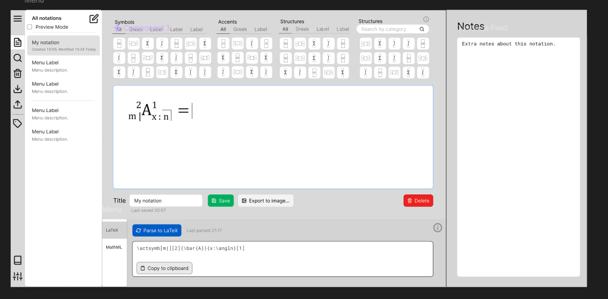
curr design in case figma does not save

TODO think more abt the structures and accents etc toolbar, it's a mess. the search bar is a good idea imo if executed more cleanly than on first design; it's good to not be overwhelmed since there are too many options in existing editors, and if used regularly then setting groups for diff courses is a good idea here?

TODO: must add undo, redo to design? Betw export and delete? Also, put button to shortcuts list. Not hidden in menus or sth 

Also still need a tag system? (maybe that is better to put betw export and delete).

OR: maybe instead of having user make tags for diff courses, have them make "environments". Each env would be a course, likely. Envs would be a diff page? Kinda like how overleaf works, where the list of envs is the list of projects, and the page I already designed is what you get for each env. Then the toolbar should get customized by having each env allow a set of corresp structures etc. (Or at least those would be at the top, if rest still needs to be reachable)

OR for the latter I could predefine categories and have those be tags within the toolbar. User can then click relevant tag(s) to filter the sybmols/accents/structures

Which option is best may depend on the duration of the user's courses. Cuz one of the options requires signif more prep from the user than the other options

TODO: make the text fields in the design not have so much margin, it feels like its from 20y ago. Just do what vsc and all others 

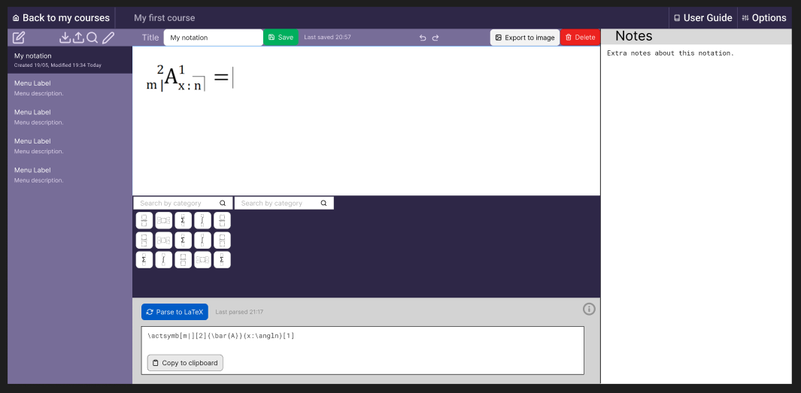
latex-inspired alternative

### 20/05/2025

https://math-editor.online/ this one looks similar to what I am making but very unusable due to the long animations of the toolbar. But I should totally ~~steal~~ be inspired by their templates

https://www.mathcha.io/editor seems kinda similar in goal but the execution is way off for its purpose. Still seem to need lot of latex knowledge, and looks slow to use

https://www.hostmath.com/ opposite of mine but kinda clean toolbar

Should maybe do some kinda "card sorting" of all symbols or accents, where phase 1 is closed:
1. "I use this symbol/accent all the time (usually at least once per lecture)."

2. "I use this symbol/accent regularly (usually at least once per week)"


3. "This symbol/accent is used a lot in very few courses. Sometimes, I need it every day, while other times I may not need it for months."

4. "I use this symbol/accent occasionally."

5. "I use this symbol/accent rarely, but not never."

6. "I have seen this symbol/accent before. It is used in my studies, but I very rarely come across it or have not come across it yet."

7. "I do not know/use this symbol/accent, but I still would like to be able to access it in a math notation tool, just in case."

8. "I have never used and will never use this symbol/accent in my life. This symbol/accent means nothing to me, and I am not interested in ever seeing it again." 


(Note: you can always change your mind about this. This activity is for me to know the scope of the problem. Results will be used to determine the order and layout of toolbars. If you say you don't use a symbol, it may still be accessed through more time-consuming interaction modes, and I can always change the code later if your situation changes a lot.)

Afterwards ask participant if there are any symbols/accents they can think of that are not in the ones I provided. If so, let them provide which, and add that to the result too

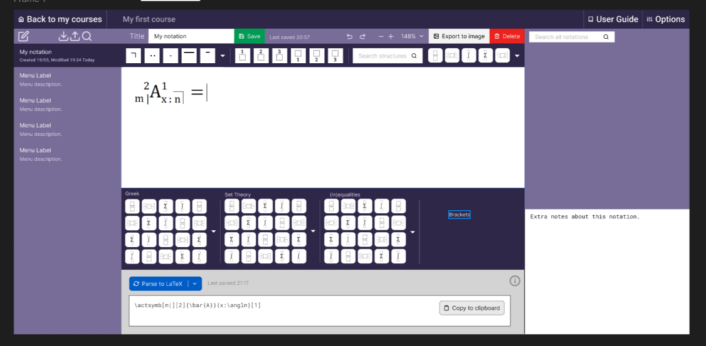
Curr design. Clearly need client's input on ordering of symbols/accents (anything that can go in "textnode" that is not on a normal keyboard)

#### Things that would be nice to know

**Questions about your courses**:
Q: What are all the branches of mathematics that you use in your studies? (E.g. Linear Algebra, Game Theory, Calculus, ...)
A: [YOUR ANSWER HERE]

Q: How long do courses last? (E.g. quarter (~10 weeks); semester; year?)
A: [YOUR ANSWER HERE]

**Questions about chronic pain**:
Q: You mentioned fibromyalgia in a youtube comment at some point. I could not find much info about how fibromyalgia influences human-computer interaction, apart from people promoting Speech-to-Text (which won't be appreciated in lecture halls). I did find some reddit posts about brain fog and how that makes it hard to use apps with cluttered UI. In your geoguessr gameplay, you seem very in control of your focus so I have been assuming that hand pain is the most relevant problem when designing this tool. Is there anything else (brain fog or other) that you would like me to take into account during design? Of course do not share medical details you are not comfortable with sharing, but anything you say can be used to better customize it to your situation. 
A: [YOUR ANSWER HERE]

Q: At some point(s) you mentioned that scrolling hurts, but I don't remember any remarks about other types of keyboard/mouse events. This is also not something I could find sources on, so I would like to ask for each keyboard/mouse/trackpad event (typing, clicking, scrolling, zooming, drag-and-dropping, etc if there are more), how preferred they are for you. Is pain caused by specific movements, or is it random, or caused by (lack of) repetition? And what is the relationship between pain intensity and duration of interactions (e.g. does pain increase when dragging the mouse for longer in one go)?
A: [YOUR ANSWER HERE]

Q: How much does pain differ throughout a day/are there any factors that influence severity in such a way that user testing will not be representative of real usage during a lecture?
A: [YOUR ANSWER HERE]

**Questions about your note-taking experiences**:
Q: What note-taking apps (not specifically math, just anything for any notes) do you currently use, if any? Preferably ordered by favorite first (nicest-feeling usability), or which one(s) you are most used to. If you order it, please mention. Feel free to explain as much as you want why certain apps are (not) nice.
A: [YOUR ANSWER HERE]

Q: What makes digital math note-taking "awkward"? (Not disagreeing with you; just asking since it refines the problem statement of the whole project, which impacts everything else.) 
A: [YOUR ANSWER HERE]

Q: Are you familiar with LaTeX?
A: [YOUR ANSWER HERE]

#### Things that would be nice to have (but you don't have to provide it if you don't want to)
- Pictures of your handwritten mathematical lecture notes, so I know what we're digitalising.
- Picture of your keyboard. I googled "Irish keyboard" and it's very different from mine so would like confirmation of whichever one to expect when defining hotkeys.

- Describe the mathematical note-taking app of your dreams? Does not have to be detailed or complete; I already have a lot of progress done in terms of design of functionality and UI/UX. It's not your job to tell me what to do, but rather to tell me what you like, so I do not end up making you an app you will hate while I could have known all along that you would prefer something different. 

### 21/05/2025

Should not work much on this today, but I should note this down: maybe SubSup and Actsymb can be merged into 1 type, and same for Precedence and Accent. That would reduce code duplication. Just use extra field to show which one? Since it should be distinguishable clearly, due to them having different roles in the to-latex. But same type is good for interaction too (e.g. accent can just make menu on hover, with accents and precedences in different "sections")

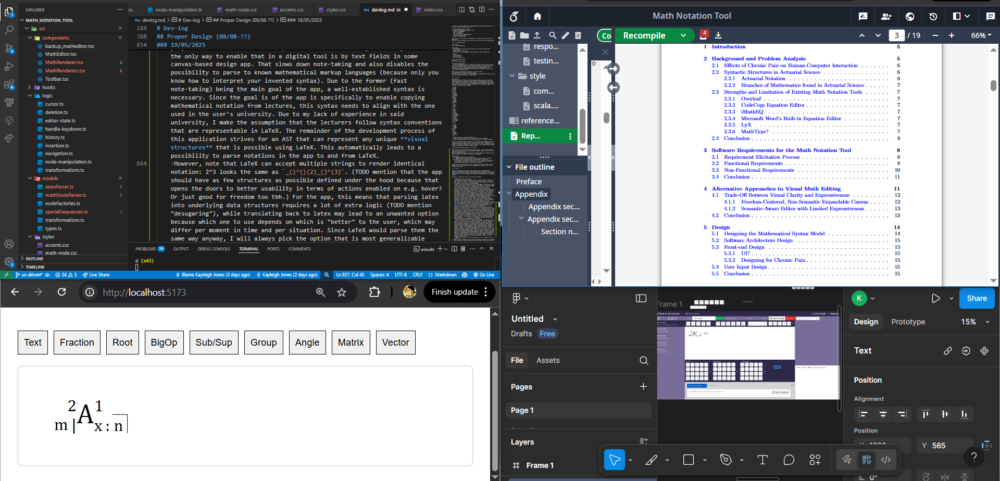
Image to send into dc in case I suddenly feel confident

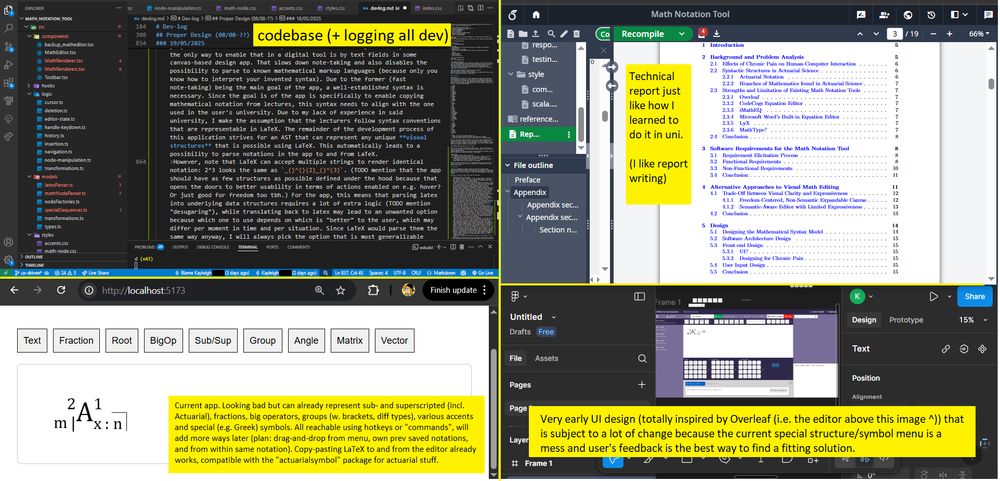

Timeline for the participant to understand what would be asked from them if accepting the offer of being my client:

1. In own time, fill out questionnaire. Reason: scoping the problem. I already made the questions; this is basically ready. Estimated duration: max 1h.

> Kayleigh: updates the report's background, requirements and design sections accordingly (may take 1-2 weeks if before end of June).

2. Read (parts of) the report in own time, write out some feedback (e.g. confirm/correct any assumptions I made). Estimated duration: max 2h.

> Kayleigh: update report again if necessary

3. Repeat step 2 until the client is happy with the overall plan of the application (Not 100% detailed plan yet; just fundamental stuff like the way math is defined and an overview of how the app would be used). Estimated duration: ??.

> Kayleigh: Prepare categorisation activity

4. Categorise a bunch of special symbols/accents/structures into predefined categories. (In own time; I'll prepare instructions and I know a good website where this can be done). Estimated duration: max 1h.

> Kayleigh: Take subset of result of step 4; prepare open card sorting activity. Not on same day as previous, to at least try to avoid some cognitive biases.

5. Open card sorting of remaining subset (again in own time; same setup as previous step.). Estimated duration: max 2h.

> Kayleigh: Finish working prototype of the editor, and toolbar based on card sorting outcome. Probably also already include a user guide and/or hotkey overview.

6. Cooperative evaluation of working prototype. This is the first time you try the system youself. Since there is only 1 end user, this first impression is very valuable. I prepare some relevant math notations for you (or I find lectures on youtube (don't prepare for this; the evaluation should be the first time you see it)), and your task is to type them out in the editor as fast as you can (or better: as fast as the lecture requires you to). Recording your screen (and keyboard-overlay?) and all your thoughts is very useful, and best outcome is actually if this is done in a call so I can take notes on unexpected behavior & help out if necessary. But unlike what I learned in uni, my presence is not strictly required since you clearly have a lot of experience recording yourself and your thoughts. Also I suck at being an independent evaluator because I get excited about showing off my system and start yapping and influencing the user. Estimated duration: max 2h.

> Kayleigh: Improve ease of use based on evaluation results. Then finally start designing the rest of the application (i.e. the note-saving, additional fields, and maybe even a home screen of notation collections).

7. "Final" evaluation/confirmation of overall app design outside of the editor itself (i.e., how the app will work in terms of saving, keeping track of notations per lecture/course, settings pages, etc). Probably just by you giving feedback on a textual description of the design. Estimated duration: max 1h.

> Kayleigh: Based on your feedback, I make a visual design. 

> Kayleigh: Maybe I will ask my fiend(s) to do an expert heuristic evaluation on that, since they know "established usability principles (heuristics)" so that would help identify issues that the user may not notice due to usability just feeling "off" without knowing the exact reason.

> Kayleigh: turn visual design into working prototype.

8. Cognitive evaluation of overall app's prototype. Similar to the other evaluation: I prepare tasks (e.g. "Make a new course", "create a new notation", "import a notation from LaTeX format" (I provide necessary files), "Export all notations from course X to LaTeX", ...). Should be recorded (but no keyboard strokes necessary for this one). Estimated duration: max 1.5h.

> Kayleigh: identify issues that arise from step 8. Prioritise problems using a severity matrix

9. Conform/correct severity matrix. Estimated duration: max 0.5h.

> Kayleigh: Keep fixing issues until ~1 week before start of academic year. Then provide "final product" with enough time left to discover and fix critical bugs before uni starts.

10. Final user testing in own time. Any bugs or ideas on how to improve the app (even new functionality) can be sent to me at any time. I will try to fix bugs ASAP, while ideas will be kept as new requirements for a potential next iteration of the app. Estimated duration: ???.

So like, at least 11h from user but probably more like 15 incl. iterative things. So 15h scattered over 3 months.

Message:
Some time ago you mentioned your struggles regarding actuarial sciences lecture notes with chronic pain. I looked into digital tools, and found nothing proper even though I believe it is achievable in theory. I really enjoy and miss the full software development pipeline and you clearly deserve proper software, so this is your chance to get a custom mathematical notation tool, taking into account your exact accessibility needs, developed for free by someone who has the qualifications to do this exact stuff in real companies. I already have a decent starting point to avoid making impossible promises. If you are interested in being my client, I will involve you in the development so it actually becomes a solution for you specifically. My plan would be to finish it by next academic year (01/09?) and I estimate that your involvement would cost you around ~15h scattered over these 3 months. 

This project is not affiliated with or endorsed by my university. This means I have no contracts or ethical approval for anything, but I intend to uphold professional standards as I was taught in my studies. You can opt out of being my client at any time, refuse to provide answers or participate in any of the evaluations, and most can be done in your own time through text (except much later on, actually trying out the app would be best to at least record). Your unprocessed feedback and evaluation results will not be shared with anyone, and you can decide whether and when you want them deleted. The technical report and the actual codebase will protect your anonymity, and can be kept private as well if you wish. (However, I believe those may be nice to publish (on my github) eventually for anyone else who may be in your sitation.)

If you are interested, I can send you more information on the exact timeline I have in mind and what I would ask from you at each step. A first set of questions to further define the scope of the problem is already prepared. Expect other steps to take some time, because my academic year ends at the end of June (and I have been neglecting my actual responsibilities for this fun stuff).

---

A few weeks ago, you mentioned your struggles with chronic pain and actuarial lecture notes. I looked into existing tools and found nothing proper, even though I think it's achievable. I enjoy and miss software development, and you clearly deserve proper software, so I started designing and building it myself.

It could become a custom math notation tool designed around your exact accessibility needs. I would handle all the development (for free) and involve you as the client to make sure it actually solves your problems. I already have a decent starting point, so these are not impossible promises (I believe).

My plan would be to finish it by September, and I estimate your involvement would cost at most 15h over the next 3 months, mostly asynchronously via text (with the only exception being actual user testing at the end).

This is not linked to my university, though I will always follow professional standards. You can opt out anytime, skip questions, and all your input is kept private and deleted if and when you want. I can also keep the code and report private if you prefer that, but think it's nicer to publish it for others with similar struggles.

If you're interested, I can send more info on what I would ask from you at each step. First step would be some questions to help scope the problem better. Everything else might wait until a week after EMEA because I still have uni at the moment.


Here is sth to keep in mind when deciding to allow anything as "precedence" on any node
https://tex.stackexchange.com/questions/123279/convergence-in-distribution

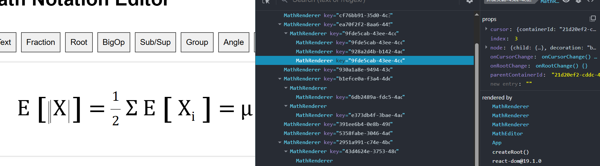
Some bug when removing accented

### 22/05/2025
Maybe stupid idea but writing it down anyway: Should there be a "find all / replace" option? Within a notation

Might need to distinguish \text{} from normal because normal should be italic

### 23/05/2025

You mentioned struggles with chronic pain and actuarial lecture notes, so I looked into existing tools and found nothing proper even though I think it's achievable. You deserve proper software, and I enjoy (and miss) the full development pipeline, so I started working on a math editor myself. If you are interested, I would like to turn it into a custom tool designed around your exact accessibility needs. I would involve you as the client to make sure it actually solves your problems. I already have a decent starting point, so these are not impossible promises (I believe).

My plan would be to finish it by the start of the academic year, and your involvement should cost you no more than 1h per week on average, mostly asynchronously via text.

This is not linked to my uni, but I will always follow professional standards. I.e. you can opt out anytime, skip questions, etc, and all your input is kept private and deleted if and when you want. If you're interested, I can send more info on what I would ask from you at each step. First step would be some questions to help scope the problem better. Everything else might wait until a week after EMEA because I still have uni at the moment.

--

I currently use latex sequences for special sequences e.g. \alpha but that is just a choice I made assuming that it's good to sync w known other solutions. If alpha is used a lot, it may be worth it to just use \a. That's completely possible, but makes it harder to learn (mine if already knowing latex, or vice versa).

Decision time abt how to do precedence
alternative options: 
1. allow any char above or below a base char
2. allow only 1,2,3 above and below, as well as anything above arrows

In favor of 1:
user has freedom. Freedom supports speed (I assume) and avoids limiting the app to the point where the reqs no longer met because I missed part of the scope in terms of math notations in the user's career path

In favor of 2: 
Allows clean translation to latex. knowing that 1 above is \itop is needed anyway (?) and so far I have only seen other "char-shaped accents" on arrows for random variable stuff. 
> These 2 types of "accents" may need diff ways of processing already to get to latex. Latter I think needs another package (which I think is already required by actuarialsymbol). Maybe I should somehow have a mapping from some internal data types or something that keeps track of the required packages. That is good to report to the user at all times when parsing to latex. ALso that is where parse to latex differs from just ctrl c, cuz ctrl c is abt the intermediate representation chosen by me for copying into the editor. It just happens to be that I chose latex for this intermediate representation. This chain of thought has nothing to do with the decision anymore.


Let's actually revise the data types:
1. text node 
2. container node - contains a sequence of nodes
3. childed node - a base node and up to 4 children nodes (1 per corner)
4. accented node - a base node with some accent. These correspond to some one-childed latex commands
5. Nth root node - could this also be an accented node wrapped in a childed node? that would lead to `^{}{[root symbol]\underline{}}` so def a bad idea for parsing
6. BigOp node - todo check how latex deals w it
7. Vector node - most likely different from accented
8. Matrix node - needs to exist because latex also uses a special way?
9. (?) find out how latex allows cases w the big bracket on the left

TODO: find out if it is a good idea if:

```
MathNode = InlineContainerNode | StructureNode

InlineContainerNode = { 
    children: StructureNode[] 
  }

StructureNode = TextNode | ChildedNode | MatrixNode | ... 

All of which only take InlineContainerNode as child type
```

That way, always know that it's `IC -> Struc -> IC -> Struc -> ... -> IC -> TextNode`. IC is then somewhat representing the ability to always add to an expression, while Struc is all about defining visually unique structures of sub-expressions. 

For SubSup vs ActSymb as Childed: must merge (I think) and keep which one it is as a field (enum?) to deal with parsing later. can still init the diff types separate (i.e. one with ctrl and the other w shift). Make sure to render it maybe with a colored outline so user knows which one they made, and always have a clean option to convert to the other. Using the "wrong" version should not matter too much until parsing to latex. Ensure that SubSup is easier to create, because that one is more failsafe imo. Biggest actsymb problem is that children may need preferences, which concerns a different node type.

Something that would be really cool: if I have some representation of a "course" or a "lecture", keep track of the special characters or \commands already used before, and have those be in some kinda dropdown to ensure it is easy for the user to re-use a variable that the system knows is already existing in the "environment" of the lecture/course. Would be extra cool if I actually keep track of variables and can highlight other occurrences of the same one. This feels like the programming language course. Gotta revisit those.

Probably allow \text as command to call a new group or IC and have it have some field for the font styling to ensure that \text is normal and everything else italic. I actually think IC could have extra fields for all kinds of styling options! And have renderer adopt the deepest one (i.e. the most "specific"). Styling options could be color, text type, (size?, ) and thickness. Things like color might not even be wanted in a to_latex, but those options can be configured, and the color is still needed in the data model to ensure that loading your notes later will render the color correctly. 

I really want to make a "find and replace" option. I use it all the time in my text editors. Would be so cool in math editor.

Does GroupNode need to exist? It is an InlineContainer wrapped in matching delimiters. It would be possible I think to have it be an IC as long as surrounded by matching delimiters. That may feel freer but also sounds more messy. GroupNode existence allows for perfect certainty that the matching pair is there, and can trigger options on hover to change the bracket type, or maybe even to apply something to its contents.

### 24/05/2025
Questions for chatGPT

Should I merge childed nodes?

```
export interface SubSuperscriptNode extends BaseNode {
  type: "subsup";
  base: MathNode;
  subLeft: MathNode;
  supLeft: MathNode;
  subRight: MathNode;
  supRight: MathNode;
  variant?: "default" | "actuarial"; // default = normal sub/sup, actuarial = special \ax form
}
```

keep DecoratedNode for accent-specific rendering with a strict set of symbols (bar, hat, tilde, dot, etc.), likely backed by an enum (NodeDecoration is perfect for this).

`\overset{1}{n}` - tiny
`\overset{\textstyle 1}{n}` - VERY similar
`\itop{n}` - goal

`\underset{2}{n}` - tiny
`\underset{\textstyle 2}{n}` - VERY similar
`\iibottom{n}` - goal

```
export interface AnnotatedNode extends BaseNode {
  type: "annotated";
  base: MathNode;
  above?: MathNode;
  below?: MathNode;
  style: "generic" | "arrow" | "precedence";
}
```

| Concept            | In UI/Editor                   | In Data Model                             | In LaTeX Export              |
| ------------------ | ------------------------------ | ----------------------------------------- | ---------------------------- |
| Accents            | Menu or command (`\bar`, etc.) | `DecoratedNode` or `AnnotatedNode`        | `\bar{x}`, `\tilde{x}`       |
| Precedence         | Arrow + key-in number (1-3)    | `AnnotatedNode` with style `"precedence"` | `\itop{x}`, `\overset{4}{x}` |
| Arrow labels       | Select arrow + add text        | `AnnotatedNode` with style `"arrow"`      | `\xrightarrow{label}`        |
| General over/under | Menu or drag-and-drop          | `AnnotatedNode` with style `"generic"`    | `\overset`, `\underset`      |

```
export interface ArrowNode extends BaseNode {
  type: "arrow";
  direction: "left" | "right" | "leftright";
  labelAbove?: MathNode;
  labelBelow?: MathNode;
}
```

| User types… | Insert node…                                |
| ----------- | ------------------------------------------- |
| `\->`       | `ArrowNode` (right arrow)                   |
| `\<-`       | `ArrowNode` (left arrow)                    |
| `\<->`      | `ArrowNode` (both ways)                     |
| `\brace`    | `BraceNode` (maybe prompt "over or under?") |
| `\widehat`  | `WideAccentNode`                            |

About wide vs narrow for accents:
```
export interface NodeDecoration {
  name: string; // "hat", "widehat", etc.
  displayName: string; // For menu UI: "Hat (wide)", "Double Dot", etc.
  latexCommand: string; // e.g., "\\hat", "\\overbrace"
  isWide: boolean;
  position: "above" | "below" | "both";
  stretchBehavior: "fixed" | "stretch-child" | "stretch-decoration";
}
```
```
const NODE_DECORATIONS: NodeDecoration[] = [
  {
    name: "hat",
    displayName: "Hat",
    latexCommand: "\\hat",
    isWide: false,
    position: "above",
    stretchBehavior: "fixed",
  },
  {
    name: "widehat",
    displayName: "Wide Hat",
    latexCommand: "\\widehat",
    isWide: true,
    position: "above",
    stretchBehavior: "stretch-child",
  },
  {
    name: "overbrace",
    displayName: "Overbrace",
    latexCommand: "\\overbrace",
    isWide: true,
    position: "above",
    stretchBehavior: "stretch-decoration",
  },
  {
    name: "ddot",
    displayName: "Double Dot",
    latexCommand: "\\ddot",
    isWide: false,
    position: "above",
    stretchBehavior: "fixed",
  },
  // etc.
];
```
```
if (!decoration.isWide && isLongExpression(child)) {
  suggestAlternativeDecoration(decoration.name, findWideVariant(decoration));
}
```
Dummy upper node:
```
interface RootNode { //TODO rename, not nth root
  type: "root";
  child: InlineContainerNode;
}
```

Big operator: how to space for int? 
Smart heuristic:
```
if (node.type === "big-operator" && node.operator === "∫") {
  const body = node.body;
  const rightNeighbor = getRightSibling(node); // from IC container

  if (isTxtNode(rightNeighbor) && /^d[a-z]?$/.test(rightNeighbor.content)) {
    return `\\int ${toLatex(body)}\\,${toLatex(rightNeighbor)}`;
  }
}
```
... or enable the user to insert it (just have the editor be WYSIWYG to the point where the small space would be representative?)

Vector, Matrix, etc:
>Keep:
`GroupNode` → for bracketing scalar expressions
`MatrixNode, VectorNode, BinomialNode` → for data structures

| Action                 | Effect                             |
| ---------------------- | ---------------------------------- |
| Press `Enter` in Group | Add row (convert to vector/matrix) |
| Press `Tab`            | Add column                         |
| Hover + `+` button     | Explicit row/column insert         |
| Type `choose` inside   | Suggest binomial conversion        |
| Context Menu           | “Convert to Vector” / “Matrix”     |

For cases (which is like Bmatrix with only the left brace, 2 columns, and left-alignment):
```
export interface CasesNode extends BaseNode {
  type: "cases";
  rows: [MathNode, MathNode][]; // each row is [value, condition]
}
```
| Action                          | Result                                        |
| ------------------------------- | --------------------------------------------- |
| Type `{?}` or `if:` or `cases:` | Suggest inserting a `CasesNode`               |
| Start line with `{` + Enter     | New line = new case (inside the brace)        |
| Use arrow-down inside brace     | Moves to next row, creates new row            |
| Tab inside row                  | Switches between value and condition          |
| Hover on `{}`                   | Show options to convert to matrix or binomial |
>If user deletes all conditions → convert to vector/matrix.
If user adds if in second column → convert to CasesNode.

Lim and argmax etc are kinda like normal text w under accent but the accent has to be smaller; not \textstyle. Maybe I should have it always be smaller, and put the \textstyle version in the predef accents for 1 2 3 and maybe still allow \textstyle as some command?

This can be for styling:
```
export interface StyledNode extends BaseNode {
  type: "styled";
  child: MathNode;
  style: {
    fontStyle?: "normal" | "italic" | "bold" | "upright" | "text";
    color?: string; // optional hex or named color
    fontSize?: "small" | "normal" | "large";
  };
}
```

multi-digit numbers: keep in 1 textnode, instead update cursor to have optional extra offset for in numbers. When user inserts non-digit inside number, split into 3 textnodes

Current plan of all existing MathNode types:

`MultilineEquationNode` - Optionally wrap rootwrapper into this to allow multiple expressions in a vertical list

`RootWrapperNode` - Dummy root wrapper to hold full expression
`InlineContainerNode` - A flexibly-sized list of nodes

`FractionNode` - numerator and denominator
`NthRootNode`
`BigOperatorNode` - sum, inf, etc. Big symbol, 1 child above, 1 child below

`ChildedNode` - merged subsup and actsymb; this node has 4 children, 1 in each corner. Keep track of variant (subsup as default, actsymb as variant) but using default for actsymb does not break anything; it only makes the latex export less elegant
`AccentedNode` - node with an accent (can be above or below; accent possibiliteis are predefined or can be whatever the user wants to custom put in. In latter case use \over-/underset{\textstyle }{})
`ArrowNode` - arrow + 2 children: 1 up, 1 down. Similar to accents, but different rendering details and latex export

`GroupNode` - InlineContainer wrapped in brackets. On hover (or other, hover is just rough idea), options appear to turn it into a vector or matrix (or binom or cases?)

`BinomCoefficientNode` - Very similar to fraction, just no line in between and actually very different semantically and visually due to brackets

`VectorNode`
`MatrixNode` 
`CasesNode`

`TextNode` - main expected leaf node. Contains 1 character, a command starting with "\", or a (single- or multi-digit) number.

`StyledNode` - Special wrapper for styling options, e.g. coloring or italic vs upright. Likely not used during fast-paced lecture notes, but may be 'suggested' occasionally when user types known sequences like sin, cos, lim. Or perhaps this wrapper is applied automatically when doing \sin or \cos or \lim.

Things I am missing, which I will maybe not implement:
- phantom node - 100% latex coverage requires spacing. I enable normal space I think. Typing "phantom" takes ages anyway
- Multi-line equation. I think I do want MultilineEquation

```
interface MultilineEquationNode extends BaseNode {
  type: "multiline-equation";
  rows: RootWrapperNode[]; // Each line is its own row of math
  alignment?: "left" | "center" | "right" | "align" | "multline"; // Optional for LaTeX export
}
```

possible cool stuff that can be added later: 
| Feature                      | Feasibility / Approach                                |
| ---------------------------- | ----------------------------------------------------- |
| Find & Replace               | Traverse `TextNode`s, split/merge as needed.          |
| Highlight Matching Variables | Wrap matched nodes in `StyledNode` or use UI overlay. |
| Color All Appearances        | Same as highlighting; assign consistent style.        |
| Cursor-based Highlighting    | Track cursor position + match variables dynamically.  |

TODO next steps:

- Ask ChatGPT if I should have all descend from MathNode or if I should split into IC vs Struc. Also should I have all Struc's children be IC rather than MathNode just for robustness? 

```
MathNode
├── InlineContainerNode
│     └── children: StructureNode[]
├── StructureNode
│     └── children: InlineContainerNode(s)
├── RootWrapperNode
│     └── child: InlineContainerNode
└── MultilineEquationNode
      └── children: RootWrapperNode[]
```

- Create all: 
`MultilineEquationNode`

`RootWrapperNode`

`InlineContainerNode`

`FractionNode`
`NthRootNode`
`BigOperatorNode`
`ChildedNode`
`AccentedNode`
`ArrowNode`
`GroupNode`
`BinomCoefficientNode`
`VectorNode`
`MatrixNode` 
`CasesNode`
`TextNode`
`StyledNode`

- Add textnode cursor optional position

- Make renderer for all nodes 
- make latex to/from all nodes

Switch to paste all over the codebase:
```
switch(node.type) {
  case "text":
    //TODO
    return ``;
  case "styled":
    //TODO
    return ``;
  case "multiline":
    //TODO
    return ``;
  case "root-wrapper":
    //TODO
    return ``;
  case "inline-container":
    //TODO
    return ``;
  case "group":
    //TODO
    return ``;
  case "fraction":
    //TODO
    return ``;
  case "nth-root":
    //TODO
    return ``;
  case "big-operator":
    //TODO
    return ``;
  case "childed":
    //TODO
    return ``;
  case "accented":
    //TODO
    return ``;
  case "arrow":
    //TODO
    return ``;
  case "binom":
    //TODO
    return ``;
  case "matrix":
    //TODO
    return ``;
  case "vector":
    //TODO
    return ``;
  case "cases":
    //TODO
    return ``;
  default:
    return `Unknown`;
}
```

Next steps: 
- fix custom accented nodes. Curr not even working cuz I cannot maybe give them children simply? Cuz it dep on the "type"

### 25/05/2025
Fixed a bunch of stuff regarding accented nodes
made it on shift + arrow to avoid confusion because arrow feels somtimes like it should navigate thru existing
implemented rendering and commands for upright styled stuff (also \text )
made \sin, \tan, \lim etc make predefined upright textnodes (yes, textnode; not IC)
make safe deletion of custom accented nodes (do not delete child on accent deletion; do delete accent on child deletion)

Next steps:
Sequential tasks:
1. Implement cursor control inside text nodes (maybe not in \sin etc? not sure; maybe no harm in allowing?)
2. track hovered node
3. track multi-selection (will req lotta deletion logic too?)
4. hovering logic??!

Anytime tasks:
- make del of bracket not del whole group?
- implement bigop
- implement arrows
- make custom accent spacing better (atm bad for e.g. lim, but above is good for actsymb) and make it change the width of the space that its "parent" takes up

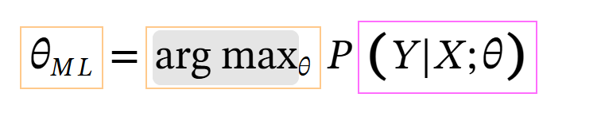
sexy

Maybe nice for final product: instead (?) of having complicated stuff with predefined courses or sth for the menus, just have a component where user drags nodes to, and each becomes a "template node" that is "permanent" and can be dragged to copy. Easy to delete, even easier to add, and maybe that component can have tabs to divide the mess into own-defined collections of templates

### 26/05/2025

When doing 1/2 and then ^3 it will allow it, which looks off cuz irl you would put brackets no?

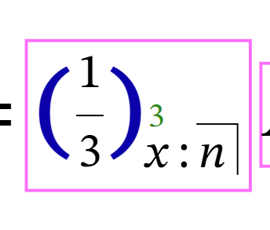
current impl does this shite but that is ok because
`_{}^{}{(\frac{1}{2})}_{\overset{1}{x}:\angl{n}}^{}`
also does that, and this is just the dirty version that does not use itop etc yet
TODO: explain the diff in user guide and/or report, and maybe even impl a tooltip or sth to recc switch to itop

Big Operator: inline sum is quite similar to Sigma with subright and supright (but not 100% same :()
otherwise need bigass version :3
This whole inline vs block shite is really annoying. I think since my app is a visual version that should translate to latex in a WYSIWYG way, I need to choose 1 (or support both but have a toggle). I choose block for now

Idea for the big clipboard thingy: just drag into it to save to collection. Then also have a little box to drag into to delete. But since deletion is probably often needed: do not ask "are you sure?". Rather, have a ~5min timer to undo any trashed before it is permanently deleted? Also give this component a "selection" mode where you can click a bunch and drag all of em into the trash. In the trash, also put a "recover all" option.

changed fraction children size to 1em cuz that is what inline mode seems to do?

BUG: currently when turning node into group it does not wrap in IC
TODO: when typing into the scrollable (cuz v long eq), make it shift so user sees the new stuff instead of staying at the start
TODO: make brackets take on parent's height?
TODO: enable scroll in editor component (or buttons!) to change base text size

Broke everything; TODO revert all or check all where I use -1 

Must ask chatgpt wtf I should do to get the mouse-based cursor control inside the number
Fixed the del a lil but still makes it del 2x necc for single char
also arrow nav is fucked
nav bit works now but only not on last node, and also still not at all inside text nodes 
I am confused, why do I have index seperate from cursor again in math renderers??
index is the index of the node itself
cursor holds the curr index in the doc

Maybe I need sth like this but for within textnode? 
```
    <span
      className={clsx("math-node", "type-inline-container")}
      onClick={(e) => {
        e.stopPropagation();
        if (node.children.length === 0) {
          onCursorChange({ containerId: node.id, index: 0, offsetInTextNode: 0 });
        }
      }}
    >
      {node.children.map((child, i) => {
        const elements: React.ReactNode[] = [];

        // Render cursor before this child if applicable
        if (isCursorInThisContainer && cursor.index === i) {
          elements.push(<span key={`cursor-${i}`} className="cursor" />);
        }

        // Render the child itself
        elements.push(
          <MathRenderer
            key={child.id}
            node={child}
            cursor={cursor}
            onCursorChange={onCursorChange}
            onRootChange={props.onRootChange}
            parentContainerId={node.id}
            index={i + 1}
            inheritedStyle={props.inheritedStyle}
          />
        );

        return elements;
      })}

      {/* Cursor at the end of the container */}
      {isCursorInThisContainer && cursor.index === node.children.length && (
        <span className="cursor" />
      )}
    </span>
```

curr nav broken: char not navvable if in_idx is not 0. somehwer, I do not properly update

offsetInTextNode will be removed. I will be using TextNode only for single-character stuff, and when multi-digit stuff is made it will become some kinda container (IC, Group, or new type). For commands it is more difficult: mutli-char must have cursor control BUT ALSO easily allow for match checking and replacement of the node.

TODO introduce wrapper nodes:
```
interface MultiDigitNode extends BaseNode {
  type: "multi-digit";
  children: TextNode[]; // each with one digit
}
```
and 
```
interface CommandInputNode extends BaseNode {
  type: "command-input";
  children: TextNode[]; // e.g., `\a`, `\al`, `\alpha`
}
```
And remove all the shit I added for offset in textnode

```
if (char === "\\") {
      const newCommandInput = createCommandInputNode([createTextNode(char)])

      const updatedChildren = [
        ...children.slice(0, index - 1),
        newMultiDigit,
        ...children.slice(index),
      ];

      const updatedRoot = updateNodeById(state.rootNode, container.id, {
        ...container,
        children: updatedChildren,
      });

      return {
        rootNode: updatedRoot,
        cursor: {
          containerId: container.id,
          index: index + 1,
        },
      };
    }
```
^make sth like that appear first to ensure commands make new node wrap
TODO: maybe I need to put IC and the new wrappers into own node type so I won't run into trouble with the container tracking for cursor

### 27/05/2025

Made commandinputnode safe del and nav
but it does not allow insertion yet within the node, only nav and del
TODO fix that
TODO also make sure that command is reverted back to flattened when the "\" is removed

I also broke digits, now they are always just atomic 

TODO: backspace on empty childed's child should go to prev child, except when first child: then if all empty, revert to its base

Fixed bracket creation cursor jumps

TODO: Everything I do with adding to multidigit etc should also exist at the other side of it. I.e. always checking if next node is multidigit (or curr digit and next digit to merge).

Things to wrap in brackets when applying transform: 
- fraction
- ...


Style-coding node types:
:green_heart: clarity of current state
:green_heart: 
:warning: coloring like vsc assumes user's own experiences
:warning: removes "WYSIWYG" effect: no longer really what you "get" when copying to latex

### 28/05/2025
`\\sum _{i\doteq 1}^{N}(_{}^{}{x}_{}^{i}+\frac{2x}{3})`
did some parsing fixes for new nodes etc
still bad when doing a space after the latex stuff
need to check if spaces are expected and if so maybe explicitly match on them for special symbols
or otherwise need to change the mapping to actually split latex from input sequence (which is a good idea anyway) in SpecialSequences

TODO:
- fix bracket matching in parser
- fix \sum in parser
- ignore(?) rootwrapper in parser
- make all special sequences have latex seq separate from input seq, even if I will use the same for almost all, because otherwise it is impossible to force commands that are unknown in the app. Because "\" becomes setminus. Not sure actually atm if my idea fixes that
- work on special styling for sum and inf, because they cannot be treated the same due to diff spacing (annoying gap down) and the way the next math will not be nicely aligned as you expect in latex

:) made nth root rendering etc
- TODO: eventually use svg for all kinds of fancy stuff to actually make it latexy?
- TODO: make cursor disappear if full editor component not selected?
- TODO!!: do not allow paste of IC into IC --> flatten!

There are a lot of bugs atm but I want to implement a simple version of node dragging next to make sure that idea is even possible. But make it as generic as possible i.e. not depend on node types, no cases, blabla

TODO allow period inside multidigit (and comma?). uhhm maybe I need to actually know what is an operator vs not


Starting to look pretty nice, but that first bracket pair should not be needed. I need to split operators...

Next steps:
- multi-node selection (siblings)
- drag into "clipboard" section
- drag from "clipboard" section
- drag within node
- multi-node drag (wrap into IC or other container type?)
- fix multidigit starting idx issues (similar to end of multidigit). Same for command-input
- hover actions on hover of accentNode
- implement matrices and vectors and binom
- hover actions on hover of groupnode -> to matrix/vector etc
- hover actions on hover of actsymb or subsup -> switch to the other variant
- ArrowNode?
- CasesNode
- MultiLineEquationNode
- enable zooming in editor to change text size

Nice? 
- Make a little grey text in the upper right corner of the editor component that always prints the name of the node type you are hovered on? 
- .type-actsymb .base .type-inline-container should have the color bg but nested IC in it should not. Only fist level child!

Things to think about:
- what to do with things like \lim? It already looks good, but it will give the wrong latex because in latex it's sub and superscript, while in mine it is \underset and \overset. Maybe I need to make those a bigOperator?? In node transformations
- REALLY have to clean up specialSequences

ugh I really need to fix multichar nodes

Very generally speaking: this editor is all about simplifying latex typing by offering visual structure and hotkeys while typing it. It is important that each hotkey etc does what you expect, and is relevant for the use case. I think my editor is WYGIWYM for the step from typing to visualization in-app, but the app is _supposed to be_ WYSIWYG for LaTeX (but it isn't -- it has colors. And differences because latex is huge).

Big choice to make:
what is more intuitive? f2/ gives (f2) or only the 2 as numerator?
I.e. ditch the multidigit; match until operator (?) during node transforms, or leave as is?

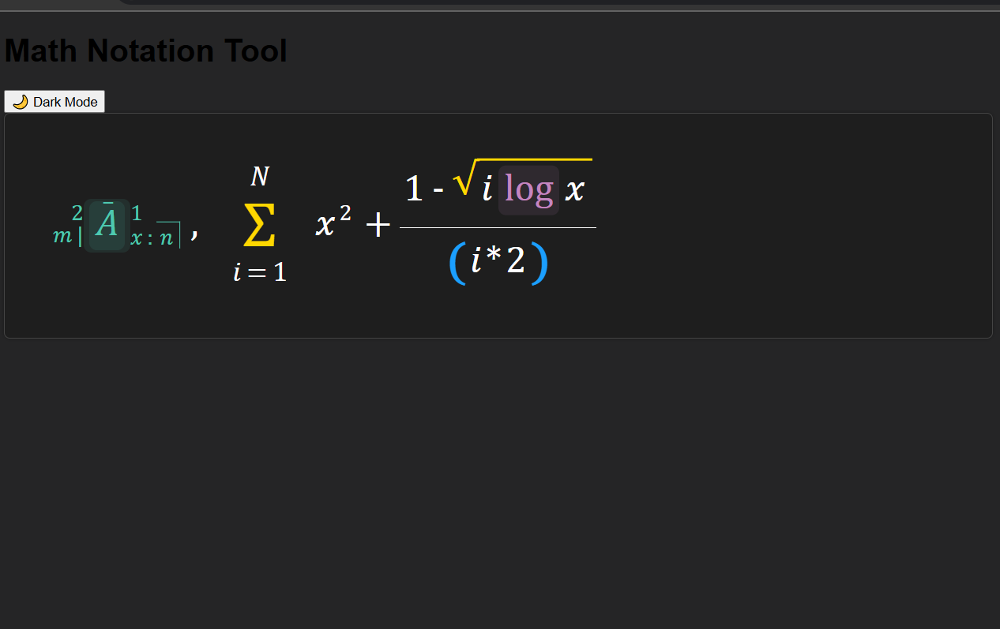

Im so tired rn but chatgpt has now the last message be exactly what I am looking for as implementation plan for multiselect

### 29/05/2025
This app should allow to type anything _as on the board in a lecture_. That means 

| Hotkey               | Function                     |
| -------------------- | ---------------------------- |
| `Ctrl + Alt + Del`   | Task manager/security screen |
| `Alt + F4`           | Close active window          |
| `Alt + Tab`          | Switch between apps          |
| `Ctrl + Shift + Esc` | Open Task Manager            |
| `Win + L`            | Lock screen                  |
| `Win + D`            | Show desktop                 |
| `Win + E`            | Open File Explorer           |
| `Win + R`            | Run dialog                   |
| `Win + Tab`          | Task View                    |

| Hotkey                   | Function            |
| ------------------------ | ------------------- |
| `Ctrl/Cmd + T`           | New tab             |
| `Ctrl/Cmd + W`           | Close tab           |
| `Ctrl/Cmd + R`           | Reload page         |
| `Ctrl/Cmd + Shift + R`   | Hard reload         |
| `Ctrl/Cmd + L`           | Focus address bar   |
| `Ctrl/Cmd + Shift + T`   | Reopen closed tab   |
| `Ctrl/Cmd + Tab`         | Next tab            |
| `Ctrl/Cmd + Shift + Tab` | Previous tab        |
| `Ctrl/Cmd + + / -`       | Zoom in/out         |
| `F5`                     | Reload (Windows)    |
| `Cmd + ,`                | Preferences (macOS) |
| `Ctrl + F`               | Find in page        |

| Hotkey             | Why Be Careful                     |
| ------------------ | ---------------------------------- |
| `Ctrl/Cmd + C/V/X` | Copy/Paste/Cut – expected behavior |
| `Ctrl/Cmd + Z/Y`   | Undo/Redo – standard editing       |
| `Ctrl/Cmd + S`     | Save – might trigger browser save  |
| `Ctrl/Cmd + P`     | Print – opens system print dialog  |
| `Ctrl/Cmd + D`     | Bookmark page                      |
| `Ctrl/Cmd + O`     | Open file                          |

My current hotkeys:
| Hotkey             | My App's Behavior                     |
| ------------------ | ---------------------------------- |
| `Ctrl + C/V/X` | Copy/Paste/Cut – expected behavior |
| `Ctrl + Z/Y`   | Undo/Redo – standard editing       |
| `Shift + 6`     | (`^` wihtout Dead;) make subsup & focus top-right |
| `Shift + _`     | (to match prev;) make subsup & focus bottom-right |
| `Ctrl + 6`     | make actuarial & focus top-right |
| `Ctrl + _`     | make actuarial & focus bottom-right |
| `Ctrl + Shift + 6`     | make actuarial & focus top-left |
| `Ctrl + Shift + _`     | make actuarial & focus bottom-left |
| `Shift + ArrowUp`     | make custom accented & focus above |
| `Shift + ArrowDown`     | make custom accented & focus below |
| `/`     | make fraction & focus denominator |

TODO: ensure \/ gives a normal slash

I asked chatgpt for a refactor to clean up renderers and instead got the completion of unimplemented node types
```
// --- Additional Renderers ---

export const renderMatrixNode = (
  node: any, // Replace `any` with your actual MatrixNode type if available
  props: RenderProps
) => {
  return (
    <span className="math-node type-matrix" onMouseEnter={() => props.onHoverChange?.(node.id)}>
      <span className="matrix-bracket-left">[</span>
      <span className="matrix-contents">
        {node.rows.map((row: any[], rowIndex: number) => (
          <div key={rowIndex} className="matrix-row">
            {row.map((cell: MathNode, cellIndex: number) => (
              <span key={cell.id} className="matrix-cell">
                <MathRenderer
                  node={cell}
                  {...props}
                  parentContainerId={node.id}
                  index={0}
                />
              </span>
            ))}
          </div>
        ))}
      </span>
      <span className="matrix-bracket-right">]</span>
    </span>
  );
};

export const renderVectorNode = (
  node: any, // Replace with VectorNode if defined
  props: RenderProps
) => {
  return (
    <span className="math-node type-vector" onMouseEnter={() => props.onHoverChange?.(node.id)}>
      <span className="vector-bracket-left">[</span>
      <span className="vector-contents">
        {node.elements.map((el: MathNode, i: number) => (
          <div key={el.id} className="vector-element">
            <MathRenderer
              node={el}
              {...props}
              parentContainerId={node.id}
              index={0}
            />
          </div>
        ))}
      </span>
      <span className="vector-bracket-right">]</span>
    </span>
  );
};

export const renderBinomNode = (
  node: any,
  props: RenderProps
) => {
  return (
    <span className="math-node type-binom" onMouseEnter={() => props.onHoverChange?.(node.id)}>
      <span className="binom-bracket-left">(</span>
      <span className="binom-contents">
        <div className="binom-top">
          <MathRenderer node={node.top} {...props} />
        </div>
        <div className="binom-bottom">
          <MathRenderer node={node.bottom} {...props} />
        </div>
      </span>
      <span className="binom-bracket-right">)</span>
    </span>
  );
};

export const renderArrowNode = (
  node: any,
  props: RenderProps
) => {
  return (
    <span className="math-node type-arrow" onMouseEnter={() => props.onHoverChange?.(node.id)}>
      <span className="arrow-left">
        <MathRenderer node={node.left} {...props} />
      </span>
      <span className="arrow-symbol">{node.arrow}</span>
      <span className="arrow-right">
        <MathRenderer node={node.right} {...props} />
      </span>
    </span>
  );
};

export const renderCasesNode = (
  node: any,
  props: RenderProps
) => {
  return (
    <span className="math-node type-cases" onMouseEnter={() => props.onHoverChange?.(node.id)}>
      <span className="cases-brace-left">{'{'}</span>
      <span className="cases-contents">
        {node.rows.map((row: { condition: MathNode; result: MathNode }, i: number) => (
          <div key={i} className="cases-row">
            <span className="cases-result">
              <MathRenderer node={row.result} {...props} />
            </span>
            <span className="cases-condition">
              <MathRenderer node={row.condition} {...props} />
            </span>
          </div>
        ))}
      </span>
    </span>
  );
};

export const renderMultilineNode = (
  node: any,
  props: RenderProps
) => {
  return (
    <span className="math-node type-multiline" onMouseEnter={() => props.onHoverChange?.(node.id)}>
      <span className="multiline-contents">
        {node.lines.map((line: MathNode[], lineIndex: number) => (
          <div key={lineIndex} className="multiline-line">
            {line.map((child: MathNode, i: number) => (
              <MathRenderer
                key={child.id}
                node={child}
                {...props}
                parentContainerId={node.id}
                index={0}
              />
            ))}
          </div>
        ))}
      </span>
    </span>
  );
};

```

Hover stuff nice-ish
drag stuff fffuuuuuuccckkkkeedddd
but draggable-node-wrapper not yet styled so that is first thing to try
after that, actually fix those functions

OK kinda works 
Next steps:
- (DONE) get back my pretty styling of special nodes? 
- enable ctrl z of drag actions
- allow drop also in IC

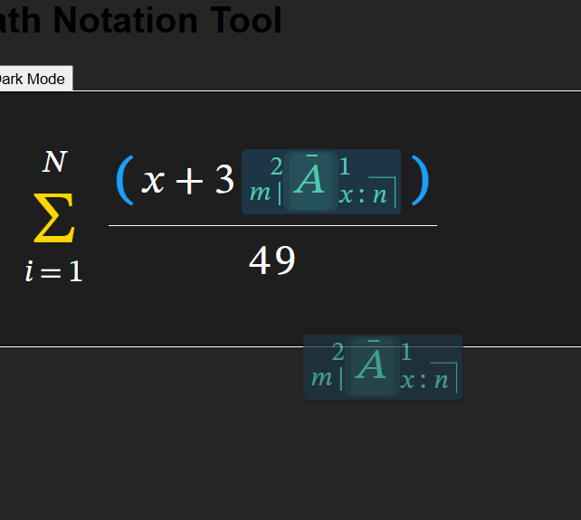
Drag queen

### 30/05/2025
Did some styling cleanup
also found out that currently, index of nth root does not influence parent width when long. //TODO fix later

Latex box stuff!
My inspiration for the refresh latex button:

|Outdated|Not outdated|
|--|--|
||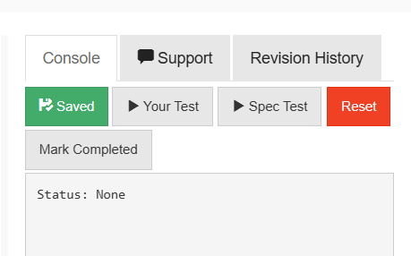|

From WebLab: https://eip.pages.ewi.tudelft.nl/eip-website/weblab.html

Overleaf colors for block style:
#833fba: things with slash 
#036a07: non-brackets

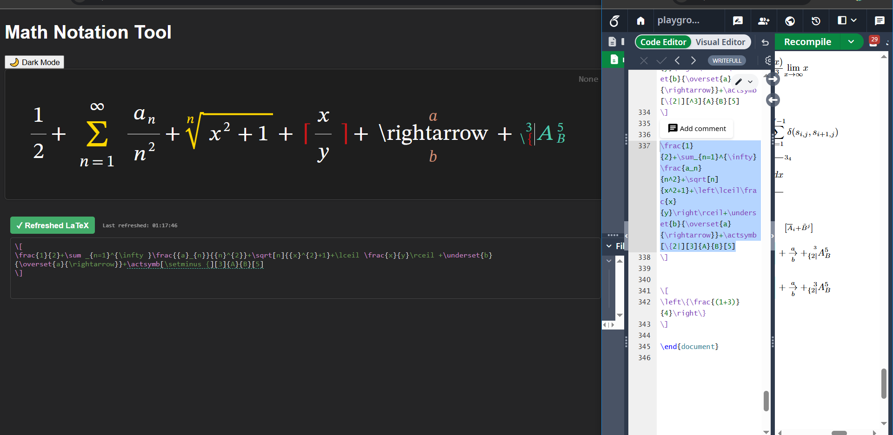
lots and lots and lots and lots and lots of debugging today. It's still broken but for the nicher stuff mostly 

Next steps
- fix more (i.e. `\{` not being group node but allowed to be anway); and group node pairing of rceil; and recognize \rightarrow (I think \to overrides it cuz no 1:1 mapping in specialSequences)
- Make dragging actions part of EditorHistory
- Make hover actions NOT part of EditorHistory

quickly fixed command bracket insert (only in editor, not from latex)
Note: when implementing the drag-from-dumpster thingy, I should not have it be anything about state cuz by then the parser _should_ work, meaning I can just insert at index from latex? Idk yet

Maybe use Fn - instead of Ctrl - cuz I am already suffering because it feels like Ctrl - should zoom 

### 31/05/2025 
How to match all special sequences w style

`sequence: "([^"]+)", \n    createNode: \(\) => createStyledNode\(\n      createTextNode\("([^"]+)"`
Replacement: `sequence: "$1", \n    createNode: () => createStyledNode(\n      createTextNode("$2", "$1"`

Check for success: `createTextNode\("[^"]+"\)` should give no results

refactored some of specialSequences (MUCH BETTER OMG)

TODO: must ensure some way to get styling options back in latex. Either by node to latex having a style case, or by doing a similar thing as the new inputAlias of textnode?

| Command         | Style             | Works on      | Notes                                                             |
| --------------- | ----------------- | ------------- | ----------------------------------------------------------------- |
| `\mathcal{}`    | Calligraphic      | A–Z           | Only uppercase; default in LaTeX                                  |
| `\mathscr{}`    | Script (fancier)  | A–Z           | Needs `\usepackage{mathrsfs}` or `mathpazo`                       |
| `\mathfrak{}`   | Fraktur (Gothic)  | A–Z, a–z      | Needs `\usepackage{amssymb}` or `eufrak`                          |
| `\mathbb{}`     | Blackboard Bold   | A–Z           | Used for number sets: `\mathbb{R}, \mathbb{N}`; needs `amssymb`   |
| `\mathbf{}`     | Bold Roman        | A–Z, a–z, 0–9 | Bolds normal Latin characters (not Greek)                         |
| `\boldsymbol{}` | Bold math symbols | Everything    | Bolds Greek, operators, etc.; needs `amsmath`                     |
| `\mathrm{}`     | Upright Roman     | A–Z, a–z      | Non-italic math text (useful for units/constants like "Re", "Im") |
| `\mathit{}`     | Italic Roman      | A–Z, a–z      | Forces italic even in non-default contexts                        |
| `\mathtt{}`     | Typewriter        | A–Z, a–z      | Fixed-width font, good for code snippets                          |
| `\mathsf{}`     | Sans-serif        | A–Z, a–z      | Rare, but sometimes used in stylistic documents                   |

Implemented: Now if trying to get unknown open/close bracket, it gives empty string
TODO: add overline and underbrace styles for nodedecoration
underbrace is so hideous and also it doesnt work well cuz it should b elike bigop but for me it is a deco
but that is not the most important thing atm

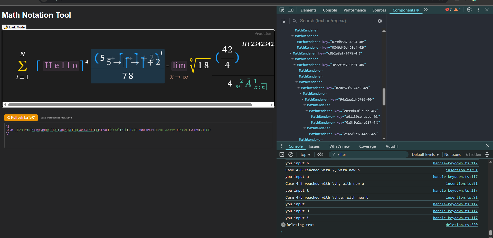

Weeee
nice work

Next steps:
- ensure clicking on non-text nodes still brings cursor somewhere intuitive
- allow dropping of dragged nodes into IC? 
- Make drop-target "cursor" 
- make "clear equation" button

### 01/06/2025

TODO: fix the drag-drop of multi-digit and command-input


AW YEHAHH

Also quickly added zoom stuff

Some next TODOs for usability but not extremely crucial yet:
- when childed base is larger than 1 node long, wrap into group

Just realised I am quite latex-focused. Maybe my output is latex. Latex is what you get. What you see is not at all what you get. What you see is what you would get if you would put what you got into a What You See Is What You Mean editor. Or so I thought. But latex is much more complex, e.g. with different column type options and stuff.

My editor in itself is **WYSIWYG** (What You See Is What You Get) because it's interactive; all about directly building the math.

But that is only for a single equation, and for within the app. You can look at your equation. Nice. Now what? Courses are more than 1 equation. I make the assumption that my editor is not enough. Latex parsing is a huge part of it, and latex is not at all what you were seeing in the editor. The part where I output latex is **WYSIWYM** (What You See Is What You Mean). Not your usual WYSIWYM editor, but it is similar in spirit. The loss of freedom in formatting appears in the form of loss of freedom in e.g. alias choices and spacing within the latex string.

But ideally, this latex is then put back into a normal WYSIWYM editor. Under the assumption that my application correctly understood what you meant, the output of the external editor _should_ be what you got from the app in the first place. Due to ambiguities, this step is messy. E.g. precedences in actuarial science can look like underset and overset. You can display them as under-/overset, and then so will your final render. But it is not what you meant. Similarly, since block vs inline math is not something you have to adhere to in physical notes I visually allow both. You can just make a subscript or superscript to make it look inline. The final rendering would do so too, so you get what you see but not what you mean.


Possible ways to represent a course:
1. **side menu is all notes (math + text pairs); main page is 1 pair and a to-latex; user saves new pair with selected custom tag that represents the course.**
  🔥 Courses-to-notations are allowed to be many-to-many
  🔥 Getting started takes 0 effort (Very friendly for quick use!)
  ⚠️ No feeling of a course "environment". (No clean dumpsters)
  ⚠️ user effort required to obtain course overview.
2. **Side menu is all courses, main page consists of an arbitrary-length sequence of math boxes and text boxes (similar to jupyter notebook), to-latex is moved outward to only translate the entire course to latex at once. This design would basically be reverse-overleaf.**
  🔥 Very sequential; by-design follows sequential (i.e. chronological) nature of real lectures.
  🔥 Great potential for to-latex: single click can give full latex for entire lecture/course, all styled and ready for pdf.
  🔥 To-latex can infer necessary packages and include them in the latex output. No extra effort or learning curve for the user.
  ⚠️ Need extra logic for text notes; sections and subsections etc may be necessary due to potentially large length of courses. This is easier than math (presumably) but I build this app due to other apps not being good enough for math. Text editors are already great, or at least better than what I would make.
  ⚠️ Learning curve for user to know what latex normally looks like, or just in general the planning in advance (even though the latex is the _output_, for text you still need to decide the ((sub)sub)section tree).
  ⚠️ Very sequential; implies that math (within a course) has a storyline.
  ⚠️ Forces certain ideas on the user about how course notes are supposed to look (i.e. math **blocks** and text, always under each other; no freedom in layout)
  ⚠️ No natural definition/separation of "lectures" within a course.
3. side menu is all notes within a course, main working page is a math-text pair, but home button exists that sends to an overview of courses (similar to e.g. overleaf or samsung notes). 
  🔥 Absence of other courses being visible may help feel like a clear environment; opens possibility to nicely separate different custom "node dumpster" for each course.
  ⚠️ Courses are very detached 

Sent the message

### 02/06/2025
he does not want it

what am i doing

todo: make childed revert to its base when dragging away the only child
todo: add logical up/down nav:
- fractions (+ calc which index?)
- big operators
- childed

### 03/06/2025

#### Components Pseudocode
Pseudocode of the components of the application.

**MathNotationTool.tsx** – _Top-level app container_
```
Component App:
  State:
    isDarkMode ← load from localStorage
    showHotkeys ← false

  on isDarkMode change:
    → update document theme
    → save to localStorage

  Functions:
    toggleDarkMode → toggle theme
    toggleHotkeyOverlay → toggle help visibility

  Render:
    - Header:
        - Dark mode toggle
        - Hotkey overlay toggle
    - Main:
        - MathEditor
    - If showHotkeys:
        - HotkeyOverlay (with onClose handler)
```

**HotkeyOverlay.tsx** – _Global keyboard shortcut reference modal_
```
Component HotkeyOverlay(onClose):

  Static data: groupedHotkeys = list of shortcut groups (title + key combos)

  On mount:
    - Listen for Escape → onClose
    - Listen for outside click → onClose

  On unmount:
    - Remove event listeners

  Render:
    - Modal with:
        - Close button
        - Title
        - For each group:
            - Section with title + list of hotkeys
```

**MathEditor.tsx** – _Main editor for a single math expression_
```
Component MathEditor:

  Setup:
    - Editor state & ref
    - Hooks for:
        - Undo/redo history
        - Hover tracking
        - Drag-and-drop
        - Zoom level

  On editor state change:
    - Sync ref with latest state

  Handlers:
    - onKeyDown: shortcuts, undo/redo, navigation
    - onCopy / onCut / onPaste: LaTeX serialization & parsing

  Render:
    - Editor container with keyboard/mouse listeners
    - MathRenderer (core visual rendering)
    - Overlays: hovered node info, zoom level
    - (Optional) LatexViewer for LaTeX output
```

**LatexViewer.tsx** – _Displays and manages LaTeX export for the editor_
```
Component LatexViewer(rootNode):

  State:
    - latex ← highlighted LaTeX string
    - lastRefreshed ← last update timestamp
    - isOutdated ← true if rootNode changed
    - copied ← clipboard status

  On rootNode change:
    → Mark as outdated

  Handlers:
    - Refresh:
        → Generate highlighted LaTeX
        → Update timestamp and flags
    - Copy:
        → Copy plain LaTeX to clipboard
        → Show confirmation briefly

  Render:
    - Refresh button + timestamp
    - Output box (highlighted LaTeX)
    - Copy button with visual feedback
```
**MathRenderer.tsx** – _Renders a single node using drag-and-drop-aware logic_
```
Component MathRenderer(node, props):

  Setup:
    - Define drag handlers:
        onDragStart, onDragOver, onDrop, onDragEnd
    - Create baseProps for shared interaction

  Logic:
    - Match node.type → call appropriate render function
    - If node is a drop target → render indicator

  Return:
    - Rendered node wrapped with drag behavior
```

**MathRenderers.tsx** – _Rendering logic for all node types (recursive)_
```
Function renderContainerChildren:
  - Check if cursor is in this container
  - For each child:
      - Insert cursor if needed
      - Wrap with click handler
      - Recursively render child
  - Add trailing cursor if needed

Function renderStyledNode:
  - Merge styles
  - Recursively render child

Function renderRootWrapperNode:
  - Render single child in wrapper

Function renderMultiDigitNode:
  - Render as span + recursively render children

Function renderCommandInputNode:
  - Use monospace style + render children

Function renderInlineContainerNode:
  - Span container with children

Function renderFractionNode:
  - Render numerator and denominator recursively

Function renderGroupNode:
  - Render brackets and inner content

Function renderChildedNode:
  - Render 5 slots (sup/sub left/right + base)

Function renderAccentedNode:
  - Render accent above/below + base

Function renderBigOperatorNode:
  - Render upper, operator, lower in stack

Function renderNthRootNode:
  - Render index and base with radical

Helper Functions:
  getStyleClass → map style type to className
  getInlineStyle → convert style to CSS
  getIsHovered → match hoveredId
  handleMouseEnter → set hoveredId
  handleMouseLeave → conditionally clear hover
```
Progress:
- made nodeToLatex only have 1 function, with the "highlighted?" being a boolean input argument
- made cursor show only in selected container
- enable individual zoom level per container
- enable global zoom reset with custom preference
- turn tool into jupyter-notebook-inspired scrollable cell list of Math cells and Text Cells

todo: make nice preview toggle: 
- set text-align: center in math-editor
- hide all latex
- remove borders and box-shadows from cells
- set zoom levels to fit the boxes?
- no hover and zoom info in corners 

- make max zoom in preview mode be just enough to not overflow-x

todo: usability improvements for new overall app design
- make cell actions undoable
- enable cell duplication
- enable cell re-ordering by drag
- enable cell insertion by hover between existing cells

todo: 
- do not make the hover drop cursor stay forever (easy fix same as normal cursor)
- make zoom outside contianer do actual zooming of the rest of the app

### 04/06/2025 
I should not be working on this today but train wifi sucks so this is the one thing I do not need wifi for

📖: better "icon" for preview mode

some usability idea(s):
- when pressing shift on hover, move hover target the (valid; ie. maybe skip IC) parent. THis would really save time instead of having to be very exactly in the right place with mouse
- when hover target is a child of some non-IC node, highlight the parent in lower opacity, or make little outline, so the user knows what it belongs to
- zoom-to-fit (for all math? Either take the edge case for all, or zoom all to fit independently)

todo meta-stuffs:
- find out wtf is making the textcell laggy. That is a big problem for a 100+wpm typer for sure
- make zooming do normal page zoom when not inside a cell
- also zoom text cells (but maybe not indiv? idk yet. For math makes sense cuz math is recursive but text is just text bro)
- make latex viewer auto refresh on toggle
- move latexviewer to the MathCell (so 1 up from the MathEditor) 
- duplicate, drag, undo/redo cells
- copy paste cells?
- make math cell not be exactly too big for no overflow (may be caused by nth-root?)

todo editor stuffs:
- make ^i not do î when doing something to the power of i (idk yet how)

left-side menu:
- all courses (or all notes, whatever a note represents)
- "outline" (in document) - will work w header, subheader, text, and math? 

Done today:
- removed the header that said "Math Notation Tool"

next step for the header:
- make sticky
- add "Add cell" button for both cell types
- theme toggling should go into "settings" popup/overlay/page/whatever
- "Hide all latex"

### 05/06/2025

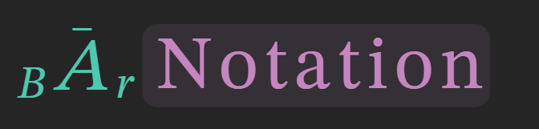
That should totally be the logo

Cool logo stuff today
still todo tonight: 
- make a basic menu at the left, or on the right, so at least I have some overall layout to work with that is placeholder for final node library and notation history list

things that need fixing or implementing:
- in preview mode, childed is always slightly overflowing in y
- ffs move the hover bar of math cells away from the hovered node info 
- make hover bar not hover bar but active bar. Just like jupyter notebook
- always print the type of cell in the lower right corner
- also make the text cell zoomable
- ctrl + or - should zoom not only the math (/text) cells but also the size of the header text. But maybe zooming by touchpad should actually keep the "move closer" type of zoom rather than the "enlarge text"?
- no toggle button for theme in settings. Make it a dropdown, or horizontal list of radio-button-like use. (i.e. only 1 can be selected at once) 

editor stuff:
- nested brackets must take other colors, just like vsc

### 06/06/2025
Feeling a little demotivated because soon the logical next step is database stuff 😭

Moved cells to separate folder and made shared BaseCell but now LatexViewer should really be moved 1 lvl up at least (?), and the old .tsx for cells should be deleted later when I am sure the new ones are perfect

added option to (not) use color in preview but still need to use it in the actual code. Atm it does nothin

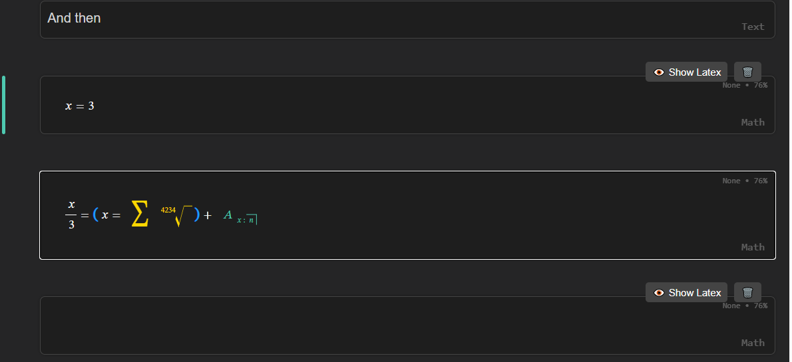
Oops, right now when doing +Math with tab it will select the new one so it will have the wrong cell outlined because the outlining is by mouse
```
|   App.tsx                        # div with main component loaded in (for maintainability)
|   index.css                      # @import "tailwindcss", (hopefully) unused for the remainder
|   main.tsx                       # Loads App in React.StrictMode
|   vite-env.d.ts                  
|                                 
+---assets                         
|       logo.svg                   # svg with the full logo (used in the header bar)
|                                 
+---components                     
|   |   BarNotation.tsx            # main app component
|   |   LatexViewer.tsx            # little box in MathEditor for viewing latex of 1 expression
|   |   MathEditor.tsx             # used in MathCell, holds 1 math expression (and a bunch of state)
|   |   MathNotationTool.tsx       # (outdated full app:) list of cells (+ header bar that will change)
|   |   MathRenderer.tsx           # recursively called to render expression, + wraps in draggable
|   |   MathRenderers.tsx          # called by MathRenderer, holds renderers for each MathNode type
|   |                              
|   +---cells                      
|   |       BaseCell.tsx           # Basic Cell stuff
|   |       InsertCellButtons.tsx  # Insert Math Cell / Text Cell buttons (re-used a lot)
|   |       MathCell.tsx           # Cell containing MathEditor
|   |       TextCell.tsx           # Cell containing simple textarea
|   |                              
|   +---layout                     
|   |       HeaderBar.tsx          # Main header bar (curr outdated; holds logo, settins, cell options)
|   |       MainLayout.tsx         # Main layout (Header, Note History, Note Editor, Library)
|   |                              
|   +---modals                     
|   |       HotkeyOverlay.tsx      # Overlay of hotkey info    
|   |       SettingsModal.tsx      # Overlay of settings (options/preferences, e.g. light vs dark theme)
|   |                              
|   +---tooltips                   
|   |       tooltip.css            # styling for tooltips
|   |       Tooltip.tsx            # tooltip wrapper to show text on hover of other components
|   |                              
|   \---zOutdated                  # Outdated stuff that I am keeping for now, just in case
|           MathCell.tsx           
|           TextCell.tsx           
|           Toolbar.tsx            
|                                 
+---hooks                          
|       useCellDragState.ts        # Hook for dragging cells (for re-ordering in MathNotationTool)  
|       useDragState.ts            # Hook for dragging MathNodes within the MathEditors 
|       useEditorHistory.ts        # Hook for history of single MathEditor (may move to top-level)
|       useHoverState.ts           # Hook for hover of MathNode in a MathEditor
|       useZoom.ts                 # Hook for zooming of MathEditor (may move higher as well)
|                                 
+---logic                          
|       cursor.ts                  # CursorPosition (in MathEditor): curr InlineContainer + idx within 
|       deletion.ts                # Backspace handler (in MathEditor)
|       editor-state.ts            # EditorState: rootNode and CursorPosition (in MathEditor)
|       handle-keydown.ts          # Keydown handler for MathEditor
|       history.ts                 # HistoryState (same format as EditorState) used in history hook
|       insertion.ts               # Handle character insertion into MathEditor
|       navigation.ts              # Handle arrow navigation in MathEditor
|       node-manipulation.ts       # Node insertion/deletion, at cursor or by index/id, in MathEditor
|       transformations.ts         # Transform nodes, e.g. into numerator of new FractionNode
|                                 
+---models                         
|       mathNodeParser.ts          # (Will rename) parse LaTeX, to obtain MathNode
|       nodeFactories.ts           # Factories for all Math Node types
|       nodeToLatex.ts             # input MathNode, output LaTeX string
|       specialSequences.ts        # mappings from escape sequences to `() => StructureNode` 
|       transformations.ts         # more "boilerplate" transforms (might remove, similar to factories)
|       types.ts                   # MathNode = .. | InlineContainer | StructureNode (fraction, bigOp, group, ...)
|                                 
+---styles                         
|       accents.css                # ::before and ::after for rendering accented math nodes 
|       cells.css                  # styling for MathCell, TextCell, cell list itself, and insert zones
|       hotkeyOverlay.css          # styling for HotkeyOverlay (also used by SettingsModal)
|       math-node-old.css          # outdated styling
|       math-node.css              # styling for math node types and MathEditor
|       math.css                   # outdated styling (I think)
|       settings.css               # Styling for toggles in settings 
|       styles.css                 # Styling for header bar, settings overlay, LatexViewer, and .app-container 
|       themes.css                 # :root, .dark (theme, will add more themes later), and predefined DOM stuff (h1, html, body, label)
|                                 
\---utils                          
        accentUtils.ts             # define NodeDecoration names and map to Latex, keep track of required LaTeX packages
        bracketUtils.ts            # define BracketStyle and each style's opening and closing bracket character
        navigationUtils.ts         # define directional order of MathNodes' children, function for flattening CursorPosition
        subsupUtils.ts             # define "CornerPosition" type, only used once in transformations.ts
        textContainerUtils.ts      # (unused, might use later) splitting MultiDigit mathnode into multiple (curr not implemented feature)
        treeUtils.ts               # find nodes, update tree, get logical children of nodes, etc.
```

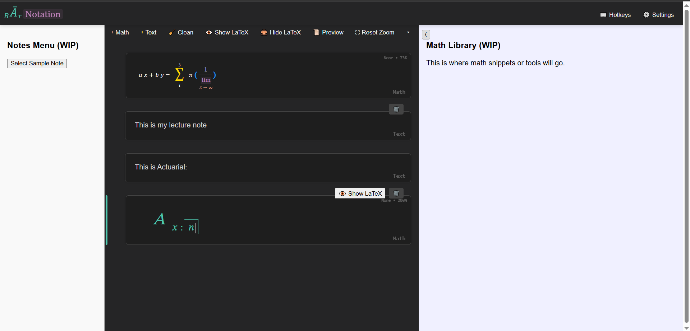
Starting to look like a real app :D
TODO:
- make add cell buttons visible w/o hover at the end of non-preview-mode cell list
- fix the weirdass overflow-y (on short cell list, should not overflow)
- fix the way overflow-y works: only the editor pane should be scrollable (if that is the one that is overflowing)
- make note menu also resizable and collabpsible
- Remember width of un-collapsed menus, so it can go back to that after uncollapsing again

2nd level priority:
- move LatexViewer OUT of the MathEditor cell thing. Make it go under. Kinda like running a code cell in jupyter notebook
- hover of delete buttons should be red
- fix the "+Math"/"+Text" buttons in EditorHeaderBAr
- wrap Reset Zoom with its arrow, so they don't break up during squishing

Cool things that will happen afterwards:
- add "export to Latex" button in EditorHeaderBar (with cool logic to actually do that -- math editors give the blocks, text goes between. BUT I think I can also infer which packages are needed. And with date info and metadata like the name of the notation and the user, I can make the whole dang latex, ready for pdf when pasting it into overleaf!)
- The library!!!! So much work
- Saving notations
- search logic in both the compoennts ^^ 
- Right-click(?) on a tab inside the MathLibrary should enable "Split Library" - which will then split that component into 2 collections being shown and usable at the same time, taking both the half of the library's width. The user can drag math cells from one collection to the other (this is important cuz they might want to have a collection per course, and re-use things from similar courses from the past)
- in the main header should be options to chnage the global layout (e.g. move the library to be horizontal, under the editor pane)  

### 07/06/2025


IT LOOKS LIKE AN APP

bugs:
- zoom preference resizes parts of the app so it moves itself, leading to horrible epileptic danger stuff

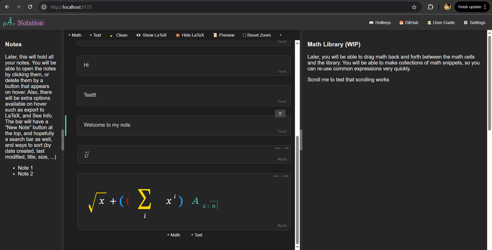

many bugs still but I gotta slow down and do my real uni stuff

things to do:
- Editor panel stuff
  - add Export to Latex for full note (with bunch of stuff to implement e.g. package requirement logic, preamble building, can have Author and Date if I have the user fill in their name somewhere in the app. Perhaps lower left corner?)
  - fix buttons in editor header
  - move Latex previews out of the cell visual background, put it under (with normal editor bg color, so it does not actually "live in the math block")
  - group the zoom button and dropdown to never break up
  - Make Header (mandatory; synced with Note name in notes menu)
  - enable (sub)sections (as a type of cell)
  - enable collapsing of (sub)sections
  - enable dragging between math cells
- Math AST stuff
  - add binom, vector and matrix
  - add Precedences into predef accents
  - add MultiLine
  - add Cases
  - add Arrow (? the auto resize one)
  - fancily deal with \left and \right
  - implement on-hover actions
  - fix MultiCharacter stuff
- Math Library
  - enable drag-and-drop back and forth between library and math cells
  - make header bar and multi-collection support 
  - enable "split library" for viewing multiple collections at once
  - enable dragging between collections (for deep copying)
  - persistent storage
- Notes Menu
  - make into nice list
  - persistent storage
  - enable delete & view details: time created, modified, other relevant metadata (about courses? idk yet)
- Main layout
  - enable customizing the layout (maybe just current 3 vertical, versus left stays but editor and library go under each other). It may be nice also to enable "popup view" for library collections, so the user can drag it to the left for faster accessibility as well.

### 25/06/2025
Time to get back to this wonderful project

I think I need to move all cell content upward in the architecture, to implement dragging between cells and between the editor and the library

Also I should add some fields at the top of any notebook that contain the title, author name, date (?) and maybe a short "abstract/summary" to put also in the notes menu for displaying. 

#### Ideas for the metadata at top of notebook
**What would *I* need?**
1. Title
2. course code
3. course period ((Y/Q) or start date - end date?) 

TU Delft names courses like this in Brightspace:
> DSAIT4070 Designing Human-Centred AI Systems (2024/25 Q4)

I.e.,

> {course_code} {course_title} ({course_period})

**What does latex benefit from?** (I.e. things in preamble)
- \title{My Bar Notation}
- \author{Kayyleigh the Evil Genius}
- \date{May 2025} (or even \date{Y1Q4})

Other things that go in preamble:
- later auto-inferred \usepackage 😃

**Combining these 2**:
1. (Required) Title
2. (Optional) Author name - taken from within my app (some field in settings that is your "account". Only used for this purpose)
3. (Optional) course code
4. (Optional) course period - could have auto "today" button? With setting of what format that would use
5. auto-inferred \usepackage

1 and 3 merged in latex conversion into "Title" field

Thus, required implementation:
- Make account name field (in settings)
- Make: title, cc, cp, author fields
- Auto-fill author field to account name
- Other stuff is for later (like datetime format etc)

Current filetree
```
.
├── App.tsx                        # div with main component loaded in (for maintainability)
├── index.css                      # @import "tailwindcss", (hopefully) unused for the remainder
├── main.tsx                       # Loads App in React.StrictMode
├── vite-env.d.ts                  # Vite environment type declarations (default)
│
├── assets
│   └── logo.svg                   # svg with the full logo (used in the header bar)
│
├── components
│   ├── cells
│   │   ├── BaseCell.tsx           # Basic Cell stuff
│   │   ├── InsertCellButtons.tsx  # Insert Math Cell / Text Cell buttons (re-used a lot)
│   │   ├── MathCell.tsx           # Cell containing MathEditor
│   │   └── TextCell.tsx           # Cell containing simple textarea
│   │
│   ├── editor
│   │   ├── Editor.module.css      # Styling for EditorPane and NotationEditor
│   │   ├── EditorHeaderBar.tsx    # Header bar for EditorPane (may show breadcrumbs or tools)
│   │   ├── EditorPane.tsx         # Main pane containing the math/text cells
│   │   └── NotationEditor.tsx     # Main app component (used in MainLayout)
│   │
│   ├── icons
│   │   └── CollapseIcon.tsx       # Collapse arrow icon (for UI collapsing)
│   │
│   ├── layout
│   │   ├── MainHeaderBar.tsx      # Main header bar (curr outdated; holds logo, settings, cell options)
│   │   ├── MainLayout.tsx         # Main layout (Header, Note History, Note Editor, Library)
│   │   ├── ResizableSidebar.module.css  # CSS for resizable sidebar styling
│   │   └── ResizableSidebar.tsx   # Sidebar that can be resized (e.g. for note history)
│   │
│   ├── mathExpression
│   │   ├── LatexViewer.module.css # Styling for LatexViewer
│   │   ├── LatexViewer.tsx        # Little box in MathEditor for viewing LaTeX of 1 expression
│   │   ├── MathEditor.tsx         # Used in MathCell, holds 1 math expression (and a bunch of state)
│   │   ├── MathRenderer.tsx       # Recursively called to render expression, + wraps in draggable
│   │   └── MathRenderers.tsx      # Called by MathRenderer, holds renderers for each MathNode type
│   │
│   ├── mathLibrary
│   │   ├── MathLibrary.module.css # Styling for math library pane
│   │   └── MathLibrary.tsx        # Panel showing predefined or saved expressions
│   │
│   ├── modals
│   │   ├── HotkeyOverlay.tsx      # Overlay of hotkey info
│   │   └── SettingsModal.tsx      # Overlay of settings (options/preferences, e.g. light vs dark theme)
│   │
│   ├── notesMenu
│   │   └── NotesMenu.tsx          # Menu for switching between notes (or opening new ones)
│   │
│   └── tooltips
│       ├── tooltip.css            # Styling for tooltips
│       └── Tooltip.tsx            # Tooltip wrapper to show text on hover of other components
│
├── hooks
│   ├── useCellDragState.ts        # Hook for dragging cells (for re-ordering in MathNotationTool)
│   ├── useDragState.ts            # Hook for dragging MathNodes within the MathEditors 
│   ├── useEditorHistory.ts        # Hook for history of single MathEditor (may move to top-level)
│   ├── useHoverState.ts           # Hook for hover of MathNode in a MathEditor
│   └── useZoom.ts                 # Hook for zooming of MathEditor (may move higher as well)
│
├── logic
│   ├── cursor.ts                  # CursorPosition (in MathEditor): curr InlineContainer + idx within 
│   ├── deletion.ts                # Backspace handler (in MathEditor)
│   ├── editor-state.ts            # EditorState: rootNode and CursorPosition (in MathEditor)
│   ├── handle-keydown.ts          # Keydown handler for MathEditor
│   ├── history.ts                 # HistoryState (same format as EditorState) used in history hook
│   ├── insertion.ts               # Handle character insertion into MathEditor
│   ├── navigation.ts              # Handle arrow navigation in MathEditor
│   ├── node-manipulation.ts       # Node insertion/deletion, at cursor or by index/id, in MathEditor
│   └── transformations.ts         # Transform nodes, e.g. into numerator of new FractionNode
│
├── models
│   ├── mathNodeParser.ts          # (Will rename) parse LaTeX, to obtain MathNode
│   ├── nodeFactories.ts           # Factories for all Math Node types
│   ├── nodeToLatex.ts             # input MathNode, output LaTeX string
│   ├── specialSequences.ts        # mappings from escape sequences to `() => StructureNode` 
│   ├── transformations.ts         # more "boilerplate" transforms (might remove, similar to factories)
│   └── types.ts                   # MathNode = .. | InlineContainer | StructureNode (fraction, bigOp, group, ...)
│
├── styles
│   ├── accents.css                # ::before and ::after for rendering accented math nodes 
│   ├── cells.css                  # Styling for MathCell, TextCell, cell list itself, and insert zones
│   ├── hotkeyOverlay.css          # Styling for HotkeyOverlay (also used by SettingsModal)
│   ├── latexOutputColoring.css    # Styling for LaTeX viewer's text coloring
│   ├── math-node.css              # Styling for math node types and MathEditor
│   ├── math.css                   # Outdated styling (I think)
│   ├── settings.css               # Styling for toggles in settings 
│   ├── styles.css                 # Styling for header bar, settings overlay, LatexViewer, and .app-container 
│   └── themes.css                 # :root, .dark theme, and predefined DOM stuff (h1, html, body, label)
│
└── utils
    ├── accentUtils.ts             # Define NodeDecoration names and map to LaTeX, track required LaTeX packages
    ├── bracketUtils.ts            # Define BracketStyle and its opening/closing characters
    ├── navigationUtils.ts         # Define directional order of children, flatten CursorPosition
    ├── subsupUtils.ts             # Define "CornerPosition" type, only used once in transformations.ts
    ├── textContainerUtils.ts      # (Unused) possibly to split MultiDigit mathnode into multiple (not yet implemented)
    └── treeUtils.ts               # Find nodes, update tree, get logical children of nodes, etc.

```


#### Project Overview
##### Purpose
An accessible math note-taking app designed specifically for actuarial science students with chronic hand pain. It enables users to:

Take real-time math notes during fast-paced lectures.

Avoid traditional LaTeX command typing.

Use hotkeys and intuitive actions to build and transform expressions.

Work within a Jupyter-style notebook interface, with cells that can be text or math.

Reuse and organize expressions using a Math Library.

##### Core Concepts & Design Philosophy
1. Reverse LaTeX Input Model
    Instead of writing LaTeX strings (\frac{a}{b}), users directly edit the visual math expression.

    Special keyboard hotkeys / actions convert part of the expression tree into different node types.

    Internally, the system models math similar to LaTeX: an expression tree of nodes with types, children, and rendering rules.

2. Notebook Interface with Cells
    Cells are either MathCell (editable math expression) or TextCell (simple textarea).

    Cells live in a linear list, allowing users to take notes sequentially like a notebook.

    Cells are draggable and reorderable, providing flexibility in organizing lecture notes.

3. Three Main UI Areas
    Editor: The main notebook interface where the user writes math/text.

    Menu / Notes System: For switching between saved notes (each is a different notebook instance).

    Math Library: A dockable panel where users can drag math subtrees from any cell to reuse them. Includes tabbed collections for organization.

##### File Architecture Summary
This is a bird's-eye view of how the codebase implements the app features.

1. components/
    a. Notebook System
      - cells/ — MathCell.tsx and TextCell.tsx for editable blocks; InsertCellButtons.tsx to add new cells.
      - Drag and cell state logic is supported by hooks (see hooks/).

    b. Math Editor & Rendering
      - mathExpression/:
      - MathEditor.tsx: Core math input editor, maintains local expression tree and cursor.
      - MathRenderer.tsx: Recursive render tree component, visualizes MathNodes.
      - LatexViewer.tsx: Shows real-time LaTeX output for current expression.

    c. Layout and Navigation
      - layout/ includes MainLayout.tsx, MainHeaderBar.tsx, and ResizableSidebar.tsx, which scaffold the entire page structure.
      - EditorPane.tsx and NotationEditor.tsx form the heart of the editable cell view.

    d. Modals & Settings: Includes overlays like HotkeyOverlay.tsx and SettingsModal.tsx for toggles, theme switching, etc.

    e. Notes Menu & Math Library
      - notesMenu/NotesMenu.tsx: Sidebar to switch between notes.
      - mathLibrary/MathLibrary.tsx: Organize reusable expressions by dragging into tabs.

2. models/ (MathNode Data Layer). This layer defines and manages the underlying math expression tree, including:
  - Node types and factories (nodeFactories.ts, types.ts).
  - Transformations and parsing (transformations.ts, mathNodeParser.ts).
  - Export helpers (nodeToLatex.ts, specialSequences.ts).

3. logic/ (Editor Behavior Layer). Handles all interactive editor logic:
  - editor-state.ts: Manages cursor and expression tree state.
  - navigation.ts: Arrow key behavior.
  - deletion.ts, insertion.ts, transformations.ts: Modify the expression tree.
  - handle-keydown.ts: Maps hotkeys to math actions.
  - history.ts: Local undo/redo system.

4. hooks/ (UI State Hooks). Examples:
  - useCellDragState.ts, useDragState.ts: Drag/drop logic for cells and nodes.
  - useHoverState.ts: Track hover state for nodes.
  - useEditorHistory.ts: Per-editor undo/redo tracking.
  - useZoom.ts: Zoom logic for math display.

5. utils/ (Helpers for Node Logic). Utility modules like:
  - accentUtils.ts: Handles accents like hats, overlines.
  - bracketUtils.ts: Styling logic for brackets.
  - treeUtils.ts: Tree traversal helpers.
  - navigationUtils.ts: Cursor movement helpers.

6. styles/ (CSS Layer) Organized by purpose: cells.css, math-node.css, styles.css, themes.css.

Most components use either global styles or module.css.

##### Data Flow Summary
Here's a simplified flow of how the app works:
```
User Action (e.g. keypress, drag, insert cell)
        ↓
Editor Logic (handle-keydown.ts, insertion.ts, etc.)
        ↓
Expression Tree Updated (MathNode[])
        ↓
React Components (MathEditor, MathRenderer) rerender
        ↓
View Updates (DOM + CSS), LaTeX preview updated
```

Note-level data is stored in a tree of cells (each with type, content, etc.). Math expressions are stored in custom MathNode structures and transformed via hotkeys.

---

Implemented the 4 fields plus their preview modes. 
New Files: 
- components/editor/NoteMetadata.tsx - defines NoteMetadataSection (TODO rename?)
- components/editor/NoteMetadata.module.css
- models/noteTypes: types NoteMetadata, CellData, and Note 

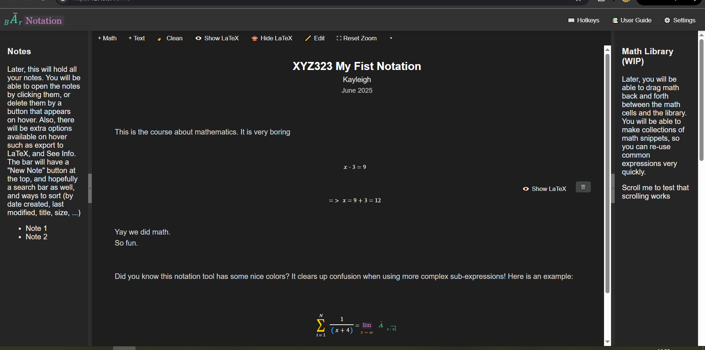

🔥🔥🔥🔥 HOT^

Time to plan that HUGE update that needs to happen regarding multi-mathcell-state.

Goals:
- allow dragging between cells to deep-copy
- allow dragging between a cell and the math library to make entries into math library or deep-copy from library into math cells

Currently, I do this:
- MathEditor has `const initialState = createEditorState(createRootWrapper());`. This creates a math expression (EditorState has: rootNode, cursor; cursor is current InlineContainerNode and position within it. Nodes can be InlineContainer (i.e. list of other nodes) or specific structure such as fraction or bigOperator).
- MathEditor is inside MathCell
- MathEditor uses useEditorHistory hook (has past, present, and future EditorState)
- MathCells (as many as you want) are loaded inside NotationEditor into a cell list (cells can be other cell types than math too!)
- NotationEditor is loaded into EditorPane
- EditorPane is where the cells list is initialised
- EditorPane and MathLibrary are both loaded into MainLayout
- MathLibrary is still mostly a placeholder.

Drag state (DragContext):
draggedNode: MathNode | null — the whole node being dragged (deep clone or original depending on source).

sourceCellId: string | null — which math cell the drag originated from (null if from library).

dropTargetCellId: string | null — target math cell (or library) id for drop.

dropTargetIndex: number | null — position within target cell container to insert node.

dragSourceType: "mathcell" | "library" — so drop handler knows whether to move or deep-copy.

Things that are now broken:
- History of Math stuff
- Dragging of Math stuff
(so like, everything. Surely I made space for an improvement but everything now is just worse-looking than when I had it single-cell defined)

Ctrl+C still works, but not together with the multi-select that I somehow got from today's additions. So either remove multi-select or use it and have it work like I already do with "do action (cut/copy) on the current node (i.e. the one to your left)"

### 26/06/2025
Goal: fix that mess I made yesterday

```
- App.tsx wraps MainLayout in DragProvider
- MainLayout contains:
  -- MainHeaderBar (settings, user guide, hotkeys modals)
  -- NotesMenu (WIP; will have list of all notes; notes are meant to support e.g. all lecture notes of an entire university course)
  -- EditorPane: represents currently opened note. Already holds state regarding cells and math editor states. EditorPane contains the following:
    --- EditorHeaderBar: add cell, show/hide latex, set zoom level, etc (actions to do stuff to/with current note and/or underlying cell list)
    --- NotationEditor: Represents content of note, incl cell list (but cell list is passed on from EditorPane so header buttons can add cells too). NotationEditor contains:
      ---- NoteMetadataSection: similar to latex preamble metadata (note title, author name, date)
      ---- List of alternating BaseCell and InsertCellButtons (latter appear on hover). BaseCell wraps MathCell or TextCell. 
        ----- TextCell is simply holding text input
        ----- MathCell is for mathematical expressions. It wraps around MathEditor:
          ------ MathEditor handles math of a single cell. Handles keydowns for that cell, and copy-paste logic. Then calls MathRenderer:
            ------- MathRenderer contains a switch to find the MathNode type so it can recursively render nodes' individual correct type of renderer function. These functions are defined in MathRenderers.tsx, to keep the recursive renderer itself separate in the codebase.
  -- MathLibrary (WIP; will contain tabs corresponding to predefined and custom-made collections of re-usable math expression to drag into the math cells)
```

Goals:
- Dragging a sub-expression within a MathEditor will move the sub-expression
- Dragging a (sub-)expression from one MathEditor (i.e. math cell) to another will deep-copy the source (sub-)expression into the target location
- Dragging a (sub-)expression from a MathEditor (i.e. math cell) to the library will deep-copy the source (sub-)expression into a new library (collection) entry
- Dragging an expression (i.e. entry) from the library to a MathEditor will deep-copy the source entry's underlying expression into the target location in the MathEditor (i.e. in a math cell)


| Source               | Target               | Outcome                     |
| -------------------- | -------------------- | --------------------------- |
| MathNode in Cell A   | MathNode in Cell A   | Move node within same cell  |
| MathNode in Cell A   | MathNode in Cell B   | Move node between cells     |
| MathLibrary item     | MathNode in any Cell | Insert a clone of that node |
| MathNode in any Cell | MathLibrary          | Create entry (clone node)   |

#### List of tiny things that would be nice to change at some point
- Rename GroupNode to something like BracketedNode. Reason: GroupNode kinda implies that there are multiple children. That confuses chatGPT so probably also other people and my future self.
- Move component-specific css into the .module.css way rather than having a mix of that and the css/ folder (at least for the settings modal)
- Rename "types.ts" to somethign that clarifies that it's math types (used to not be an issue because all was math, now app is big enough for noteTypes to also exist...)
- make scrollbars dark in dark mode

Bigger things:
- make the hotkeys bindable by user


Current filetree
```
.
├── App.tsx                        # div with main component loaded in (for maintainability)
├── index.css                      # @import "tailwindcss", (hopefully) unused for the remainder
├── main.tsx                       # Loads App in React.StrictMode
├── vite-env.d.ts                  # Vite environment type declarations (default)
│
├── assets
│   └── logo.svg                   # svg with the full logo (used in the header bar)
│
├── components
│   ├── cells
│   │   ├── BaseCell.tsx           # Basic Cell stuff
│   │   ├── InsertCellButtons.tsx  # Insert Math Cell / Text Cell buttons (re-used a lot)
│   │   ├── MathCell.tsx           # Cell containing MathEditor
│   │   └── TextCell.tsx           # Cell containing simple textarea
│   │
│   ├── editor
│   │   ├── Editor.module.css      # Styling for EditorPane and NotationEditor
│   │   ├── EditorHeaderBar.tsx    # Header bar for EditorPane (add cell, show/hide all latex, zoom control, etc)
│   │   ├── EditorPane.tsx         # Initializes cells, controls interaction between editor header and NotationEditor
│   │   ├── NotationEditor.tsx     # Render cell list (of a single Math "Notebook") 
│   │   ├── NoteMetadataSection.module.css # CSS for note metadata 
│   │   └── NoteMetadataSection.tsx # Title, Author, Date fields of a note
│   │
│   ├── icons
│   │   └── CollapseIcon.tsx       # Collapse arrow icon (for UI collapsing)
│   │
│   ├── layout
│   │   ├── EditorWorkspace.tsx    # Wraps EditorPane and MathLibrary. This is where gloabl drag lives
│   │   ├── MainHeaderBar.tsx      # Main header bar (curr outdated; holds logo, settings, cell options)
│   │   ├── MainLayout.tsx         # Main layout (Header, Note History, Note Editor, Library)
│   │   ├── ResizableSidebar.module.css  # CSS for resizable sidebar styling
│   │   └── ResizableSidebar.tsx   # Sidebar that can be resized (e.g. for note history)
│   │
│   ├── mathExpression
│   │   ├── LatexViewer.module.css # Styling for LatexViewer
│   │   ├── LatexViewer.tsx        # Little box in MathEditor for viewing LaTeX of 1 expression
│   │   ├── MathEditor.tsx         # Used in MathCell, holds 1 math expression (and a bunch of state)
│   │   ├── MathRenderer.tsx       # Recursively called to render expression, + wraps in draggable
│   │   └── MathRenderers.tsx      # Called by MathRenderer, holds renderers for each MathNode type
│   │
│   ├── mathLibrary
│   │   ├── MathLibrary.module.css # Styling for math library pane
│   │   └── MathLibrary.tsx        # Panel showing predefined or saved expressions
│   │
│   ├── modals
│   │   ├── HotkeyOverlay.tsx      # Overlay of hotkey info
│   │   └── SettingsModal.tsx      # Overlay of settings (options/preferences, e.g. light vs dark theme)
│   │
│   ├── notesMenu
│   │   └── NotesMenu.tsx          # Menu for switching between notes (or opening new ones)
│   │
│   └── tooltips
│       ├── tooltip.css            # Styling for tooltips
│       └── Tooltip.tsx            # Tooltip wrapper to show text on hover of other components
│
├── hooks
│   ├── DragContext.ts             # Global Drag stuff (NEW)
│   ├── useDragContext.tsx         # Global Drag stuff (NEW)
│   ├── DragProvider.tsx           # Global Drag stuff (NEW)
│   ├── EditorHistoryContext.tsx   # Global History stuff (NEW)
│   ├── EditorHistoryProvider.tsx  # Global History stuff (NEW)
│   ├── useCellDragState.ts        # Hook for dragging cells (for re-ordering in MathNotationTool)
│   ├── useDragState.ts            # Hook for dragging MathNodes within the MathEditors (OUTDATED)
│   ├── useEditorHistory.ts        # Hook for history of single MathEditor (OUTDATED)
│   ├── useHoverState.ts           # Hook for hover of MathNode in a MathEditor
│   └── useZoom.ts                 # Hook for zooming of MathEditor (may move higher later)
│
├── logic
│   ├── cursor.ts                  # CursorPosition (in MathEditor): curr InlineContainer + idx within 
│   ├── deletion.ts                # Backspace handler (in MathEditor)
│   ├── editor-state.ts            # EditorState: rootNode and CursorPosition (in MathEditor)
│   ├── handle-keydown.ts          # Keydown handler for MathEditor
│   ├── global-history.ts          # states: Record<string, EditorState>; order: string[]; // the order of cell IDs
│   ├── history.ts                 # HistoryState (same format as EditorState) used in history hook (OUTDATED)
│   ├── insertion.ts               # Handle character insertion into MathEditor
│   ├── navigation.ts              # Handle arrow navigation in MathEditor
│   ├── node-manipulation.ts       # Node insertion/deletion, at cursor or by index/id, in MathEditor
│   └── transformations.ts         # Transform nodes, e.g. into numerator of new FractionNode
│
├── models
│   ├── mathNodeParser.ts          # (Will rename) parse LaTeX, to obtain MathNode
│   ├── nodeFactories.ts           # Factories for all Math Node types
│   ├── nodeToLatex.ts             # input MathNode, output LaTeX string
│   ├── noteTypes.ts               # define CellData, NoteMetadata, and Note (CellData[], NoteMetadata, and an ID) 
│   ├── specialSequences.ts        # mappings from escape sequences to `() => StructureNode` 
│   ├── transformations.ts         # more "boilerplate" transforms (might remove, similar to factories)
│   └── types.ts                   # MathNode = .. | InlineContainer | StructureNode (fraction, bigOp, group, ...)
│
├── styles
│   ├── accents.css                # ::before and ::after for rendering accented math nodes 
│   ├── cells.css                  # Styling for MathCell, TextCell, cell list itself, and insert zones
│   ├── hotkeyOverlay.css          # Styling for HotkeyOverlay (also used by SettingsModal)
│   ├── latexOutputColoring.css    # Styling for LaTeX viewer's text coloring
│   ├── math-node.css              # Styling for math node types and MathEditor
│   ├── math.css                   # Outdated styling (I think)
│   ├── settings.css               # Styling for toggles in settings 
│   ├── styles.css                 # Styling for header bar, settings overlay, LatexViewer, and .app-container 
│   └── themes.css                 # :root, .dark theme, and predefined DOM stuff (h1, html, body, label)
│
└── utils
    ├── accentUtils.ts             # Define NodeDecoration names and map to LaTeX, track required LaTeX packages
    ├── bracketUtils.ts            # Define BracketStyle and its opening/closing characters
    ├── mathHoverUtils.ts          # handleMouseEnter and handleMouseLeave for Math nodes
    ├── navigationUtils.ts         # Define directional order of children, flatten CursorPosition
    ├── subsupUtils.ts             # Define "CornerPosition" type, only used once in transformations.ts
    ├── textContainerUtils.ts      # (Unused) possibly to split MultiDigit mathnode into multiple (not yet implemented)
    └── treeUtils.ts               # Find nodes, update tree, get logical children of nodes, etc.
```

Very fast summary of the day:
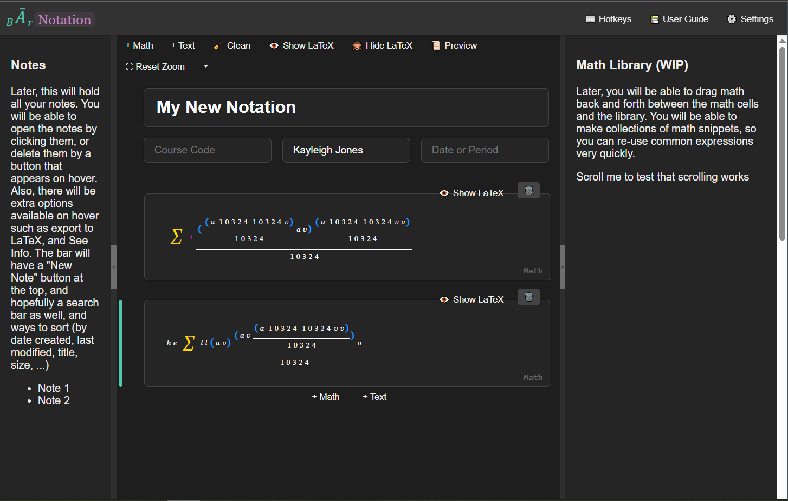
🔥 WORKING DRAG WITHIN AND BETWEEN CELLS!!
🆗 Broke and then Fixed click-based cursor control  
⚠️ Broken hover highlighting
⚠️ Some rendering broken as well (but old ones are still there, commented out, for recovering parts later)

Should move hoveredId stuff to MathRenderer wrapper since it's not node-specific?

Fixed hover highlighting!!!!!!!!!!!!!! Next step is to maybe highlight IC as red
Ensure that dragging IC will flatten the copy
Also there are many bugs in the dropping cuz many "unhandled cases"

Also next step: LIBRARY!!!!!! Quick idea: must make colored borders corresp to diff node types since it will be hard to display full expressions in tiled view w/o truncation. Maybe should also allow switching betw tiled and list view. But imo tiled view is better for not feeling like you lose track of wtf the collection is, unless there is search logic (which could be cool to add anyway, but is bad for the purpose of the app, since the whole point is extremely quick usage)  

- fix the subsup (WTF happened to that omg)

end of day 03:43

PS I think I broke the menu's drag sizing

### 27/06/2025

🧠 Project Overview: Math/Notation Editor App
We are building a React-based mathematical notation editor that lets users create and organize math and text cells interactively. The editor includes features like drag-and-drop cell reordering, zoom controls, LaTeX output toggling, metadata editing, and undo/redo state history management. The goal of the app is to enable real-time math notations during fast-paced lectures for actuarial sciences students with chronic hand pain.

🧱 Key Architectural Concepts
1. Cell Types
TextCell: Plain text editing.

MathCell: Math expression editing via a structured EditorState and MathNode tree.

Cells are stored in a list (cells: CellData[]) and are draggable and reorderable.

2. State Management
Uses a custom EditorHistoryProvider context (useEditorHistory) to track:

past, present, and future states.

Each present state holds:

states: a record of editor states per math cell.

order: current order of cell IDs.

Actions like adding, deleting, or reordering cells update this history.

3. Zoom + LaTeX View
defaultZoom applies across all math cells.

resetZoomSignal forces re-render on zoom reset.

showLatexMap tracks which math cells have LaTeX output toggled on/off.

4. Metadata
Each note has editable metadata (e.g. title, author).

Initial author is read from localStorage.

🧪 Features Implemented / Challenges Resolved
✅ Implemented
Dynamic add/delete of text or math cells with history tracking.

Drag-and-drop reordering of cells with correct index resolution.

Zoom control across math cells using a shared signal.

Per-cell LaTeX output toggling with persistent state map.

Full metadata section with editable title/author.

History-based undo logic (undo(history)), including:

Logging of human-readable past state info (Undoing to state with N cells: [ids]).

⚠️ Issues Resolved
🔁 Improper state updates during render:

You encountered the error:
"Cannot update a component (EditorHistoryProvider) while rendering a different component (EditorPane)"

Cause: Calling updateState() inside setCells() (a render path) in EditorPane.

Fix: Rewrote addCell() logic to extract state update logic outside of setCells() to avoid cascading state updates during render.

🧩 Missing prop (updateOrder):

NotationEditor was using updateOrder, but EditorPane wasn't passing it as a prop.

Fix: Passed updateOrder={updateOrder} explicitly in EditorPane.

🔧 Next Steps / To-Dos
✅ Improve undo/redo debugging visibility (done).

🛠️ Consider adding redo support (you already have future in HistoryState).

🧪 Write tests for undo, addCell, and drag-drop ordering behavior.

🔄 Save/load notes from persistent storage (database or localStorage).

💾 Optional: persist cells, editorStates, and metadata to backend or local file.

🧹 Debounce or throttle heavy updates (e.g., editorState serialization).

👓 Improve UI polish: animations, insert cell transitions, drag handles.

Note to self; why tf does deletion of math cell lead to a text cell? Not critical but very weird
cursor control by mouse is not the same as by arrows. Not too critical atm but def annoying when trying to get to start of inline container

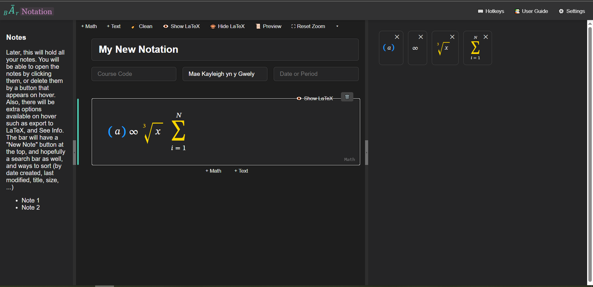

WORKING MATH LIBRARY
library entry creation is not part of history state

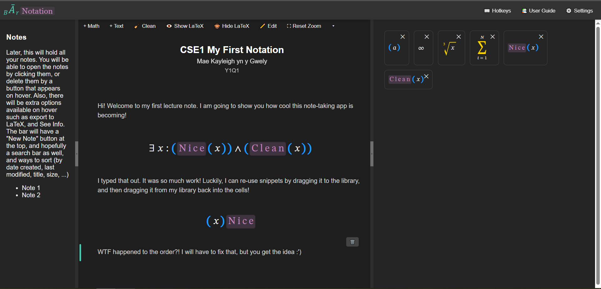

Current issues:
- angl (and probably others) are not rendered
- containers are dropped in reverse order
- drop cursor vs drop location is one index off
- curr not allowign index 0 drop on non-same-cell inserts
- children of non-containers not clickable (must wrap clickable around all MathRenderer instance?)

Things that should be implemented afterwards:
- custom collections
- predefined collections
- search bar for within a collection (perhaps that will search on corresponding latex strings?)
- on drag into wherever else, make it paste latex (so user can use the library even on Overleaf!!)
- Maybe even enable pasting INTO the library with latex? TODO look into if I need to detect latex or if I already assume latex, or if better to just have special input field option somehwere
- On hover (or (double) click?!) of node, allow deletion (so no many backspace for big node del)
- Maybe cool: when shift+arrow, do "breadth-first" (first-layer-only) multi-select and give options for "group", bulk delete, and maybe more stuff if I think of more useful things to do to groups  

Welcome to BarNotation, the mathematical note-taking app that truly raises the bar! Here's how it works: your notebook is a list of cells. Currently, the existing cell types are "Math" and "Text". This one is "Text". The "Math" ones have a tree structure inside consisting of so-called "math nodes", of which different sub-types exist for different unique visual structures in mathematics. Just typing leads to the basic math-text type, but different actions (currently: hotkeys and special "command sequences") transform your node into more complex types such as fractions, actuarial symbols, or big operators. 

The app also supports drag-and-drop within a math cell to move nodes around, as well as from one math cell to another to copy a node. And to top it all off, you can also drag math nodes to the "Library", the panel to the right of this one, to create your collection of commonly-used snippets. These can be dragged back into math cells whenever, and are saved across the whole app rather than just this notebook! 

And there is more! If you want to re-order your lecture notebook cells, just drag the space to the left of a cell to insert it elsewhere. You can also get LaTeX translations of math nodes by clicking "show latex" options, and even by Ctrl+C within a math cell to copy the LaTeX string of the node to the left of your cursor!

Future improvements: custom collections (tabs within the library); predefined collections to get you started; LaTeX export option for full notebook; custom hotkey binding; (sub(sub))section text cell types (to turn notebook from flat list into tree, how you would make it in a LaTeX editor); and many more tiny fixes and improvements! Of course I will also implement the actual saving and retrieving of notebooks, and would like to add search bars in all kinds of places.

Some other small design choices I made for this app, which may be less important for a basic user to explicitly know about:
- Easy zooming per math cell since some expressions can get huge and others tiny within the same lecture notes. zooming in and out should (in my opinion) thus be flexible and local, so you can reach deeply nested math AND zoom way out to see the full expression whenever you want, without needlessly messing up the rest of your notebook.

### 28/06/2025

Fixing Current Issues:
✅  angl (and probably others) are now rendered again (I just returned the old way of rendering accented nodes in MathRenderers.tsx)
✅ RootWrapperNode is not draggable nor hoverable (by conditioning in MathRenderer, and removing the "hovered" class from its renderer in MathRenderers)
- containers are dropped in reverse order (sometimes??!)
✅ drop cursor vs drop location is one index off
✅ curr not allowign index 0 drop on non-same-cell inserts
✅ Dropping carelessly into a cell does not drop anything (into curr pos or final pos)
✅ children of non-containers not clickable (must wrap clickable around all MathRenderer instance?)
✅ empty inlinecontainers in library are hard to understand, and should instead be filled in with placeholder squares ⬚. NOTE: I decided only to put the placeholder IN the library (so the dragged math is still truly empty) since e.g. childed nodes would clutter the notebook and confuse the user (since an exponent does not feel like a 4-childed node, unless you built this app.)

DAMN so many bugs fixed from those drag changes
Things that must be fixed at some point later:
- handle drop within multidigit and command
- IC^supleftright: drop IC into child copies instead of disallows (good? bad? hmm)
- ensure groupnode wraps around when IC of size >1 in base of childed (or not? depends; less user freedom but if user does it "wrong" then user gets confused. Check how latex does it!)

Next big step: 
- probably actual database stuff. Since I need to really have a grasp of that before I do what's after:
- allow custom (and add predefined) collections!

💡 Idea: for all library entries, keep track of #times dragged out. Library collections will get big, so probably good to have sortBy options, and frequency of use is probably a useful thing to sort on! (as well as most/least recently added, size, and "root" node type) 

Tiny todo: when clicking outside a cell, un-select it. So user is allowed to see their notebook without seeing the cell option buttons and selection marker 

Think about how to implement the toggle color in preview option that is still just placeholder. Possibilities:
- everywhere where a color is put, have a boolean to check if it should be given a color (probably bad)
- create a new "theme" that simply has tons of lines in css where I just set the vars to the main math color. must somehow be selectable as sub-theme...

Next step: fix this:
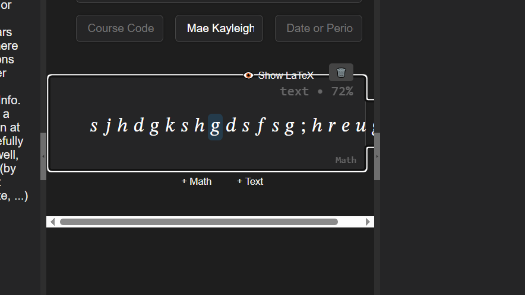

TODO: fix the way I parse sqrt from latex, since it does not initialize a container when `[]` is missing (and check if it also happens when `[]` is not missing...) 

### 29/06/2025
Fixed math cell zoom stuff 

WEEEE TIME TO BUFF UP THE LIBRARYYYYY

DOing soooo much today for library collections
current issues:
- no deletion of entries
- no reorder
- trying to reorder instead pastes raw text, weirdly?

Steps to fix things and make it all even better:
- enable library entry deletion
- allow re-ordering of the library tabs
- keep track of the custom manual order of library entries (also put it in the sortBy dropdown options?)
✅ style the sortBy dropdown
✅ enable dragging a library entry into another **tab** to deep-copy it
- bulk-select mode for deletion and bulk-copy to other collection tab
- remove collection rename button, instead click on collection name to enter rename mode (show text cursor for clarity that that features exists)
- make "are you sure?" popup for tab deletion
- make library state part of global history
- eventually hide the frequency counts (not yet; need to verify that it works while I'm developing)

Design choice I just made: 
> On hover of MathView, tooltip display of the corresponding latex. Might need to truncate if too long, allow disabling its visibility in settings, and change the styling of the text to be less overwhelming.

> Using `const cleanLatex = (s: string) => s.replace(/[\\{}[\]]/g, "");` to ignore some special characters when sorting library entries alphabetically

Made duplicate-to-other-tab

TODO: make search bar clear when dropping new nodes because otherwise it feels like the app is broken because you don't see your new node unless it matches your current search

Current filetree
```
.
├── App.tsx                        # div with main component loaded in (for maintainability)
├── index.css                      # @import "tailwindcss", (hopefully) unused for the remainder
├── main.tsx                       # Loads App in React.StrictMode
├── vite-env.d.ts                  # Vite environment type declarations (default)
│
├── assets
│   └── logo.svg                   # svg with the full logo (used in the header bar)
│
├── components
│   ├── cells
│   │   ├── BaseCell.tsx           # Basic Cell stuff
│   │   ├── InsertCellButtons.tsx  # Insert Math Cell / Text Cell buttons (re-used a lot)
│   │   ├── MathCell.tsx           # Cell containing MathEditor
│   │   └── TextCell.tsx           # Cell containing simple textarea
│   │
│   ├── editor
│   │   ├── Editor.module.css      # Styling for EditorPane and NotationEditor
│   │   ├── EditorHeaderBar.tsx    # Header bar for EditorPane (add cell, show/hide all latex, zoom control, etc)
│   │   ├── EditorPane.tsx         # Initializes cells, controls interaction between editor header and NotationEditor
│   │   ├── NotationEditor.tsx     # Render cell list (of a single Math "Notebook") 
│   │   ├── NoteMetadataSection.module.css # CSS for note metadata 
│   │   └── NoteMetadataSection.tsx # Title, Author, Date fields of a note
│   │
│   ├── icons
│   │   └── CollapseIcon.tsx       # Collapse arrow icon (for UI collapsing)
│   │
│   ├── layout
│   │   ├── EditorWorkspace.module.css # CSS for workspace styling
│   │   ├── EditorWorkspace.tsx    # Wraps EditorPane and MathLibrary. This is where gloabl drag lives
│   │   ├── MainHeaderBar.tsx      # Main header bar (curr outdated; holds logo, settings, cell options)
│   │   ├── MainLayout.tsx         # Main layout (Header, Note History, Note Editor, Library)
│   │   ├── ResizableSidebar.module.css  # CSS for resizable sidebar styling
│   │   └── ResizableSidebar.tsx   # Sidebar that can be resized (e.g. for note history)
│   │
│   ├── mathExpression
│   │   ├── DummyStartNodeRenderer.tsx # Dummy node for start of InlineContainers enabling click and drop into 0th positions
│   │   ├── LatexViewer.module.css # Styling for LatexViewer
│   │   ├── LatexViewer.tsx        # Little box in MathEditor for viewing LaTeX of 1 expression
│   │   ├── MathEditor.tsx         # Used in MathCell, holds 1 math expression (and a bunch of state)
│   │   ├── MathRenderer.tsx       # Recursively called to render expression, + wraps in draggable
│   │   ├── MathRenderers.tsx      # Called by MathRenderer, holds renderers for each MathNode type
│   │   └── MathView.tsx           # Calls MathRenderer but removes interactivity, used to display math in MathLibrary  
│   │
│   ├── mathLibrary
│   │   ├── MathLibrary.module.css # Styling for math library pane
│   │   ├── MathLibrary.tsx        # Panel showing predefined or saved math nodes
│   │   ├── TabDropdownPortal.module.css # Styling for library collection tab dropdown 
│   │   └── TabDropdownPortal.tsx  # Dropdown for rename, archive, or delete collection 
│   │
│   ├── modals
│   │   ├── HotkeyOverlay.tsx      # Overlay of hotkey info
│   │   ├── LibCollectionArchive.module.css # Styling of archive modal
│   │   ├── LibCollectionArchive.tsx # Library collection archive, options for preview, recover and delete
│   │   ├── HotkeyOverlay.tsx      # Overlay of hotkey info
│   │   └── SettingsModal.tsx      # Overlay of settings (options/preferences, e.g. light vs dark theme)
│   │
│   ├── notesMenu
│   │   └── NotesMenu.tsx          # Menu for switching between notes (or opening new ones)
│   │
│   └── tooltips
│       ├── tooltip.css            # Styling for tooltips
│       └── Tooltip.tsx            # Tooltip wrapper to show text on hover of other components
│
├── hooks
│   ├── DragContext.ts             # Global Drag stuff 
│   ├── useDragContext.tsx         # Global Drag stuff 
│   ├── DragProvider.ts            # Global Drag stuff 
│   ├── EditorHistoryContext.tsx   # Global History stuff 
│   ├── EditorHistoryProvider.tsx  # Global History stuff 
│   ├── useCellDragState.ts        # Hook for dragging cells (for re-ordering in MathNotationTool)
│   ├── useDragState.ts            # Hook for dragging MathNodes within the MathEditors (OUTDATED)
│   ├── useEditorHistory.ts        # Hook for history of single MathEditor (OUTDATED)
│   ├── useHoverState.ts           # Hook for hover of MathNode in a MathEditor
│   └── useZoom.ts                 # Hook for zooming of endividual MathEditor
│
├── logic
│   ├── cursor.ts                  # CursorPosition (in MathEditor): curr InlineContainer + idx within 
│   ├── deletion.ts                # Backspace handler (in MathEditor)
│   ├── editor-state.ts            # EditorState: rootNode and CursorPosition (in MathEditor)
│   ├── handle-keydown.ts          # Keydown handler for MathEditor
│   ├── global-history.ts          # states: Record<string, EditorState>; order: string[]; // the order of cell IDs
│   ├── history.ts                 # HistoryState (same format as EditorState) used in history hook (OUTDATED)
│   ├── insertion.ts               # Handle character insertion into MathEditor
│   ├── navigation.ts              # Handle arrow navigation in MathEditor
│   ├── node-manipulation.ts       # Node insertion/deletion, at cursor or by index/id, in MathEditor
│   └── transformations.ts         # Transform nodes, e.g. into numerator of new FractionNode
│
├── models
│   ├── libraryTypes.ts            # export interfact LibraryEntry with fields like dateAdded, corresponding latex, etc
│   ├── mathNodeParser.ts          # (Will rename) parse LaTeX, to obtain MathNode
│   ├── nodeFactories.ts           # Factories for all Math Node types
│   ├── nodeToLatex.ts             # input MathNode, output LaTeX string
│   ├── noteTypes.ts               # define CellData, NoteMetadata, and Note (CellData[], NoteMetadata, and an ID) 
│   ├── specialSequences.ts        # mappings from escape sequences to `() => StructureNode` 
│   ├── transformations.ts         # more "boilerplate" transforms (might remove, similar to factories)
│   └── types.ts                   # MathNode = .. | InlineContainer | StructureNode (fraction, bigOp, group, ...)
│
├── styles
│   ├── accents.css                # ::before and ::after for rendering accented math nodes 
│   ├── cells.css                  # Styling for MathCell, TextCell, cell list itself, and insert zones
│   ├── hotkeyOverlay.css          # Styling for HotkeyOverlay (also used by SettingsModal)
│   ├── latexOutputColoring.css    # Styling for LaTeX viewer's text coloring
│   ├── math-node.css              # Styling for math node types and MathEditor
│   ├── math.css                   # Outdated styling (I think)
│   ├── settings.css               # Styling for toggles in settings 
│   ├── styles.css                 # Styling for header bar, settings overlay, LatexViewer, and .app-container 
│   └── themes.css                 # :root, .dark theme, and predefined DOM stuff (h1, html, body, label)
│
└── utils
    ├── accentUtils.ts             # Define NodeDecoration names and map to LaTeX, track required LaTeX packages
    ├── bracketUtils.ts            # Define BracketStyle and its opening/closing characters
    ├── mathHoverUtils.ts          # handleMouseEnter and handleMouseLeave for Math nodes
    ├── navigationUtils.ts         # Define directional order of children, flatten CursorPosition
    ├── noop.ts                    # `export const noop = () => {};`
    ├── subsupUtils.ts             # Define "CornerPosition" type, only used once in transformations.ts
    ├── textContainerUtils.ts      # (Unused) possibly to split MultiDigit mathnode into multiple (not yet implemented)
    └── treeUtils.ts               # Find nodes, update tree, get logical children of nodes, etc.
```